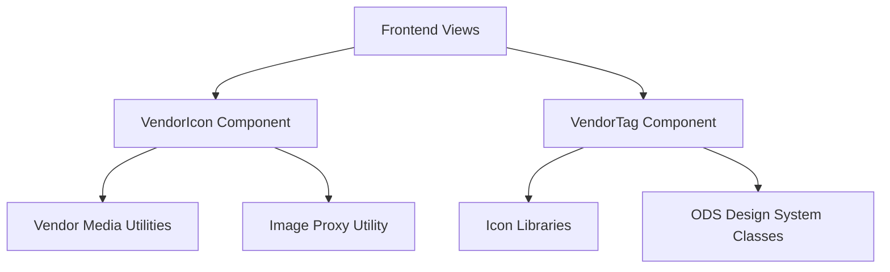
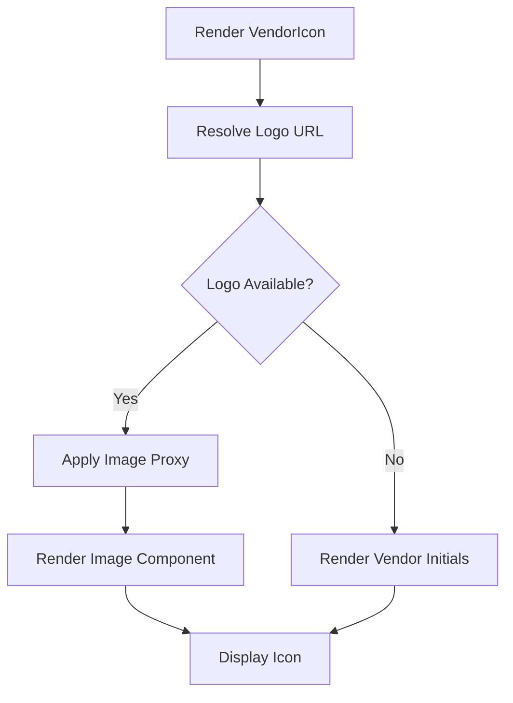
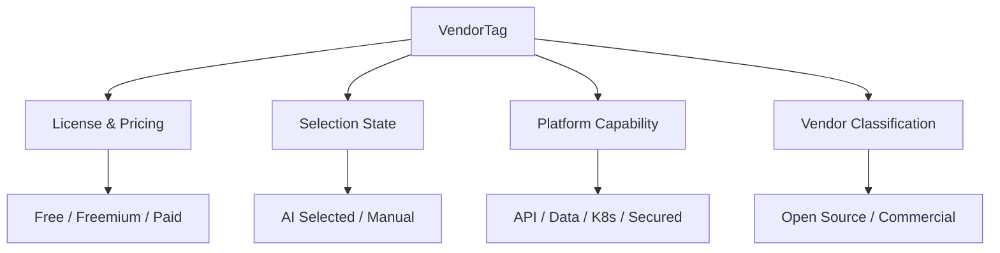

# Vendor Components

The **Vendor Components** module provides reusable UI primitives for representing vendors across the OpenFrame frontend. It standardizes how vendor logos and vendor classification tags are displayed, ensuring visual consistency in stack builders, comparison tables, dropdowns, and detail views.

This module is part of the Frontend Core layer and focuses specifically on:

- Vendor logo rendering (`VendorIcon`)
- Vendor classification and capability tagging (`VendorTag`)
- Consistent sizing, styling, and theming alignment with the design system

---

## Overview

Vendor representation is a cross-cutting concern across the application. Vendors appear in:

- Stack builder flows
- Vendor comparison views
- Platform capability listings
- Tickets, devices, and integrations

The Vendor Components module encapsulates logo resolution, fallback rendering, classification styling, and iconography into two primary components:

- `VendorIcon`
- `VendorTag`

---

## Architecture



### Responsibilities

- **VendorIcon**: Handles vendor logo resolution, sizing, background styling, and fallback rendering.
- **VendorTag**: Encodes vendor classification, licensing, capability, and selection status into consistent visual tags.

---

# VendorIcon

**Source:** `vendor-icon.tsx`  
**Primary Type:** `VendorIconProps`

## Purpose

`VendorIcon` is a reusable React component responsible for displaying vendor logos consistently across the platform.

It abstracts:

- Logo URL resolution
- Image proxy integration
- Size variants
- Background styling
- Fallback initials rendering

---

## Component API

```typescript
interface VendorIconProps {
  vendor: VendorWithMedia & {
    id?: number
    title: string
    slug?: string
    logo?: string | null
  }
  size?: 'xs' | 'sm' | 'md' | 'lg' | 'l' | 'xl'
  className?: string
  showBackground?: boolean
  backgroundStyle?: 'dark' | 'light' | 'white'
}
```

### Key Props

- **vendor** – Vendor entity including title and optional logo
- **size** – Predefined size variants mapped to container and image dimensions
- **showBackground** – Toggles background container styling
- **backgroundStyle** – Controls background theme variant

---

## Rendering Flow



### Logo Resolution

1. Retrieves logo via `getVendorLogo(vendor)`
2. Applies `getProxiedImageUrl` when available
3. Uses Next.js-compatible Image shim for optimized rendering

### Fallback Strategy

If no logo exists:

- Displays first two characters of `vendor.title`
- Applies contextual text color based on background style

---

## Size System

Two mappings control sizing:

- **Container size classes** (Tailwind width/height utilities)
- **Image pixel dimensions** for rendering optimization

This ensures consistent layout alignment across cards, lists, and tables.

---

## Design Considerations

- Uses `cn()` utility for conditional class merging
- Aligns with Open Design System (ODS) tokens
- Maintains flex-shrink behavior for responsive layouts
- Supports both background-wrapped and edge-to-edge rendering

---

# VendorTag

**Source:** `vendor-tag.tsx`  
**Primary Type:** `VendorTagProps`

## Purpose

`VendorTag` standardizes vendor classification badges such as:

- Open Source
- Commercial
- AI Selected
- Enterprise
- API / Data / K8s / Secured
- OpenFrame Selected

It combines:

- Text label
- Contextual icon
- Accent styling
- Size variants

---

## Component API

```typescript
export interface VendorTagProps {
  type:
    | 'open-source'
    | 'commercial'
    | 'free'
    | 'freemium'
    | 'paid'
    | 'enterprise'
    | 'recommended'
    | 'classification'
    | 'ai'
    | 'manual'
    | 'openframe_selected'
    | 'placeholder'
    | 'api'
    | 'data'
    | 'k8s'
    | 'secured'
  text?: string
  className?: string
  size?: 'sm' | 'md'
  hidden?: boolean
  accentColor?: string
}
```

---

## Tag Classification Model



---

## Behavior Details

### 1. Dynamic Content Resolution

A `switch(type)` determines:

- Display text
- Icon
- Icon container styling
- Optional accent color overrides

### 2. Classification Subtypes

When `type = 'classification'`, the component inspects the `text` value to determine:

- `open_source`
- `commercial`
- `openframe_selected`

This allows flexible mapping from backend-provided classification strings.

### 3. Design System Integration

Tags use:

- `bg-ods-bg`
- `border-ods-border`
- `text-ods-*`

Ensuring consistent theming and dark/light compatibility.

---

## Hidden State Handling

If `hidden` is true:

- Component remains mounted
- Uses `invisible` class instead of conditional rendering

This preserves layout spacing when toggling visibility.

---

## Integration Patterns

### Common Usage Scenarios

- Vendor comparison tables
- Stack category selectors
- Capability badges in detail views
- AI recommendation indicators

### Combined Usage Example

```typescript
<VendorIcon vendor={vendor} size="md" />
<VendorTag type="open-source" />
<VendorTag type="ai" />
```

---

# Design Principles

The Vendor Components module follows these frontend architecture principles:

1. **Encapsulation** – Vendor-specific logic is not duplicated across views.
2. **Design Token Alignment** – Uses ODS utility classes.
3. **Composable Primitives** – Can be combined freely with other UI components.
4. **Graceful Degradation** – Fallback initials ensure UI robustness.
5. **Backend Flexibility** – Supports dynamic classification via text mapping.

---

# Summary

The **Vendor Components** module provides the standardized visual layer for representing vendors across OpenFrame.

- `VendorIcon` ensures consistent, resilient logo rendering.
- `VendorTag` encodes licensing, classification, capability, and selection state into reusable UI tokens.

Together, they establish a unified vendor identity system within the frontend architecture.