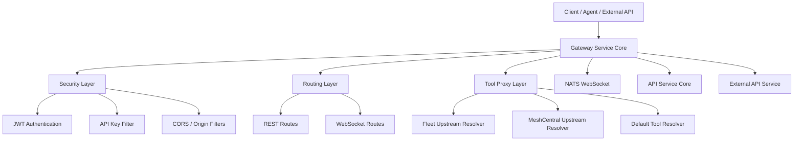
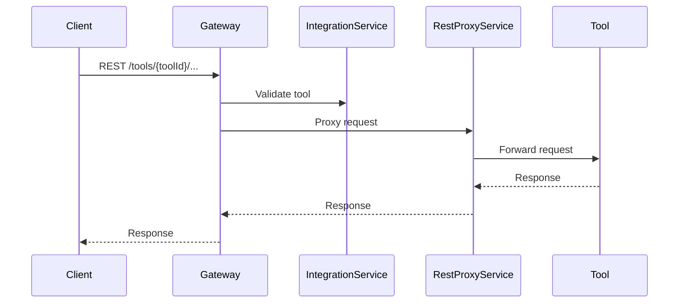
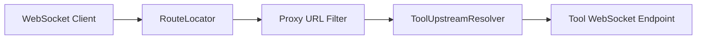
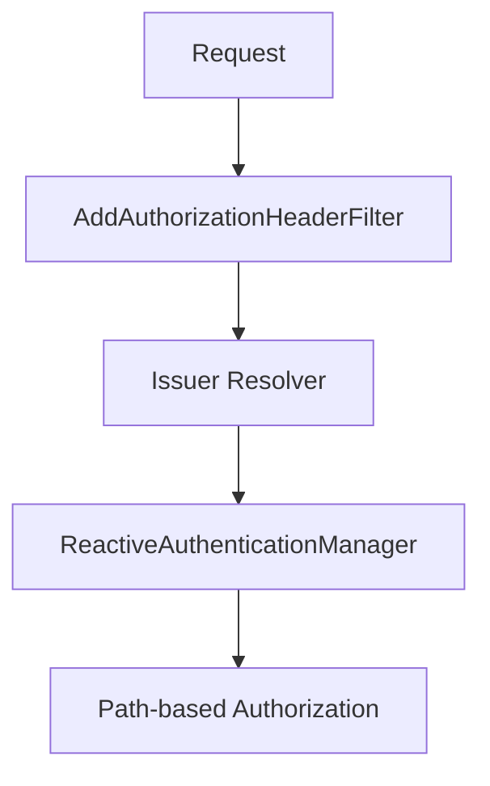
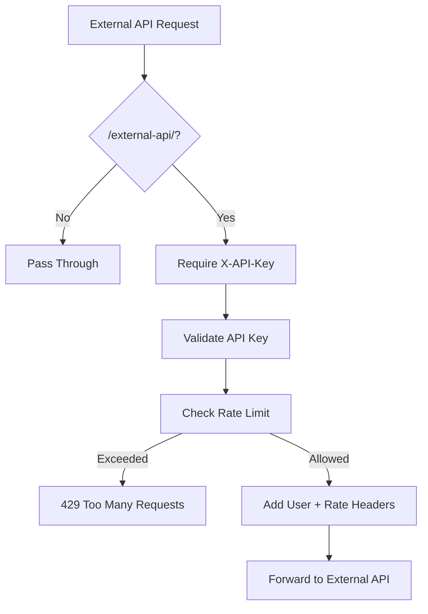
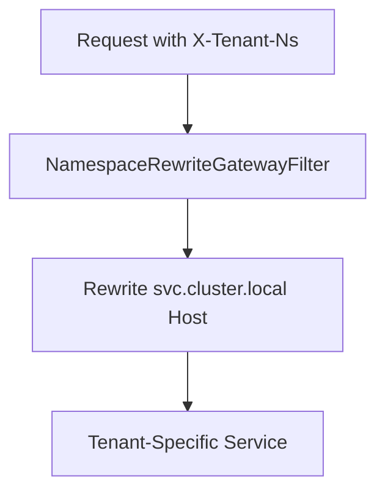
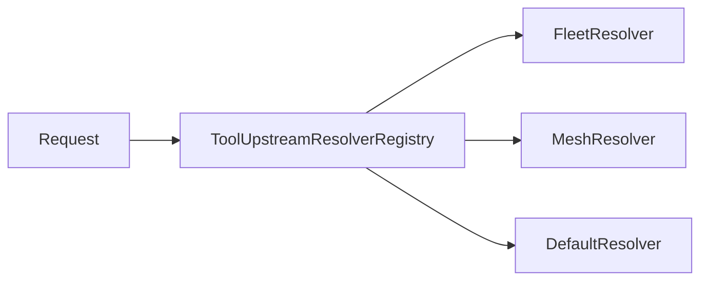

# Gateway Service Core

The **Gateway Service Core** module is the reactive edge gateway for the OpenFrame platform. It is responsible for:

- Routing REST and WebSocket traffic to internal services and integrated tools
- Enforcing authentication and authorization (JWT + API keys)
- Handling multi-tenant namespace routing
- Applying rate limiting and API key validation
- Proxying external tool APIs (Fleet, MeshCentral, etc.)
- Securing WebSocket upgrades and observability for agent connections

It is built on **Spring WebFlux**, **Spring Cloud Gateway**, and **Reactor Netty**, and acts as the primary ingress layer for agents, administrators, and external API consumers.

---

## High-Level Architecture



The Gateway Service Core sits between clients and downstream services such as:

- API Service Core
- External API Service Core
- Stream / NATS infrastructure
- Integrated tools (Fleet MDM, MeshCentral)

---

# Core Responsibilities

## 1. Reactive Server & Networking

**Key components:**

- `NettySocketConfig`
- `WebClientConfig`

### NettySocketConfig

Configures low-level Netty options for both:

- Embedded reactive web server
- Outbound HTTP client
- WebSocket client

Optimizations include:

- `TCP_NODELAY` enabled
- `SO_LINGER = 0`

This reduces connection latency and improves proxy responsiveness for high-frequency agent traffic.

### WebClientConfig

Provides a preconfigured `WebClient.Builder` with:

- Connection timeout
- Read/write timeout handlers
- Response timeout enforcement

All outbound proxy calls to integrated tools use this configuration.

---

## 2. REST Tool Proxying

**Key component:** `IntegrationController`

Routes under:

- `/tools/{toolId}/**`
- `/tools/agent/{toolId}/**`

### Request Flow



The `RestProxyService` determines the correct upstream target using a **ToolUpstreamResolver**.

---

## 3. WebSocket Gateway

**Key components:**

- `WebSocketGatewayConfig`
- `ToolAgentWebSocketProxyUrlFilter`
- `ToolApiWebSocketProxyUrlFilter`
- `WsAwareAuthenticationEntryPoint`

### WebSocket Routes

Defined using `RouteLocator`:

- `/ws/tools/agent/{toolId}/**`
- `/ws/tools/{toolId}/**`
- `/ws/nats`
- `/ws/nats-api`



### WebSocket Security Observability

`WsAwareAuthenticationEntryPoint`:

- Detects rejected WebSocket upgrades
- Logs token subject (`sub` claim)
- Emits metrics for rejected upgrades

This prevents silent agent disconnections when JWTs expire.

---

## 4. Security Architecture

**Key components:**

- `GatewaySecurityConfig`
- `JwtAuthConfig`
- `AddAuthorizationHeaderFilter`
- `OriginSanitizerFilter`
- `CorsConfig` / `CorsDisableConfig`
- `DefaultIssuerUrlProvider`

### Authentication Model

The Gateway acts as an OAuth2 Resource Server:

- JWT validation via `JwtIssuerReactiveAuthenticationManagerResolver`
- Multi-issuer support with Caffeine cache
- Role and scope extraction



### Token Sources

`AddAuthorizationHeaderFilter` resolves bearer tokens from:

- Cookies
- Custom access-token header
- Query parameter

It ensures downstream components always see a standard `Authorization: Bearer` header.

### Path-Based Authorization

Defined in `GatewaySecurityConfig`:

- `/api/**` → ADMIN
- `/tools/**` → ADMIN
- `/tools/agent/**` → AGENT
- `/clients/**` → AGENT
- `/chat/**` → AGENT or ADMIN

---

## 5. API Key Authentication & Rate Limiting

**Key components:**

- `ApiKeyAuthenticationFilter`
- `RateLimitConstants`

Applies to:

- `/external-api/**`

### Processing Flow



Features:

- API key validation per tenant
- Minute / hour / day limits
- Standard rate-limit headers
- Success / failure tracking

Multi-tenant mode scopes rate-limit keys using `X-Tenant-Id`.

---

## 6. Multi-Tenant Routing

**Key components:**

- `TenantRoutingHeaders`
- `NamespaceRewriteGatewayFilter`
- `FleetMultiTenancyProperties`
- `FleetUpstreamResolver`
- `MeshCentralUpstreamResolver`

The gateway supports two deployment modes:

1. **Single-tenant pod** (OSS)
2. **Shared multi-tenant pod** (SaaS)

### Namespace Rewriting

In multi-tenant mode:

- Trusted headers: `X-Tenant-Id`, `X-Tenant-Ns`
- Hostnames are rewritten dynamically
- Kubernetes namespace label replaced per request



If tenant routing is disabled, the filter is a no-op.

---

## 7. Tool Upstream Resolution

The gateway resolves tool targets using a pluggable strategy:



### FleetUpstreamResolver

- Supports shared Fleet multi-tenancy
- Routes all tenants to one shared Fleet
- Separates REST and WebSocket upstream config

### MeshCentralUpstreamResolver

- Reads static config from properties
- Applies namespace + path prefix rewrites
- Avoids Mongo lookup per request

---

## 8. Internal Auth Probe

**Component:** `InternalAuthProbeController`

Conditional endpoint:

- `/internal/authz/probe`

Used for:

- Health checks
- Upstream authentication verification
- Internal service monitoring

Enabled via:

```text
openframe.gateway.internal.enable=true
```

---

# Interaction with Other Modules

The Gateway Service Core integrates with:

- API Service Core (REST `/api/**`)
- External API Service Core (`/external-api/**`)
- Stream Service Core (NATS WebSocket endpoints)
- Data Mongo modules (API key + tool resolution)
- Security Core (JWT configuration)

It does not implement business logic. Instead, it:

- Validates
- Secures
- Routes
- Observes

---

# Summary

The **Gateway Service Core** module is the reactive ingress backbone of OpenFrame.

It provides:

- ✅ JWT-based authentication with multi-issuer support
- ✅ API key authentication and rate limiting
- ✅ WebSocket proxying with observability
- ✅ Tool-aware upstream resolution
- ✅ Multi-tenant namespace routing
- ✅ CORS and origin sanitization

By centralizing security, routing, and tenancy logic at the edge, the Gateway Service Core ensures downstream services remain focused purely on business functionality while maintaining strict isolation, scalability, and observability.