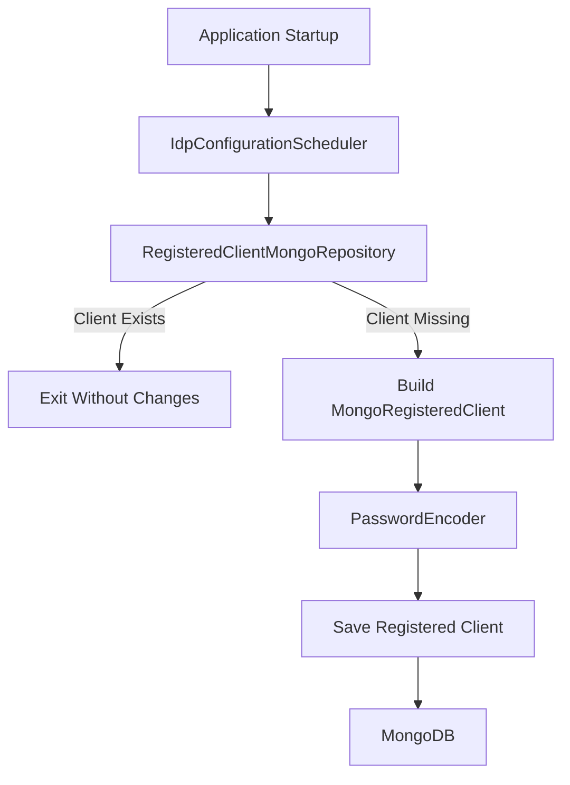
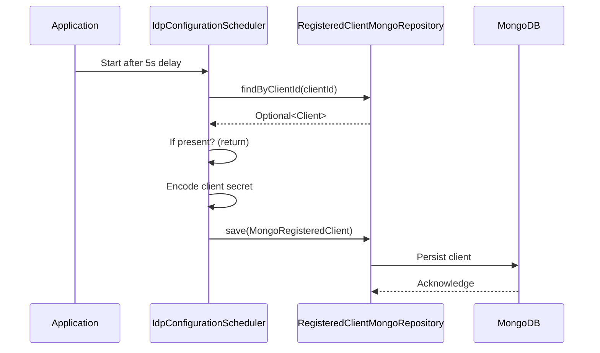
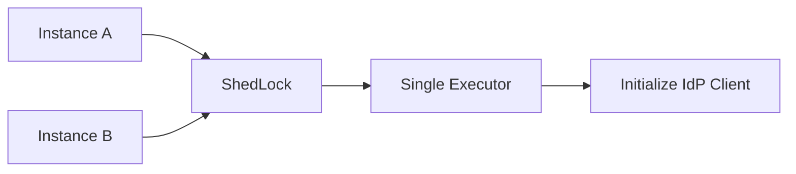

# Idp Configuration

The **Idp Configuration** module is responsible for initializing and maintaining the default OAuth2 client configuration used by the OpenFrame Gateway to communicate with the Authorization Server.

It ensures that a properly configured OAuth2 client (with PKCE, token lifetimes, and scopes) exists in the persistence layer at application startup. The module is intentionally minimal and focused: it performs one-time, idempotent initialization of the Identity Provider (IdP) client configuration.

---

## 1. Purpose and Responsibilities

The Idp Configuration module provides:

- ✅ Automatic bootstrap of the default OAuth2 client
- ✅ Secure encoding of client secrets
- ✅ Controlled execution via feature flag
- ✅ Distributed-safe execution using ShedLock
- ✅ Idempotent creation (no duplicate clients)

This module acts as a bridge between:

- **Gateway Service** (OAuth2 client)
- **Authorization Server** (OAuth2 provider)
- **MongoDB persistence layer** (Registered client storage)

---

## 2. Core Component

### IdpConfigurationScheduler

**Class:** `IdpConfigurationScheduler`  
**Package:** `com.openframe.management.scheduler`

This Spring-managed component:

- Is conditionally enabled via property:
  - `openframe.management.idp.init.enabled=true`
- Executes once after startup (5s delay)
- Uses ShedLock to prevent duplicate execution in clustered environments
- Creates a `MongoRegisteredClient` if it does not already exist

---

## 3. High-Level Architecture



---

## 4. Initialization Flow

The scheduler runs exactly once per deployment (protected by ShedLock).

### Step-by-Step Process



---

## 5. Configuration Properties

The module depends on externally provided configuration values:

| Property | Purpose |
|----------|----------|
| `openframe.gateway.oauth.client-id` | OAuth2 client identifier |
| `openframe.gateway.oauth.client-secret` | Raw secret (encoded before storage) |
| `openframe.gateway.oauth.redirect-uri` | Gateway redirect URI |
| `security.oauth2.token.access.expiration-seconds` | Access token TTL |
| `security.oauth2.token.refresh.expiration-seconds` | Refresh token TTL |
| `openframe.management.idp.init.enabled` | Enables/disables scheduler |

### Important

- The client secret is **never stored in plain text**.
- It is encoded using Spring Security's `PasswordEncoder` before persistence.

---

## 6. Created OAuth Client Configuration

When initialized, the following configuration is applied:

### Authentication Methods

- `none`
- `client_secret_basic`

### Grant Types

- `authorization_code`
- `refresh_token`

### Scopes

- `openid`
- `profile`
- `email`
- `offline_access`

### Security Settings

- PKCE required (`requireProofKey = true`)
- No explicit consent required
- Refresh tokens are not reused
- Custom access and refresh token TTL

---

## 7. Distributed Safety (ShedLock)

To avoid duplicate client creation in multi-instance deployments:



- Only one node executes the initialization
- Lock duration safeguards against long execution
- Safe in Kubernetes or horizontally scaled environments

---

## 8. Conditional Activation

The scheduler is guarded by:

```text
openframe.management.idp.init.enabled=true
```

If disabled:

- The scheduler bean is not created
- No client initialization occurs
- The system expects the OAuth client to be provisioned manually

This provides flexibility for:

- Production environments
- Pre-seeded deployments
- External identity provider management

---

## 9. Relationship to Other Modules

The Idp Configuration module interacts with:

- Authorization Server module (OAuth2 provider)
- Gateway Service module (OAuth2 client)
- Data Mongo Common module (MongoRegisteredClient document)
- Data Mongo Sync module (repository implementation)
- Security Core module (PasswordEncoder)

However, it does not implement OAuth flows itself. It strictly ensures the required client registration exists.

---

## 10. Failure Handling

If initialization fails:

- The error is logged
- The exception is rethrown
- Application startup may fail depending on configuration

This design ensures misconfiguration is detected early rather than causing subtle runtime authentication errors.

---

## 11. Design Characteristics

| Characteristic | Behavior |
|---------------|----------|
| Idempotent | Will not recreate existing client |
| Secure | Secret encoded before storage |
| Distributed Safe | ShedLock prevents duplication |
| Configurable | Fully property-driven |
| Minimal Scope | Focused only on client bootstrap |

---

# Summary

The **Idp Configuration** module is a focused infrastructure component responsible for safely bootstrapping the default OAuth2 client used by OpenFrame.

It ensures:

- The Gateway can authenticate against the Authorization Server
- Proper PKCE and token settings are enforced
- Client secrets are securely encoded
- Initialization is safe in distributed deployments

By centralizing OAuth client bootstrap logic, the module guarantees predictable and secure identity provider configuration across environments.