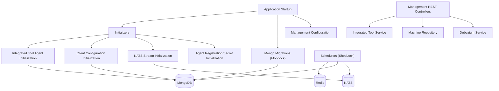
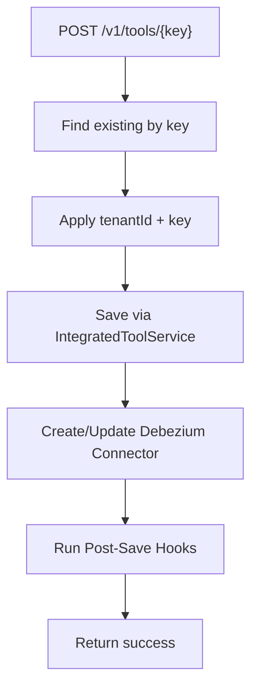
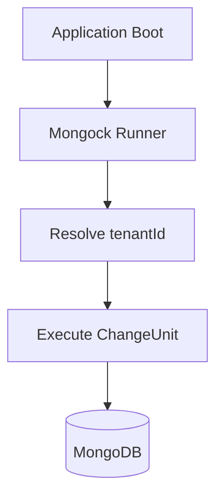

# Management Service Core

The **Management Service Core** module is responsible for operational management, initialization, migrations, scheduled background jobs, and cross-cutting orchestration within the OpenFrame platform.

It acts as the administrative backbone of the system, ensuring that:

- Integrated tools are configured and synchronized
- Agent configurations and versions are initialized and propagated
- Messaging infrastructure (NATS streams) is provisioned
- Database migrations are executed safely and tenant-scoped
- Scheduled operational jobs run reliably with distributed locking
- Critical platform configuration is bootstrapped at startup

This module primarily coordinates services from data, messaging, and integration layers rather than implementing business-domain logic directly.

---

## Architectural Overview

The Management Service Core sits between the infrastructure layer (MongoDB, Redis, NATS, Debezium) and higher-level platform services.



---

# Core Responsibilities

## 1. Configuration Layer

### Management Configuration

**Class:** `ManagementConfiguration`

- Performs component scanning across `com.openframe`
- Excludes `CassandraHealthIndicator` (management service does not expose Cassandra health here)
- Registers a `BCryptPasswordEncoder` bean for secure password hashing

This ensures the management service has cryptographic support and a clean component boundary.

### Retry Configuration

**Class:** `RetryConfiguration`

- Enables Spring Retry (`@EnableRetry`)
- Allows retryable operations for infrastructure calls (e.g., messaging, persistence)

### Distributed Scheduling (ShedLock)

**Class:** `ShedLockConfig`

- Enables scheduling and distributed locking
- Uses Redis-based `LockProvider`
- Tenant-scopes lock keys using `OpenframeRedisKeyBuilder`

Lock key format:

```text
of:{tenantId}:job-lock:{environment}:{lockName}
```

This guarantees:

- No duplicate scheduler execution across cluster nodes
- Tenant isolation for background operations
- Safe horizontal scaling

---

## 2. REST Controllers

The module exposes operational endpoints under `/v1`.

### Device Pinot Resync Controller

**Class:** `DevicePinotResyncController`

Endpoint:

```text
POST /v1/devices/pinot-resync
```

Function:

- Fetches all `Machine` documents
- Triggers `MachineTagEventService.processMachineSaveAll`
- Replays device save events to rehydrate Pinot analytics

Use case:

- Rebuilding analytics projections
- Fixing desynchronized device state in Pinot

---

### Integrated Tool Controller

**Class:** `IntegratedToolController`

Endpoints:

```text
GET  /v1/tools
GET  /v1/tools/{id}
POST /v1/tools/{key}
```

Key characteristics:

- Tools are addressed by `(tenantId, key)`
- `_id` is global and never reused across tenants
- Ensures update-in-place behavior per tenant
- Automatically:
  - Triggers Debezium connector creation/update
  - Executes `IntegratedToolPostSaveHook` extensions

#### Save Flow



Extension Point:

```java
public interface IntegratedToolPostSaveHook {
    void onToolSaved(String toolId, IntegratedTool tool);
}
```

This provides lightweight extensibility without Spring events.

---

### Deprecated Release Version Controller

**Class:** `ReleaseVersionController`

- Deprecated no-op endpoint
- Retained for backward compatibility
- Scheduled for removal

Version initialization is now handled at startup via `OpenFrameClientVersionInitializer`.

---

## 3. Startup Initializers

All initializers implement `ApplicationRunner` and execute in ordered phases.

### Agent Registration Secret Initializer

Ensures an initial `AgentRegistrationSecret` exists.

- Calls `createInitialSecret()`
- Processor hook: `DefaultAgentRegistrationSecretManagementProcessor`

Provides secure agent onboarding.

---

### Integrated Tool Agent Initializer

Loads agent configurations from classpath JSON resources.

Responsibilities:

- Deserialize `IntegratedToolAgentConfiguration`
- Override versions using `ClientVersionsProperties`
- Update persisted configurations

Special handling:

- `meshcentral-agent` → version from `mesh`
- `fleetmdm-agent` → version from `fleet`
- `osquery` asset → version from `osquery`

Ensures deployment-driven version alignment.

---

### NATS Stream Configuration Initializer

Pre-configures required JetStream streams:

```text
TOOL_INSTALLATION
CLIENT_UPDATE
TOOL_UPDATE
TOOL_CONNECTIONS
INSTALLED_AGENTS
```

Each stream:

- Uses File storage
- Uses Limits retention
- Is idempotently saved at startup

Guarantees messaging topology consistency.

---

### OpenFrame Client Configuration Initializer

- Loads `client-configuration.json`
- Updates Mongo document fields

Ensures client-side configuration is seeded before version propagation.

---

### OpenFrame Client Version Initializer

- Reads `openframe.client-versions.client`
- Delegates to `ClientVersionService.process()`
- Triggers republish of client + tool agents

Order of execution ensures:

1. Agents exist
2. Client configuration exists
3. Version propagation runs last

---

## 4. Mongo Migrations (Mongock)

The module defines tenant-scoped `@ChangeUnit` migrations.

Categories include:

- Document version backfill
- Ticket lifecycle migration
- Ticket ordering normalization (LexoRank)
- Device archival logic
- Time-entry organization backfill
- Notification TTL alignment
- AI agent settings seeding

### Migration Execution Model



Characteristics:

- Idempotent
- Tenant-aware
- Feature-flag gated where required
- Safe for multi-tenant environments

---

## 5. Scheduled Background Jobs

All critical schedulers use Redis-based distributed locks.

### Agent Version Update Publish Fallback Scheduler

- Retries unpublished client or tool-agent updates
- Uses publish attempt limits
- Ensures eventual consistency in NATS propagation

---

### API Key Stats Sync Scheduler

- Synchronizes API key statistics
- Redis → MongoDB
- Uses distributed lock

---

### Device Heartbeat Offline Detection Scheduler

- Periodically marks stale devices offline
- Delegates to `DeviceHeartbeatOfflineDetectionService`

---

### Fleet MDM Setup Scheduler

- Watches for `fleetmdm-server` tool
- Executes setup if needed
- Idempotent retry model

---

## 6. Version & Publish Coordination

### OpenFrame Client Version Update Service

Coordinates version updates via NATS publisher:

- Publishes client update
- Ensures tool agents are aligned

This integrates with the fallback scheduler for resilience.

---

# Data & Infrastructure Integration

The Management Service Core integrates with:

- **MongoDB** (migrations, configuration, tickets, agents)
- **Redis** (distributed locks, stats)
- **NATS JetStream** (client/tool update streams)
- **Debezium** (tool connectors)
- **Pinot** (device analytics resync)

It does not directly implement business logic, but ensures that all infrastructure-driven workflows remain consistent, version-aligned, and operationally safe.

---

# Design Principles

1. **Tenant Isolation First**  
   All migrations and scheduled jobs are tenant-aware.

2. **Idempotent Initialization**  
   Startup routines can run repeatedly without corrupting state.

3. **Distributed-Safe Scheduling**  
   All critical schedulers use Redis-backed ShedLock.

4. **Event-Driven Propagation**  
   Version and configuration changes propagate via NATS.

5. **Extensibility Without Overhead**  
   Lightweight hook interfaces instead of heavy event systems.

---

# Summary

The **Management Service Core** module provides the operational control plane of OpenFrame. It ensures:

- Correct system bootstrapping
- Reliable distributed scheduling
- Safe schema evolution
- Tool lifecycle orchestration
- Version propagation
- Messaging topology initialization

Without this module, the platform would lack coordinated startup behavior, tenant-safe migrations, and resilient background task execution.

It is foundational to maintaining consistency, scalability, and operational reliability across the OpenFrame ecosystem.