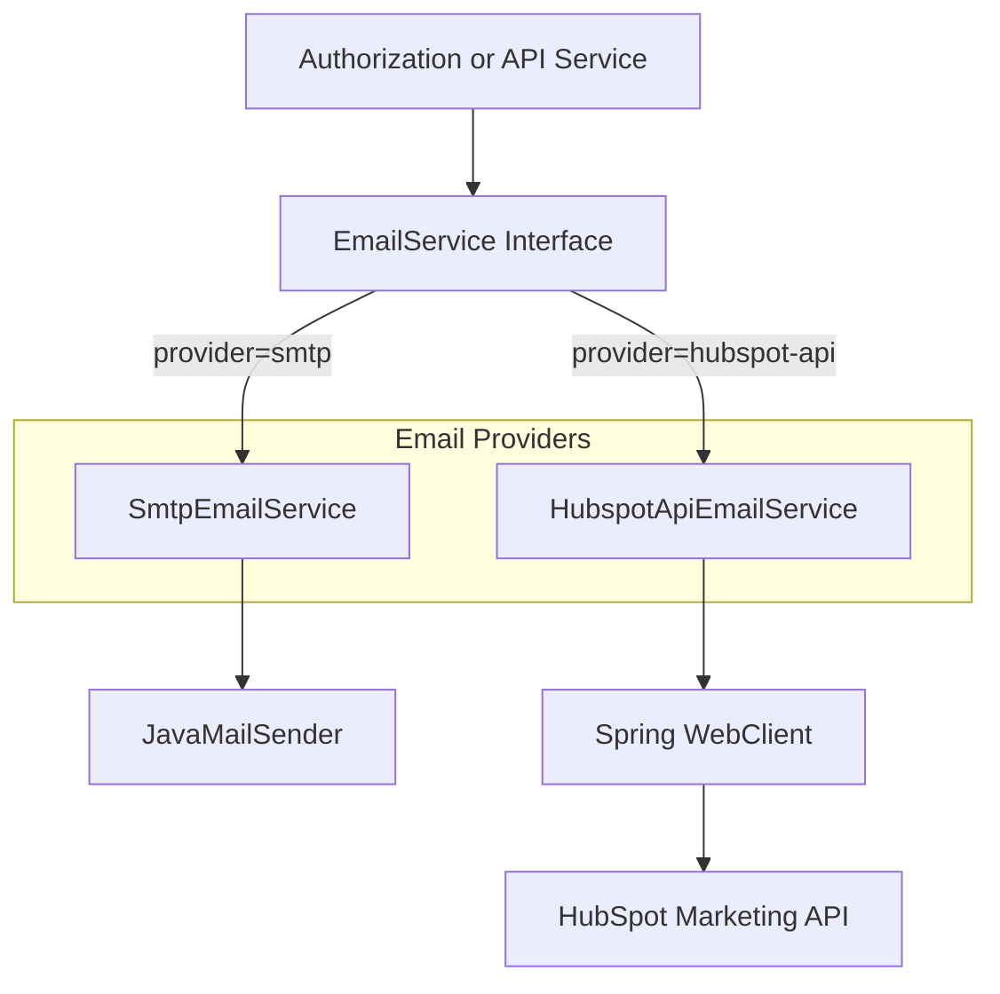
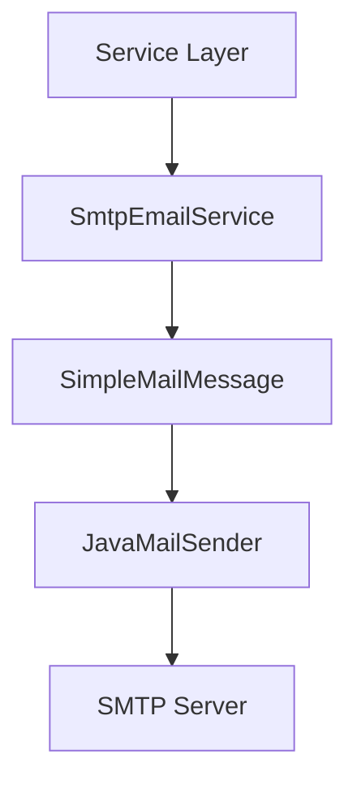
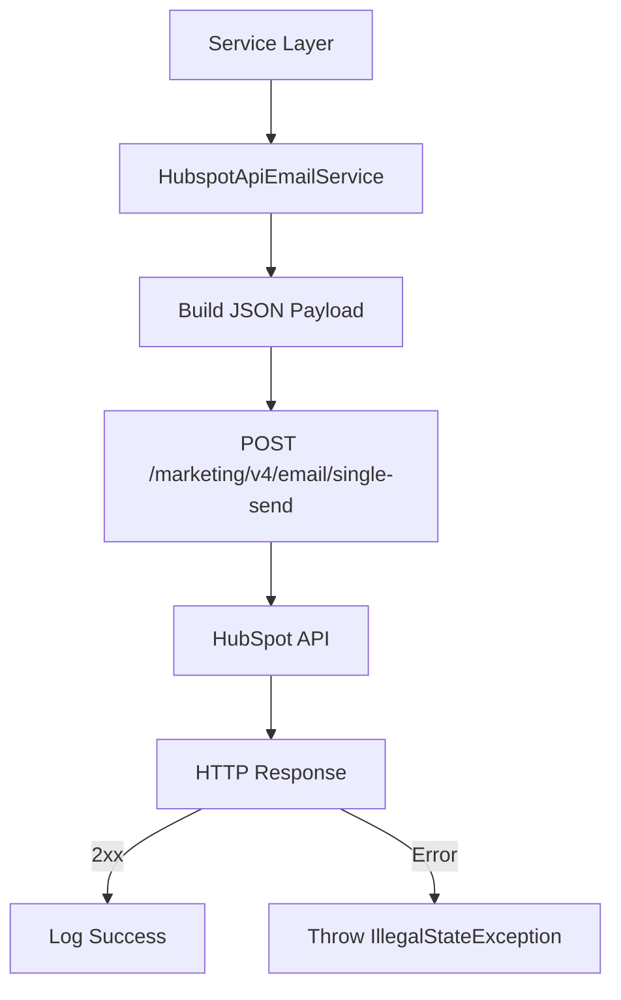
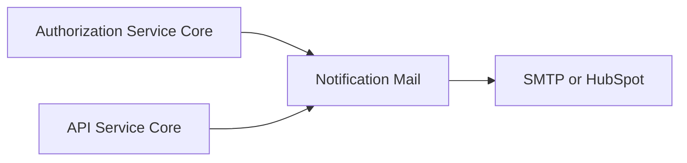

# Notification Mail

## Overview

The **Notification Mail** module is responsible for delivering transactional emails across the OpenFrame platform. It provides a pluggable email delivery abstraction that supports multiple providers while exposing a unified `EmailService` contract to the rest of the system.

Currently, the module supports:

- **SMTP-based email delivery** (default)
- **HubSpot Marketing API-based email delivery**

This module is typically invoked by higher-level services such as:

- Invitation flows (user onboarding)
- Password reset flows
- Email verification flows

It integrates with identity, authorization, and user management components in modules such as Authorization Service Core and API Service Core.

---

## Architecture Overview

The Notification Mail module follows a provider-based strategy pattern using Spring Boot conditional configuration.



### Key Design Principles

- **Abstraction First** – All callers depend on the `EmailService` interface.
- **Provider Selection via Configuration** – Controlled by the `openframe.mail.provider` property.
- **Environment Flexibility** – SMTP for local/simple deployments, HubSpot API for production-grade marketing templates.

---

## Provider Selection

The active provider is selected via Spring Boot conditional annotations:

```text
Property: openframe.mail.provider
Values:
  - smtp (default)
  - hubspot-api
```

- If set to `smtp`, `SmtpEmailService` is activated.
- If set to `hubspot-api`, `HubspotApiEmailService` is activated.
- If not set, SMTP is used by default (`matchIfMissing = true`).

---

## Core Responsibilities

The module implements three primary transactional email flows:

1. **Invitation Email** – Sent when a user is invited to join a workspace.
2. **Password Reset Email** – Sent when a password reset is requested.
3. **Email Verification Email** – Sent to verify a newly registered email address.

These flows are triggered from identity-related modules such as:

- Authorization Service Core (registration, login, password reset)
- API Service Core (user management operations)

---

# Email Providers

## SMTP Email Service

**Class:** `SmtpEmailService`  
Activated when:

```text
openframe.mail.provider=smtp
```

### Characteristics

- Uses Spring's `JavaMailSender`
- Sends plain text emails
- Simple and environment-friendly
- Suitable for development or minimal deployments

### Supported Flows

- ✅ Invitation email
- ✅ Password reset email
- ❌ Email verification (explicitly unsupported)

Attempting to send verification via SMTP results in:

```text
UnsupportedOperationException("Email verification via SMTP is not supported; use HubSpot provider")
```

### Flow Diagram



### Link Template Usage

SMTP provider uses configurable link templates:

```text
openframe.invitations.link-template
openframe.password-reset.link-template
```

Placeholders:

```text
Invitation: {id}
Password Reset: {token}
```

---

## HubSpot API Email Service

**Class:** `HubspotApiEmailService`  
Activated when:

```text
openframe.mail.provider=hubspot-api
```

### Characteristics

- Uses `Spring WebClient`
- Calls HubSpot Marketing API (`/marketing/v4/email/single-send`)
- Supports template-based email delivery
- Supports invitation, password reset, and email verification
- Blocking execution via `.block()` for deterministic transactional behavior

### Required Configuration

```text
openframe.mail.hubspot.base-url
openframe.mail.hubspot.access-token
openframe.mail.hubspot.invitation-email-id
openframe.mail.hubspot.reset-email-id
openframe.mail.hubspot.verify-email-id
openframe.mail.from
```

### Link Templates

```text
openframe.invitations.link-template
openframe.password-reset.link-template
openframe.email-verify.link-template
```

Placeholders:

```text
Invitation: {id}
Password Reset: {token}
Email Verification: {token}
```

### API Interaction Flow



### Payload Structure

```json
{
  "emailId": "template-id",
  "message": {
    "to": "recipient@example.com",
    "from": "noreply@openframe.ai",
    "subject": "Subject line"
  },
  "customProperties": {
    "link": "https://app.openframe.ai/..."
  }
}
```

### Error Handling

- Successful responses (2xx) log informational messages.
- Non-success responses:
  - Response body is read
  - An `IllegalStateException` is thrown with status and body

This ensures transactional consistency during user flows (e.g., failing fast if invitation email cannot be sent).

---

## Configuration Reference

### Common Configuration

```text
openframe.mail.provider
openframe.mail.from
openframe.invitations.link-template
openframe.password-reset.link-template
openframe.email-verify.link-template
```

### SMTP-Specific

Relies on standard Spring Boot mail configuration:

```text
spring.mail.host
spring.mail.port
spring.mail.username
spring.mail.password
spring.mail.properties.*
```

### HubSpot-Specific

```text
openframe.mail.hubspot.base-url
openframe.mail.hubspot.access-token
openframe.mail.hubspot.invitation-email-id
openframe.mail.hubspot.reset-email-id
openframe.mail.hubspot.verify-email-id
```

---

## Integration Within the Platform

The Notification Mail module integrates primarily with identity and user lifecycle modules.



Typical trigger points:

- Invitation creation
- Password reset request
- Email verification request

The module does not manage tokens, user validation, or invitation lifecycle. Those responsibilities belong to:

- Authorization Service Core
- Security Core
- API Service Core

Notification Mail is strictly responsible for **delivery**.

---

## Operational Considerations

### 1. Blocking vs Reactive

Although `HubspotApiEmailService` uses `WebClient`, it calls `.block()` to ensure:

- Deterministic behavior in transactional flows
- Immediate failure propagation

This is intentional to prevent silent email delivery failures during critical authentication flows.

### 2. Template Safety

All links rely on placeholder replacement:

```text
{token}
{id}
```

Improper template configuration can result in malformed links.

### 3. Provider Migration Strategy

Switching providers requires only configuration changes:

```text
openframe.mail.provider=smtp
```

or

```text
openframe.mail.provider=hubspot-api
```

No application code changes are required.

---

## Summary

The **Notification Mail** module provides:

- A clean `EmailService` abstraction
- SMTP-based email delivery (default)
- HubSpot API-based template email delivery
- Transactional email support for onboarding and authentication flows
- Configuration-driven provider selection

It acts as a delivery boundary between core identity logic and external email infrastructure, ensuring the OpenFrame platform remains modular, configurable, and provider-agnostic.