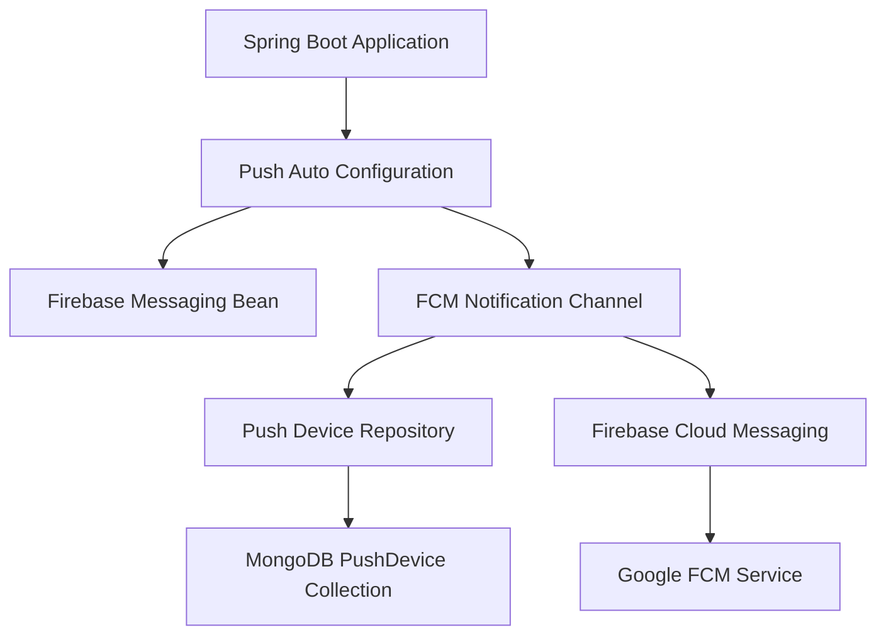
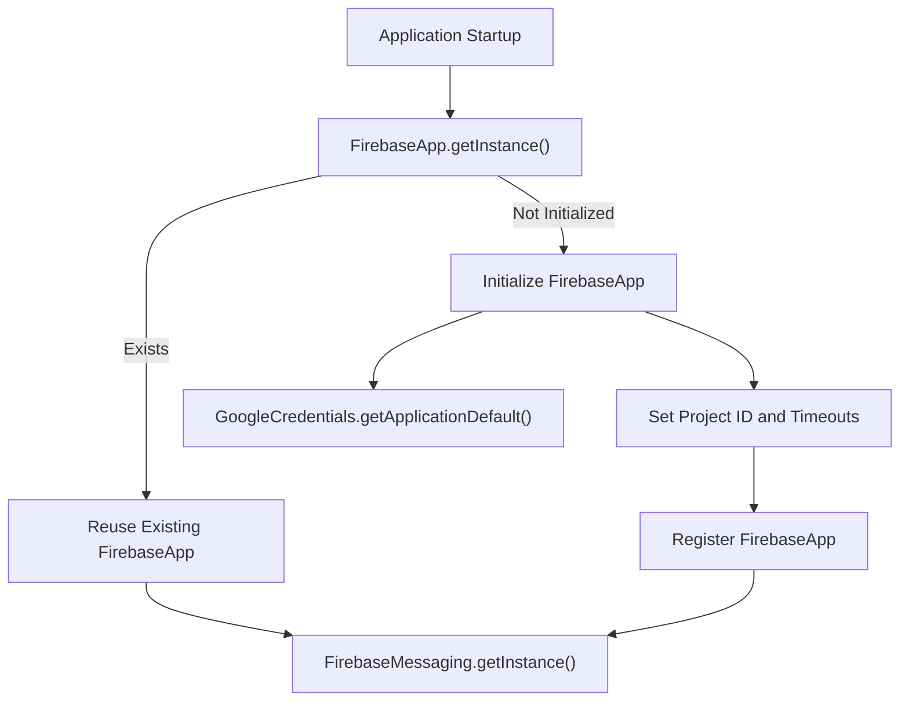
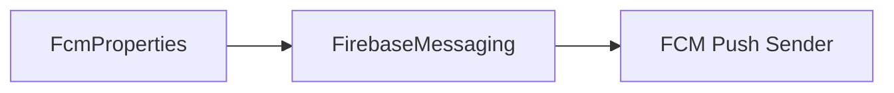
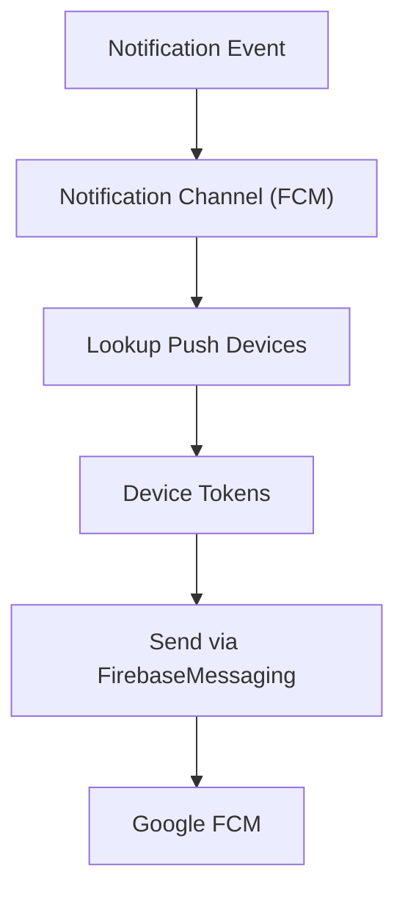
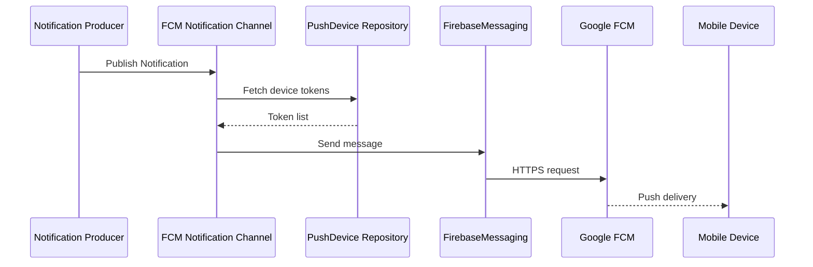

# Notification Push

The **Notification Push** module provides Firebase Cloud Messaging (FCM)-based push delivery for OpenFrame. It integrates with the platform’s messaging infrastructure and device registry to deliver real-time notifications to registered client devices.

This module is implemented as a Spring Boot auto-configuration and is conditionally enabled via configuration properties. When activated, it registers an FCM-backed `NotificationChannel` that plugs into the broader event and notification pipeline.

---

## Purpose and Responsibilities

The Notification Push module is responsible for:

- Initializing and configuring the Firebase SDK (FCM)
- Providing a `FirebaseMessaging` bean for push delivery
- Registering an FCM-backed `NotificationChannel`
- Integrating with the push device repository for token lookup
- Enabling/disabling push via configuration (`openframe.features.push.enabled`)

It does **not**:

- Define notification domain models (handled in data modules)
- Manage notification lifecycle (created, read, retention)
- Expose REST or GraphQL APIs directly

Instead, it acts as an infrastructure bridge between the notification domain and Firebase.

---

## High-Level Architecture



### Explanation

1. Spring Boot loads auto-configurations.
2. If `openframe.features.push.enabled=true`, `PushAutoConfiguration` is activated.
3. A `FirebaseMessaging` bean is created (if not already present).
4. An FCM-based `NotificationChannel` is registered.
5. When notifications are published, this channel sends messages to FCM using stored device tokens.

---

## Auto-Configuration Design

The module uses Spring Boot’s `@AutoConfiguration` mechanism.

### Conditional Activation

```text
@ConditionalOnProperty(
  name = "openframe.features.push.enabled",
  havingValue = "true"
)
```

Push support is enabled only when the feature flag property is set.

### Bean Registration

Two primary beans are registered:

1. `FirebaseMessaging`
2. `NotificationChannel` (FCM implementation)

If another `FirebaseMessaging` bean already exists, this module respects it due to `@ConditionalOnMissingBean`.

---

## Firebase Initialization Flow



### Key Points

- Uses `GoogleCredentials.getApplicationDefault()` for authentication.
- Project ID and timeouts are sourced from `FcmProperties`.
- Reuses an existing `FirebaseApp` if already initialized.
- Logs successful enablement of FCM push.

This makes the module safe for multi-module or multi-context Spring Boot applications.

---

## Core Components

### 1. Push Auto Configuration

**Class:** `PushAutoConfiguration`

Responsibilities:

- Registers FCM integration
- Binds configuration properties (`FcmProperties`)
- Exposes infrastructure beans

Key dependencies:

- `FirebaseMessaging`
- `PushDeviceRepository`
- `ObjectMapper`
- `NotificationChannel`

---

### 2. Firebase Messaging Bean



This bean:

- Connects to Firebase
- Uses application default credentials
- Configures connect and read timeouts

It serves as the low-level transport client.

---

### 3. FCM Notification Channel

The module registers a `NotificationChannel` backed by an FCM sender implementation.

Dependencies:

- `FirebaseMessaging` – sends push messages
- `PushDeviceRepository` – retrieves device tokens
- `ObjectMapper` – serializes payloads
- `FcmProperties` – configuration values

Conceptually:



---

## Integration with Other Modules

The Notification Push module integrates with several platform layers:

### Data Layer

- `PushDevice` documents (MongoDB)
- `PushDeviceRepository` for token persistence and lookup

This ensures notifications are delivered only to registered devices.

### Notification Domain

- `Notification` documents
- `NotificationReadState`
- `NotificationSettings`

The push channel reacts to notification events created elsewhere in the system.

### Messaging Infrastructure

- `NotificationChannel` abstraction
- NATS-based messaging layer

Push is one concrete implementation of the notification channel abstraction. Other modules (such as email) may provide additional channel implementations.

---

## Configuration

Push is controlled via application properties.

### Feature Flag

```text
openframe.features.push.enabled=true
```

If omitted or set to false, the entire module is inactive.

### FCM Properties (Conceptual)

```text
openframe.fcm.project-id=<your-project-id>
openframe.fcm.connect-timeout=5s
openframe.fcm.read-timeout=5s
```

Authentication relies on Google Application Default Credentials, typically configured via:

- `GOOGLE_APPLICATION_CREDENTIALS` environment variable
- GCP runtime identity (if deployed on Google Cloud)

---

## Multi-Tenancy Considerations

The module itself does not implement tenant routing logic. Instead:

- Tenant context is handled upstream
- Device repository queries are tenant-scoped
- Notification publishing infrastructure carries tenant metadata

This ensures push notifications are delivered only within the correct tenant boundary.

---

## Error Handling and Resilience

The initialization logic:

- Avoids duplicate Firebase initialization
- Logs activation status
- Relies on Firebase SDK retry semantics for delivery

Failure scenarios:

- Missing Google credentials → startup failure when push is enabled
- Invalid project ID → FCM delivery errors
- Network timeouts → controlled via configurable timeout values

---

## End-to-End Notification Flow



---

## Extensibility

The Notification Push module is designed to be extensible:

- Custom `FirebaseMessaging` bean can override default
- Additional notification channels can coexist
- Alternative push providers could implement `NotificationChannel`

Because it relies on auto-configuration and conditional bean registration, it integrates cleanly into Spring Boot applications without requiring explicit component scanning.

---

## Summary

The **Notification Push** module is the infrastructure layer that enables real-time push notifications in OpenFrame using Firebase Cloud Messaging.

It:

- Activates via feature flag
- Initializes Firebase safely
- Registers an FCM-backed `NotificationChannel`
- Integrates with tenant-scoped push device storage
- Connects the internal notification system to external mobile/web clients

This module plays a critical role in delivering real-time user experiences while remaining cleanly separated from domain and API logic.