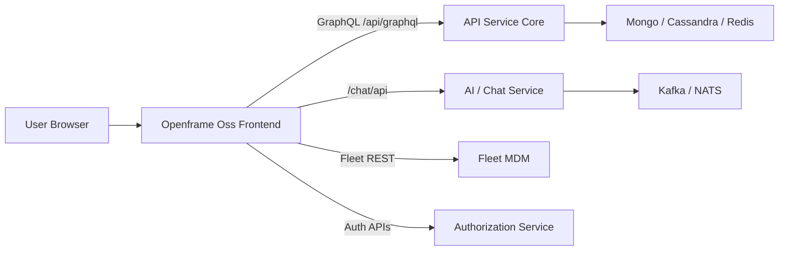
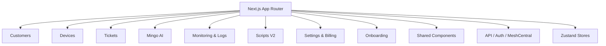
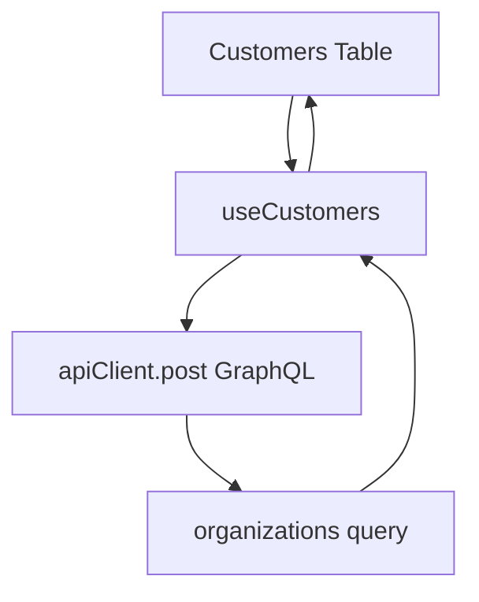
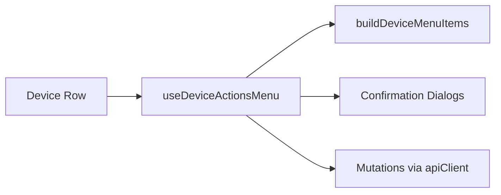
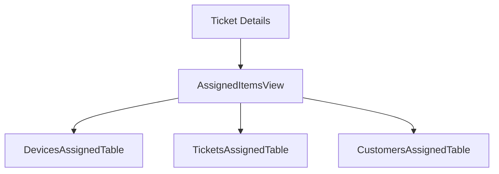
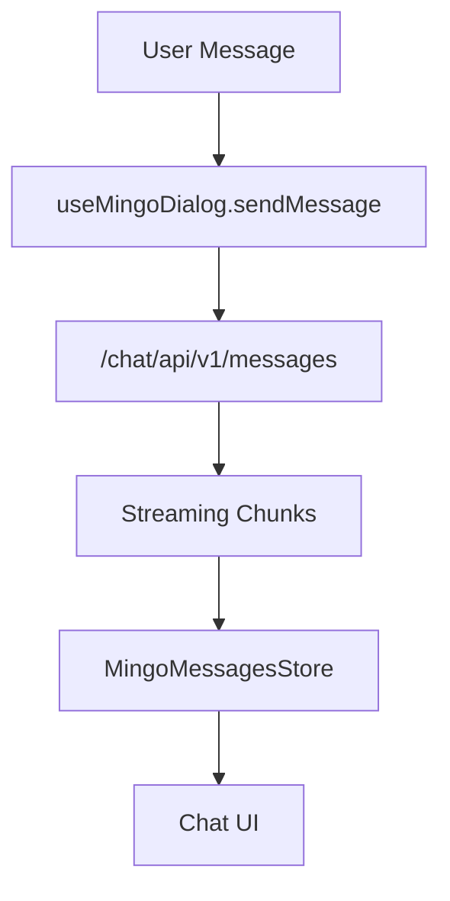
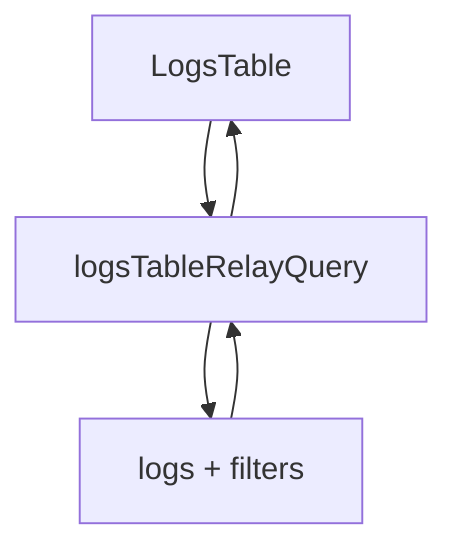
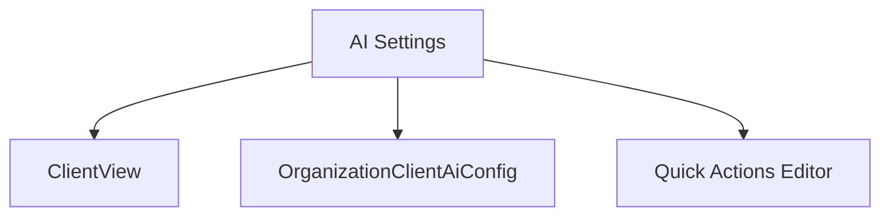
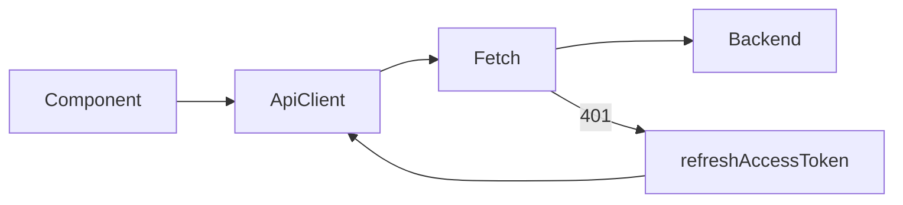

# Openframe Oss Frontend

## Overview

**Openframe Oss Frontend** is the primary web application for the OpenFrame platform. It provides a unified, AI-driven interface for MSP operations including:

- Customer and device management  
- AI assistant configuration (Mingo / Customer AI)  
- Ticketing and knowledge base  
- Monitoring, logs, and scripts  
- Billing, onboarding, and settings  

The module is implemented as a modern React + Next.js application and integrates with multiple backend services via GraphQL and REST APIs.

---

## High-Level Architecture

Openframe Oss Frontend acts as the presentation and orchestration layer on top of OpenFrame backend services.

### Responsibilities

- Render all operational UI (devices, tickets, monitoring, scripts).
- Orchestrate AI interactions (Mingo, customer AI assistants).
- Manage authentication tokens and session lifecycle.
- Maintain client-side state via React Query and Zustand.
- Handle optimistic UI updates for mutations (tickets, tags, assignments, etc.).

---

## Application Structure

The module is organized by feature domains under `src/app` and shared infrastructure under `src/lib`, `src/components`, and `src/stores`.

---

# Core Feature Domains

## Customers Domain

Key components:

- `CustomerAiAssistantAppearance`  
- `CustomerAiConfiguration`  
- `CustomerGuardrailsSettings`  
- `CustomersTableBody`  
- `useCustomers`, `useCustomerDeviceCounts`

### Responsibilities

- Render customer list with server-side pagination.
- Provide per-customer AI overrides (appearance + LLM config).
- Manage guardrails templates and per-organization overrides.
- Display aggregated device counts per organization.

### Data Flow (Customers List)

- Uses `useInfiniteQuery` (React Query) for cursor-based pagination.
- Maps GraphQL nodes to UI-safe `Customer` objects.

---

## Devices Domain

Key elements:

- Unified `Device` type (single source of truth).
- `useDeviceActionsMenu` for contextual actions.
- `DevicesPanel` (table + grid modes).
- `MeshDesktop` and file manager integrations.

### Device Model

The `Device` interface consolidates:

- Hardware and OS details  
- Installed software and vulnerabilities  
- Tool connections (Fleet, MeshCentral)  
- Policies and tags  

This avoids nested or duplicated device shapes across the app.

### Device Actions Architecture

- Centralized action availability via `getDeviceActionAvailability`.
- Supports archive, unarchive, delete, remote shell, file manager.

---

## Tickets Domain

Key parts:

- `TicketTableBody`  
- `TicketNotesSection`  
- `AssignedItemsView`  
- Dialog and Message types

### Responsibilities

- Display and filter tickets (status, assignee, organization).
- Render notes and attachments.
- Integrate AI approval flows.
- Support assignment of devices, customers, and knowledge items.

### Assignment Architecture

Assignments are normalized and shared across entity types via a common abstraction layer.

---

## Mingo AI (Chat) Domain

Key elements:

- `useMingoDialog`  
- `MingoMessagesStore`  
- `MingoContextStore`  
- Context entity system (`ContextRef`)

### Streaming & State Model

- Uses Zustand to manage per-dialog messages and streaming state.
- Maintains segment accumulators for tool execution and approval batches.
- Tracks `highestStreamSeq` per dialog to prevent duplication.

### Context System

The Mingo context layer:

- Tracks currently open entity (device, ticket, KB article).
- Persists recent views.
- Sends structured `{ type, id }` context items with each message.

---

## Monitoring & Logs

Key components:

- `LogsTable` (Relay-based pagination).  
- `useLogDetails`.  
- `PoliciesTable`, `QueriesTable`.

### Logs Data Flow

- Cursor-based pagination via Relay.
- Date-range filtering integrated into header controls.
- Supports device-level and organization-scoped views.

---

## Scripts (V2)

- Script list, detail, edit, and run views.
- Schedule assignment via `ScheduleAssignDevicesView`.
- Autocomplete via Relay (`useScheduleScriptsAutocomplete`).

Scripts integrate closely with:

- Device selection components.
- Fleet API endpoints.
- Monitoring for execution results.

---

## Settings & Billing

Key areas:

- AI settings (provider, model, quick actions).
- Tenant info management.
- Subscription cancellation and impact preview.
- Billing provisioning status polling.

### AI Settings Structure

- Separates appearance (ClientView) from AI logic (provider/model).
- Supports tenant defaults and per-organization overrides.

---

# Shared Infrastructure

## API Layer

`ApiClient` centralizes:

- Base URL resolution (tenant-aware).  
- Cookie or Bearer token authentication.  
- Automatic token refresh with single-flight logic.  
- Unified error handling.

- Prevents duplicate refresh requests.
- Handles forced logout on unrecoverable auth failures.

---

## State Management

Openframe Oss Frontend uses:

- **React Query** → server-state caching and pagination.  
- **Relay** → streaming and GraphQL fragments (logs, scripts).  
- **Zustand** → UI/session state (feature flags, onboarding, Mingo).

Key stores:

- `FeatureFlagsState`  
- `OnboardingState`  
- `MingoMessagesStore`  
- `MingoContextStore`  
- `LogoutConfirmStore`

---

## MeshCentral Integration

The frontend includes a custom desktop client:

- `MeshDesktop`  
- `RemoteDesktopSettings`  
- Binary frame decoder + tile rendering  

This enables:

- Remote desktop streaming.  
- File manager access.  
- Keyboard/mouse event encoding.

---

# Design Principles

1. **Single Source of Truth Types**  
   Unified domain models (`Device`, `Dialog`, `TenantInfo`) avoid divergent shapes.

2. **Override + Inheritance Model**  
   Many features support:
   - Tenant default  
   - Per-organization override  
   - Reset to inherit default

3. **Optimistic & Streaming UX**  
   - Streaming AI messages.  
   - Optimistic mutations for tags and assignments.  
   - Infinite scroll and cursor pagination.

4. **Strict Separation of Concerns**  
   - Domain hooks encapsulate API logic.  
   - Shared UI components live under `components/shared`.  
   - Cross-cutting logic (auth, deployment, flags) lives under `lib` and `stores`.

---

# How It Fits Into OpenFrame

Openframe Oss Frontend is the human-facing layer of the OpenFrame ecosystem:

- **API Service Core** → business logic and persistence.  
- **Authorization Service** → OAuth, SSO, tenant scoping.  
- **Stream Service Core** → event ingestion (Kafka/NATS).  
- **Fleet MDM / MeshCentral** → device control and telemetry.  

The frontend binds these systems into a cohesive, AI-first MSP experience.

---

## Summary

Openframe Oss Frontend is a modular, feature-driven Next.js application that:

- Centralizes AI-driven operations (Mingo + customer assistants).  
- Unifies device, ticket, monitoring, and scripting workflows.  
- Enforces tenant-aware configuration and override patterns.  
- Provides resilient client-side state and streaming UX.

It serves as the orchestration layer connecting OpenFrame’s backend services into a unified operational interface for modern MSPs.