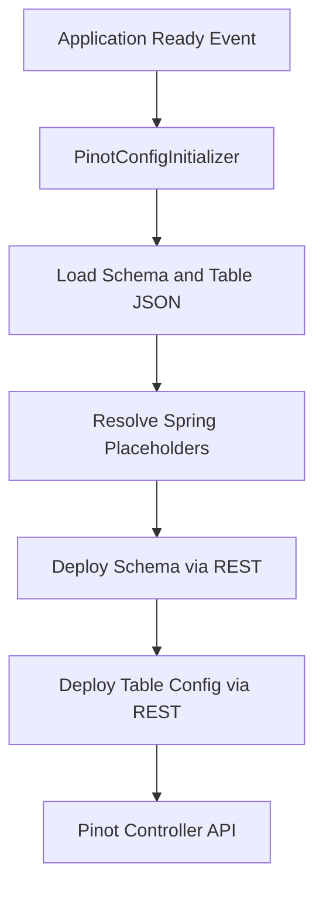
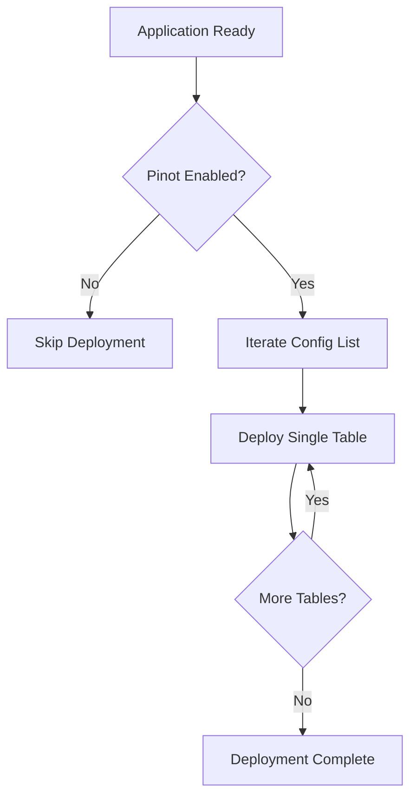
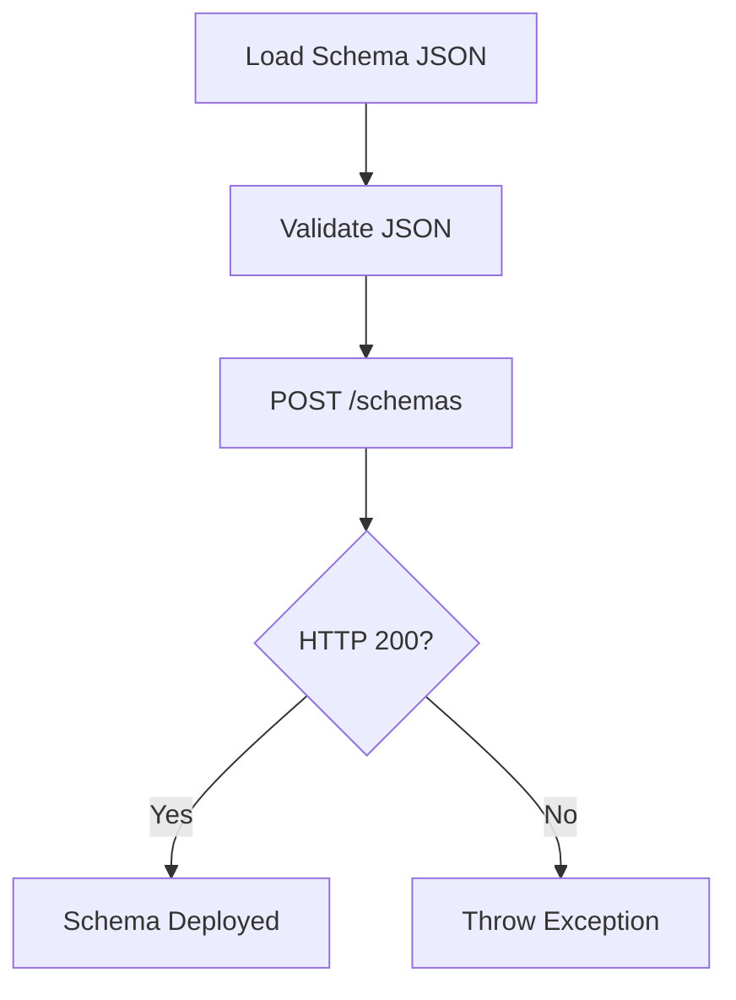
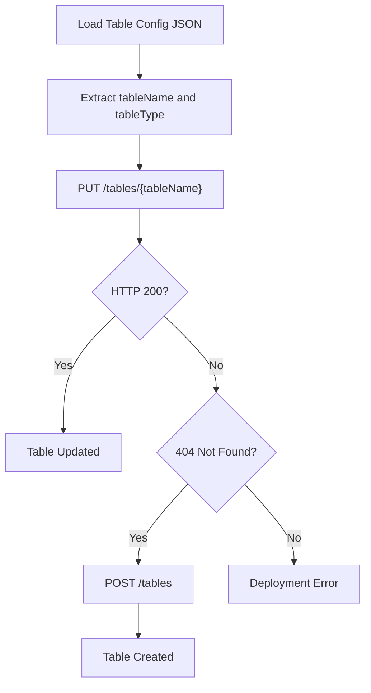
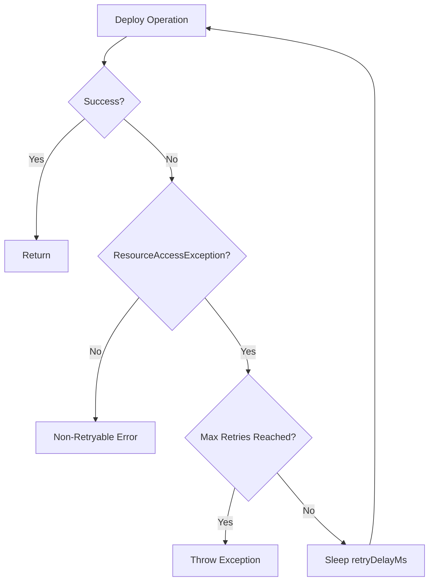
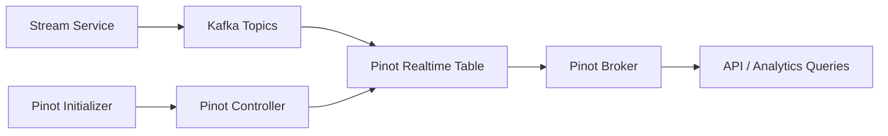

# Pinot Initializer

The **Pinot Initializer** module is responsible for automatically deploying and synchronizing Apache Pinot schemas and table configurations when the application starts.

It ensures that required analytics tables (such as devices and logs) exist in the Pinot cluster and are up to date. This module eliminates manual Pinot setup and keeps analytical storage aligned with the application’s domain model and streaming pipelines.

---

## 1. Purpose and Responsibilities

The Pinot Initializer performs the following responsibilities:

- Deploys Pinot **schemas** and **table configurations** at application startup
- Supports both **REALTIME** and optional **OFFLINE** tables
- Resolves Spring environment placeholders inside configuration files
- Retries deployment when Pinot controller is temporarily unavailable
- Updates existing tables or creates them if missing

This module is typically used alongside:

- Streaming ingestion (Kafka → Pinot)
- Data producers emitting analytics events (devices, logs, etc.)
- Pinot Broker and Controller services

---

## 2. Core Component

### PinotConfigInitializer

`PinotConfigInitializer` is a Spring `@Configuration` component that listens for `ApplicationReadyEvent` and triggers deployment logic.

Key features:

- Automatic execution after the application starts
- Configurable enable/disable switch
- Retry mechanism with backoff
- JSON validation before submission
- Idempotent table deployment (update if exists, create if missing)

---

## 3. High-Level Architecture



The initializer interacts directly with the **Pinot Controller REST API** to:

- POST schemas
- PUT existing table configurations
- POST new table configurations when missing

---

## 4. Configuration Model

The module maintains an internal list of table configurations:

```text
Tables:
- devices
  - schema-devices.json
  - table-config-devices.json

- logs
  - schema-logs.json
  - table-config-logs-realtime.json
```

Each entry includes:

- Logical name
- Schema file
- Realtime table config file
- Optional offline table config file

All configuration files are loaded from:

```text
classpath:pinot/config/
```

---

## 5. Deployment Lifecycle

### Startup Flow



If one table fails, the initializer logs the failure and continues processing remaining tables. At the end, a summary is logged indicating success or failure.

---

## 6. Schema Deployment Process



Important characteristics:

- JSON is parsed before sending (prevents malformed payloads)
- HTTP headers enforce `application/json`
- Any non-200 response is treated as failure

---

## 7. Table Deployment Strategy (Idempotent)

Table deployment is designed to be safe across multiple restarts.



Behavior:

- Attempts update first
- If table does not exist (404), creates it
- Supports REALTIME and OFFLINE suffix handling

REALTIME tables are deployed with the `_REALTIME` suffix.
OFFLINE tables use the `_OFFLINE` suffix.

---

## 8. Retry Mechanism

The module includes retry logic for transient connectivity issues.

### Retry Conditions

- Retries only on `ResourceAccessException` (typically network issues)
- Stops retrying on other exception types

### Retry Flow



Configurable properties:

```text
pinot.controller.url
pinot.config.enabled=true
pinot.config.retry.max-attempts=5
pinot.config.retry.delay-ms=5000
```

---

## 9. Environment Placeholder Resolution

Before sending JSON to Pinot, placeholders are resolved using Spring’s environment:

```text
${property.name}
```

This enables:

- Tenant-aware configurations
- Environment-specific broker URLs
- Dynamic ingestion topic configuration

If a placeholder is missing, deployment fails early.

---

## 10. Error Handling Strategy

The Pinot Initializer distinguishes between:

1. **Retryable errors** – Temporary connectivity issues
2. **Non-retryable errors** – Invalid JSON, HTTP errors, misconfiguration

Failures are:

- Logged with stack traces
- Aggregated across tables
- Reported at the end of startup

The application continues running even if deployment fails, but analytics tables may be stale or missing.

---

## 11. Integration with the Platform

The Pinot Initializer fits into the broader data pipeline as follows:



It ensures that:

- Required schemas exist before ingestion begins
- Table structures match the expected event format
- Analytics queries operate against properly configured tables

---

## 12. Operational Considerations

### Safe for Restarts

- Idempotent table updates
- Schema redeployment allowed

### Failure Scenarios

- Pinot controller not reachable → retries
- Invalid configuration JSON → immediate failure
- Missing resource file → startup error for that table

### Deployment Strategy Recommendation

In production environments:

- Keep `pinot.config.enabled=true`
- Ensure Pinot controller is reachable at startup
- Monitor logs for deployment status

---

## 13. Summary

The **Pinot Initializer** module provides:

- Automated Pinot schema and table management
- Retry-aware deployment
- Idempotent configuration updates
- Startup-time synchronization with analytics infrastructure

It acts as the bridge between application domain models and Pinot’s analytical storage layer, ensuring the system remains operationally consistent and deployment-friendly.