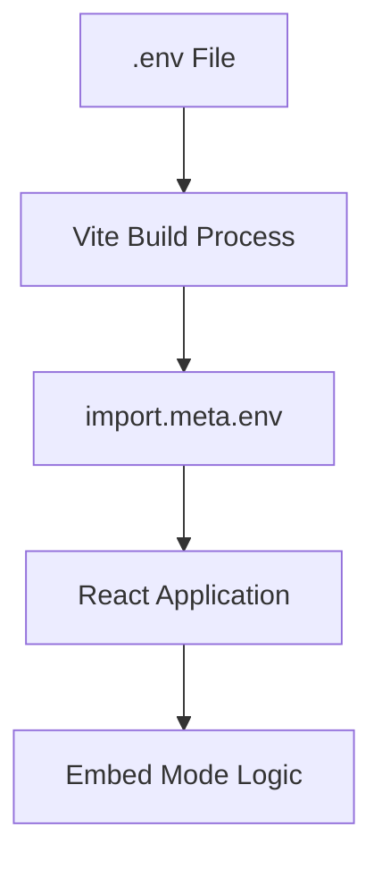
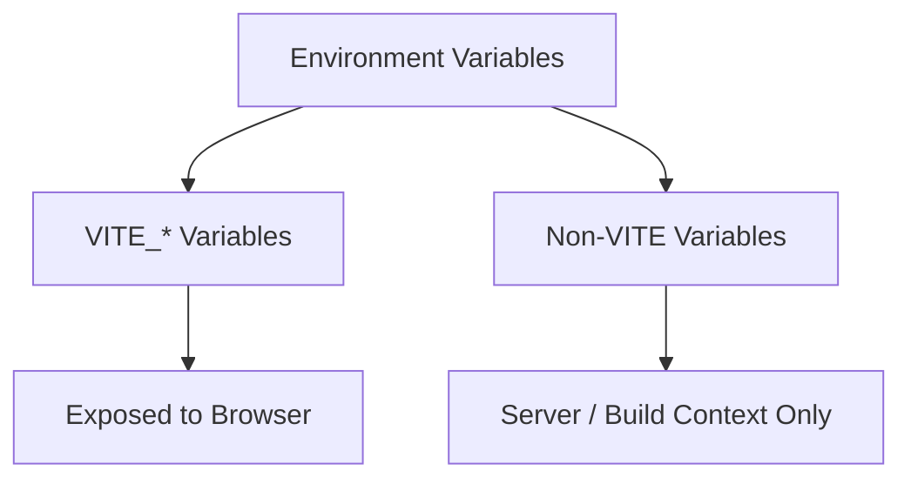
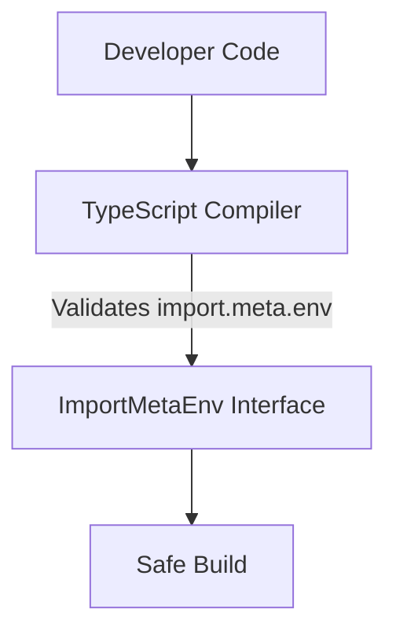
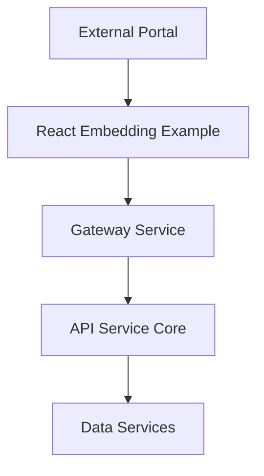

# React Embedding Example

The **React Embedding Example** module demonstrates how to embed OpenFrame functionality inside a standalone React application using Vite. It acts as a minimal reference implementation that shows how to:

- Bootstrap a Vite-based React app
- Configure environment variables for embed mode
- Integrate with OpenFrame hub origins
- Safely expose public runtime configuration to the frontend

Although the code footprint is intentionally small, this module plays an important role as a blueprint for third-party integrations and custom frontend embeddings.

---

## 1. Purpose and Scope

The React Embedding Example is designed to:

- Serve as a **reference implementation** for embedding OpenFrame UI components.
- Demonstrate **environment-driven configuration** using Vite.
- Provide a clean boundary between host applications and OpenFrame services.
- Document best practices for exposing safe, public environment variables.

This module is not a production system component. Instead, it acts as a:

- Developer onboarding sample
- Integration template
- Testing harness for embed scenarios

---

## 2. Core Component

### `vite-env.d.ts`

This file extends Vite's built-in typing system and defines the environment contract used by the application.

```typescript
/// <reference types="vite/client" />

interface ImportMetaEnv {
  /** Public hub origin for new-tab content links (embed mode). */
  readonly VITE_HUB_ORIGIN?: string
}

interface ImportMeta {
  readonly env: ImportMetaEnv
}
```

### Responsibilities

1. **Augment Vite Type Definitions**  
   Ensures TypeScript recognizes `import.meta.env` properties.

2. **Define Public Embed Configuration**  
   Introduces `VITE_HUB_ORIGIN` as an optional runtime configuration value.

3. **Provide Compile-Time Safety**  
   Prevents accidental use of undefined environment variables.

---

## 3. Environment Configuration Architecture

The React Embedding Example relies on Vite’s environment variable system.

### Configuration Flow



### Key Concepts

- Only variables prefixed with `VITE_` are exposed to the client.
- `VITE_HUB_ORIGIN` is intentionally optional.
- All environment variables are statically injected at build time.

---

## 4. Embed Mode Design

In embed mode, the application may need to open certain links in a new tab that point back to a central OpenFrame hub.

### Example Use Case

- Embedded chat component inside a third-party portal.
- Clicking a "View Full Context" button opens the full OpenFrame hub in a new tab.

### Logical Interaction


If `VITE_HUB_ORIGIN` is defined:

- Links are constructed using that origin.
- Navigation occurs in a separate browser context.

If not defined:

- The application can fallback to relative navigation.
- Or disable hub-bound features gracefully.

---

## 5. Security Model

The React Embedding Example follows Vite’s security principles:

### Public vs Private Variables



**Important:**
- `VITE_HUB_ORIGIN` is safe for client exposure.
- Secrets must never use the `VITE_` prefix.

---

## 6. Type Safety Strategy

By extending `ImportMetaEnv`, the module ensures:

- Autocomplete support in IDEs
- Static validation of environment usage
- Safer refactoring

### Compile-Time Guarantee



Without this file, TypeScript would treat `import.meta.env` as loosely typed, increasing the risk of runtime misconfiguration.

---

## 7. How It Fits Into the Overall System

Within the broader OpenFrame ecosystem, this module:

- Demonstrates how external systems can embed OpenFrame features.
- Acts as a contract reference for frontend integrations.
- Provides a minimal example without requiring the full platform stack.

### Ecosystem Positioning



The React Embedding Example sits at the edge of the system, functioning as:

- A lightweight consumer of OpenFrame services
- A demonstration of integration boundaries
- A frontend sandbox for embedding behavior

---

## 8. Extension Points

Developers can extend this module by:

- Adding authentication handling
- Integrating WebSocket streaming
- Embedding chat components
- Injecting feature flags
- Adding tenant-aware routing

When extending:

1. Keep environment variables typed.
2. Avoid exposing secrets via `VITE_` variables.
3. Maintain a clear separation between host application and embedded content.

---

## 9. Summary

The **React Embedding Example** module is a minimal but strategically important reference implementation that:

- Demonstrates Vite-based configuration patterns
- Establishes safe environment variable contracts
- Shows how embed mode can integrate with OpenFrame hub origins
- Provides a blueprint for third-party frontend integrations

Even though the implementation is small, it defines a clean architectural boundary between embedded React applications and the larger OpenFrame backend ecosystem.