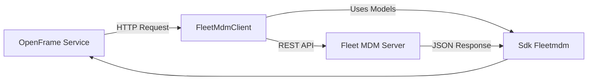
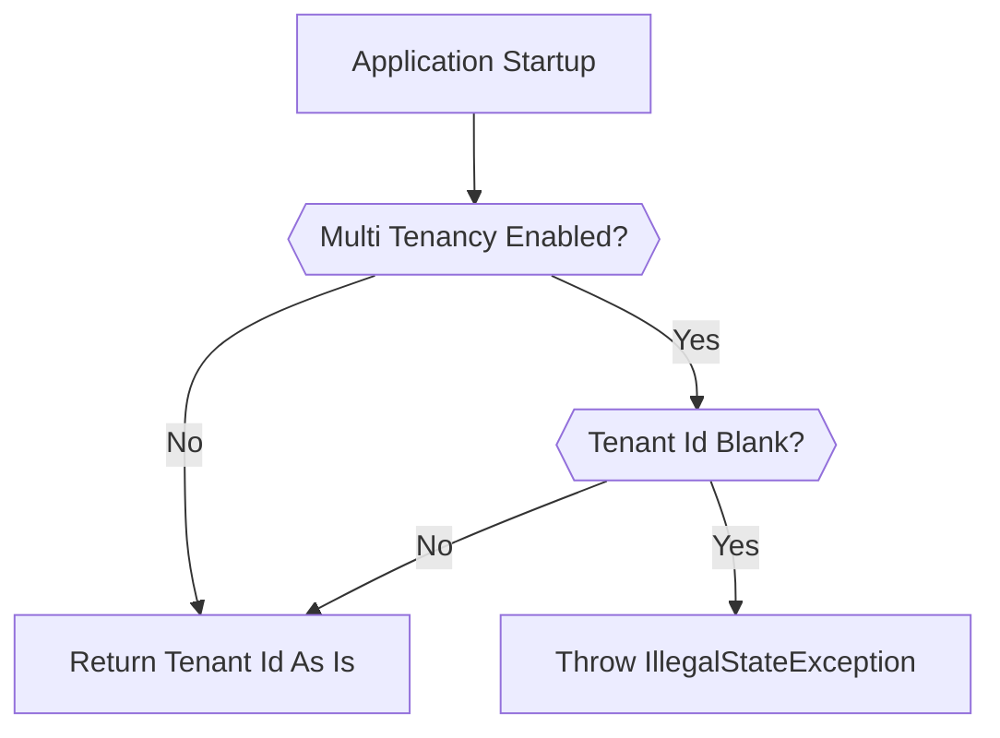
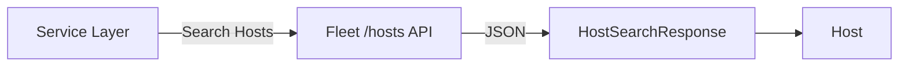
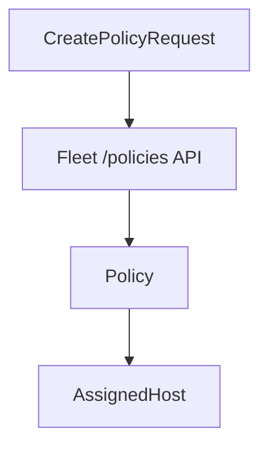
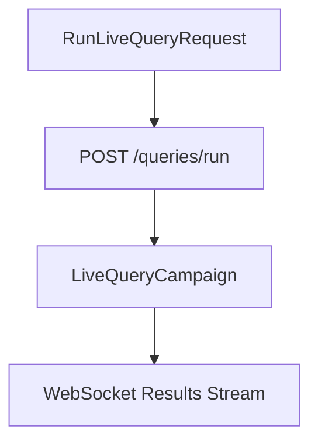

# Sdk Fleetmdm

## Overview

The **Sdk Fleetmdm** module provides a lightweight Java SDK for interacting with a Fleet MDM server from within the OpenFrame ecosystem. It encapsulates:

- Fleet multi-tenancy header validation
- Authentication and setup response models
- Host discovery and search models
- Policy management models
- Scheduled and live query execution models

This SDK acts as a typed contract layer between OpenFrame services (such as management and stream services) and a Fleet MDM deployment.

The module is intentionally model-focused: it defines request/response payloads and guard utilities used by higher-level clients (e.g., `FleetMdmClient`, `FleetMdmSetupClient`).

---

## Architectural Role

Within the OpenFrame platform, Fleet MDM is used for device visibility, compliance policies, and distributed queries. The Sdk Fleetmdm module provides:

- Strongly typed request/response models
- Multi-tenant safety validation
- JSON mapping alignment with Fleet APIs

### High-Level Interaction Flow

The SDK does not perform networking itself. Instead, it provides typed contracts used by service-layer HTTP clients.

---

## Multi-Tenancy Guard

### FleetTenantHeader

**Component:** `FleetTenantHeader`

This utility enforces correct tenant configuration when multi-tenancy is enabled.

### Key Behavior

- If multi-tenancy is disabled, a blank tenant ID is allowed.
- If multi-tenancy is enabled and tenant ID is blank, startup fails fast.
- Prevents opaque 401 errors at runtime.
- Ensures explicit configuration correctness.

This guard improves operability and enforces safe tenant isolation.

---

## Domain Models

The module contains models aligned with Fleet MDM REST APIs.

### 1. Host Management

#### Host

Represents a Fleet-managed device.

Key attributes include:

- Identity: `id`, `uuid`, `hostname`
- Platform metadata: `platform`, `osVersion`, `build`
- Hardware details: CPU, memory, vendor, serial
- Network information: `primaryIp`, `primaryMac`, `publicIp`
- Operational state: `status`, `seenTime`, `uptime`

This model mirrors Fleet's `/hosts` API response.

#### HostSearchResponse

Wrapper for paginated host search results.

Fields:

- `hosts` (List of Host)
- `page`
- `perPage`
- `orderKey`
- `orderDirection`
- `query`

---

### 2. Policy Management

#### Policy

Represents a compliance policy in Fleet.

Important fields:

- `id`, `name`, `description`
- `query` (SQL definition)
- `platform`
- `critical`
- `passingHostCount`, `failingHostCount`
- `hostsIncludeAny` (List of AssignedHost)

#### AssignedHost

Minimal model containing host identifiers used for policy scoping.

#### CreatePolicyRequest / UpdatePolicyRequest

Used for creating and updating policies:

- `name`
- `query`
- `description`
- `platform`

---

### 3. Scheduled Queries

#### CreateScheduledQueryRequest
#### UpdateScheduledQueryRequest

Used to manage scheduled queries in Fleet.

Fields:

- `name`
- `query`
- `description`
- `interval`
- `platform`

These align with Fleet's scheduled query APIs.

---

### 4. Live Queries

#### RunLiveQueryRequest

Represents a distributed query execution request.

Constraints:

- Either `query` (ad-hoc SQL) or `queryId` must be provided.
- `selected` determines targeting scope:
  - `hostIds`
  - `labelIds`
  - `teamIds`

#### LiveQueryCampaign

Returned after creating a live query campaign.

Fields:

- `id`
- `queryId`
- `status`
- `userId`
- `createdAt`

Results are streamed asynchronously over Fleet's live-query websocket channel and correlated using `id`.

---

### 5. Authentication & Setup Models

#### LoginResponse

Represents Fleet login output:

- `token`
- `availableTeams`

#### CreateUserResponse

Contains:

- `token`

#### SetupResponse

Contains:

- `token`

These models standardize token extraction for higher-level service clients.

---

## JSON Mapping Strategy

All models use:

- `@JsonIgnoreProperties(ignoreUnknown = true)` for forward compatibility
- `@JsonProperty` for snake_case to camelCase mapping
- `@JsonInclude(Include.NON_NULL)` for request payload minimization

This ensures:

- Compatibility across Fleet upgrades
- Minimal request payloads
- Stable deserialization even with new API fields

---

## Error Handling Strategy

The SDK itself is intentionally passive:

- No internal networking logic
- No retry logic
- No exception translation layer

Responsibility boundaries:

| Concern | Owner |
|----------|--------|
| HTTP transport | Service layer client |
| Authentication | Service layer |
| Multi-tenancy validation | FleetTenantHeader |
| JSON binding | Sdk Fleetmdm |

---

## Design Principles

1. **Typed Contracts First** – All Fleet interactions are modeled as POJOs.
2. **Forward Compatibility** – Unknown JSON fields are ignored.
3. **Fail Fast for Tenant Misconfiguration** – Early validation avoids runtime ambiguity.
4. **Separation of Concerns** – No transport logic embedded in model layer.

---

## Summary

The **Sdk Fleetmdm** module provides the foundational contract layer for Fleet MDM integration within OpenFrame.

It enables:

- Safe multi-tenant configuration
- Structured device and policy management
- Scheduled and live query orchestration
- Clean JSON boundary mapping

By isolating Fleet API models into a dedicated SDK module, OpenFrame ensures consistent, maintainable integration across services that depend on Fleet MDM functionality.