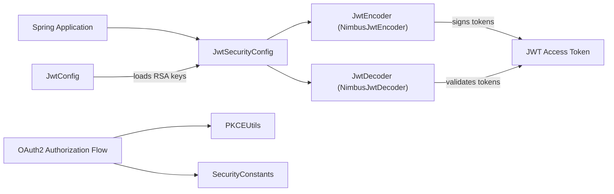
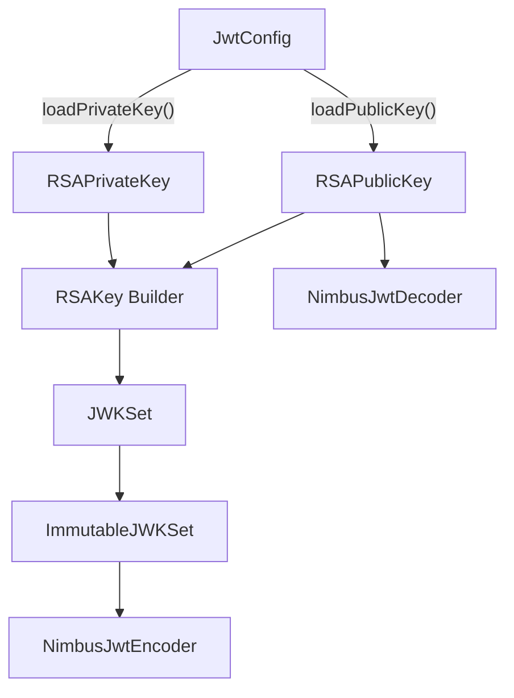
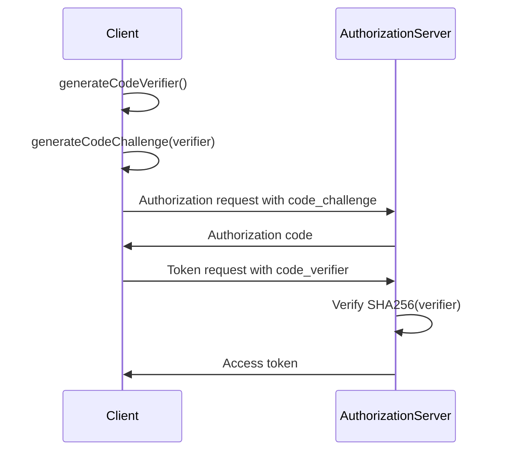
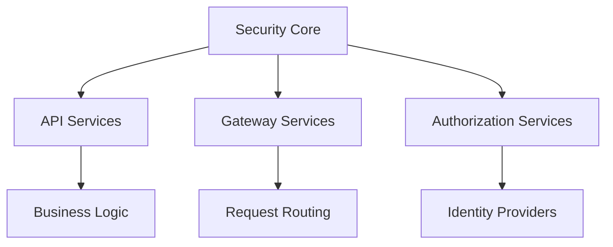

# Security Core

The **Security Core** module provides the foundational cryptographic and token infrastructure for the OpenFrame platform. It is responsible for:

- JWT encoding and decoding using RSA key pairs
- Centralized JWT configuration (issuer, audience, keys)
- OAuth2-related constants for consistent token handling
- PKCE (Proof Key for Code Exchange) utilities for secure authorization flows

This module is intentionally lightweight and framework-focused. It does not implement full OAuth flows or authorization servers. Instead, it provides reusable primitives that are consumed by higher-level modules such as API services, gateways, and authorization components.

---

## Architectural Overview

The Security Core module sits at the cryptographic boundary of the system. It integrates with Spring Security and Nimbus JOSE to provide JWT support and PKCE utilities.

### Responsibilities by Component

| Component | Responsibility |
|------------|---------------|
| JwtSecurityConfig | Registers Spring beans for JWT encoding and decoding |
| JwtConfig | Loads and exposes RSA keys and JWT metadata |
| SecurityConstants | Centralized token-related constants |
| PKCEUtils | Secure PKCE and state parameter generation |

---

## JWT Infrastructure

JWT support is implemented using Spring Security's `JwtEncoder` and `JwtDecoder` backed by Nimbus JOSE.

### JwtSecurityConfig

**Class:** `JwtSecurityConfig`

This configuration class registers two beans:

- `JwtEncoder` – Signs tokens using an RSA private key
- `JwtDecoder` – Validates tokens using the corresponding RSA public key

Key characteristics:

- Uses `NimbusJwtEncoder` with an in-memory JWK set
- Uses `NimbusJwtDecoder` built from the RSA public key
- Delegates key loading to `JwtConfig`

This design ensures:

- Private keys are only used for signing
- Public keys are used for verification
- JWT cryptography is abstracted behind Spring Security interfaces

---

### JwtConfig

**Class:** `JwtConfig`

`JwtConfig` is a Spring `@ConfigurationProperties`-backed service with the prefix `jwt`.

It provides:

- `publicKey` (RSA public key configuration)
- `privateKey` (RSA private key configuration)
- `issuer` (token issuer)
- `audience` (intended token audience)

Key behaviors:

- Parses PEM-formatted RSA private keys
- Decodes Base64 content
- Builds `RSAPublicKey` and `RSAPrivateKey` instances using `KeyFactory`

This abstraction allows:

- Externalized key management (environment variables, vaults, config servers)
- Environment-specific issuers and audiences
- Separation of configuration from cryptographic wiring

---

## OAuth Constants

### SecurityConstants

**Class:** `SecurityConstants`

This utility class defines standard constants used across OAuth and token handling layers:

- `authorization` query parameter name
- `access_token` and `refresh_token` identifiers
- `Access-Token` and `Refresh-Token` HTTP headers

By centralizing these values:

- Token naming is consistent across services
- Header usage is standardized
- Refactoring and cross-module alignment are simplified

---

## PKCE Support

### PKCEUtils

**Class:** `PKCEUtils`

`PKCEUtils` provides cryptographically secure helpers for OAuth2 PKCE flows.

Supported operations:

- Generate a secure `state` parameter (128-bit entropy)
- Generate a secure `code_verifier` (256-bit entropy)
- Generate a `code_challenge` using SHA-256
- Base64URL encoding without padding
- UTF-8 URL encoding

### PKCE Flow (Conceptual)

Security guarantees:

- Prevents authorization code interception attacks
- Mitigates CSRF using a random `state`
- Uses `SecureRandom` for entropy
- Uses SHA-256 for challenge derivation

---

## Integration Within the Platform

Security Core is consumed by multiple higher-level modules:

- API service modules for request authentication
- Gateway services for token validation
- Authorization services for token issuance
- OAuth-related modules implementing login flows

Conceptually:

The module does not:

- Store users
- Implement login endpoints
- Manage sessions
- Perform authorization decisions

Instead, it focuses strictly on:

- Cryptographic correctness
- Token encoding and decoding
- PKCE and OAuth primitives
- Reusable security constants

---

## Design Principles

1. **Single Responsibility** – Only cryptographic and token-level concerns.
2. **Framework Alignment** – Uses Spring Security abstractions.
3. **Extensibility** – Keys and metadata are externally configurable.
4. **Security First** – SecureRandom, SHA-256, Base64URL without padding.
5. **Separation of Concerns** – Higher-level modules build on top of this foundation.

---

## Summary

The **Security Core** module provides the cryptographic backbone of the OpenFrame platform. By encapsulating RSA-based JWT handling, PKCE utilities, and OAuth constants, it enables consistent, secure authentication flows across services while remaining focused and reusable.

It forms the foundational layer upon which gateway, API, and authorization services securely operate.