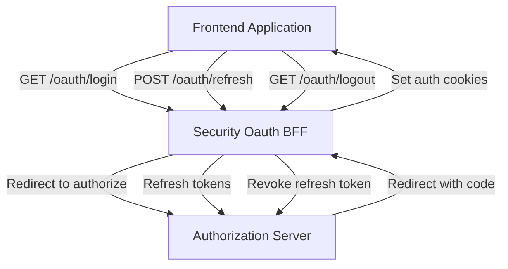
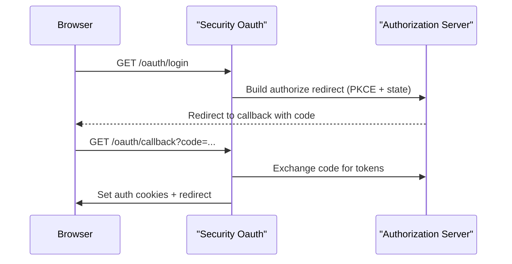
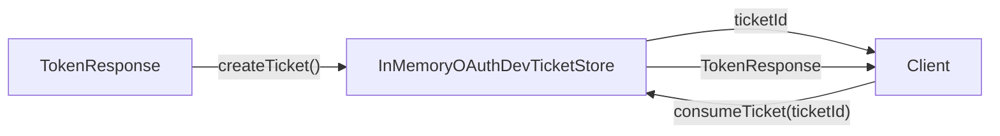

# Security Oauth

The **Security Oauth** module provides the OAuth 2.0 / OpenID Connect (OIDC) Backend-for-Frontend (BFF) layer for OpenFrame. It acts as the bridge between frontend clients (web and mobile), the Authorization Server, and downstream services by:

- Initiating OAuth authorization flows (with PKCE + state)
- Handling callbacks and token exchange
- Managing secure authentication cookies
- Supporting refresh and logout flows
- Providing development/mobile ticket exchange mechanisms

Security Oauth is designed for reactive Spring WebFlux applications and integrates tightly with the authorization and gateway layers.

---

## High-Level Architecture

Security Oauth sits between the frontend (or gateway) and the Authorization Server. It encapsulates OAuth protocol details and exposes simplified endpoints for login, callback, refresh, and logout.



### Key Responsibilities

1. **OAuth Authorization Initialization** (PKCE + state)
2. **Callback Handling and Token Exchange**
3. **Secure Cookie Management** (access + refresh tokens)
4. **Refresh Token Handling**
5. **Logout and Token Revocation**
6. **Development / Mobile Ticket Exchange**

---

## Core Components

### OAuthBffController

**Component:**
`OAuthBffController`

The `OAuthBffController` exposes the public HTTP API under the `/oauth` path. It is conditionally enabled via configuration:

- `openframe.gateway.oauth.enable=true`

#### Endpoints

| Endpoint | Method | Description |
|-----------|--------|------------|
| `/oauth/login` | GET | Start OAuth flow (clears auth cookies) |
| `/oauth/continue` | GET | Continue OAuth flow without clearing session |
| `/oauth/callback` | GET | Handle authorization code callback |
| `/oauth/refresh` | POST | Refresh access token |
| `/oauth/logout` | GET | Clear cookies and revoke refresh token |
| `/oauth/dev-exchange` | GET | Exchange development ticket for tokens |

#### Login Flow



Key behaviors:

- Clears existing SAS/auth cookies on login.
- Generates a signed state JWT with TTL (`state-cookie-ttl-seconds`).
- Stores state in a cookie via `CookieService`.
- Redirects to the Authorization Server.

#### Callback Handling

On `/oauth/callback`:

1. Validates `state`.
2. Exchanges `code` for tokens via `OAuthBffService`.
3. Sets secure authentication cookies:
   - Access token
   - Refresh token
4. Clears OAuth state cookie.
5. Redirects to the resolved target.

On error:

- Logs the failure.
- Redirects to `openframe.auth.error-url` with encoded error message.

#### Refresh Flow

`/oauth/refresh` supports:

- Cookie-based refresh token
- Header-based refresh token (mobile/dev use cases)

If successful:

- Returns `204 No Content`
- Sets updated auth cookies
- Optionally includes token headers (dev/mobile mode)

If token is missing or invalid:

- Returns `401 Unauthorized`

#### Logout Flow

`/oauth/logout`:

- Clears auth cookies.
- Revokes refresh token (tenant-aware or lookup-based).
- Returns `204 No Content`.

---

### InMemoryOAuthDevTicketStore

**Component:**
`InMemoryOAuthDevTicketStore`

This is a default in-memory implementation of `OAuthDevTicketStore`.

Responsibilities:

- Generates a temporary UUID ticket mapped to a `TokenResponse`.
- Stores tokens in a concurrent map.
- Removes tokens when the ticket is consumed.



Used in:

- Development environments
- Mobile authentication flows
- Cross-context token transfer

It is conditionally loaded when no other `OAuthDevTicketStore` bean exists.

---

### DefaultRedirectTargetResolver

**Component:**
`DefaultRedirectTargetResolver`

Resolves the post-authentication redirect target.

Resolution strategy:

1. Use explicit `redirectTo` parameter if present.
2. Otherwise use `Referer` header.
3. Fallback to `/`.

This component is replaceable via Spring bean override if stricter redirect validation or allow-list logic is required.

---

### NoopForwardedHeadersContributor

**Component:**
`NoopForwardedHeadersContributor`

Default no-op implementation of `ForwardedHeadersContributor`.

Purpose:

- Acts as a fallback bean.
- Ensures application context completeness when no custom forwarded-header logic is provided.

In production environments behind proxies (e.g., Kubernetes ingress), this interface can be implemented to inject `X-Forwarded-*` headers into outbound OAuth calls.

---

## Configuration Properties

Security Oauth behavior is controlled via application properties:

```text
openframe.gateway.oauth.enable=true
openframe.gateway.oauth.state-cookie-ttl-seconds=180
openframe.gateway.oauth.dev-ticket-enabled=true
openframe.gateway.oauth.mobile-auth-enabled=true
openframe.auth.error-url=/auth/error
```

### Property Semantics

- `enable` — Enables the OAuth BFF controller.
- `state-cookie-ttl-seconds` — Expiration time for OAuth state cookie.
- `dev-ticket-enabled` — Enables development ticket exchange endpoints.
- `mobile-auth-enabled` — Allows header-based token refresh and dev ticket flows.
- `auth.error-url` — Redirect target on authentication failure.

---

## Integration with Other Modules

Security Oauth integrates with:

- Authorization Server (see Authorization Service Core module)
- Cookie handling and JWT configuration from Security Core
- Gateway layer for tenant-aware routing

For JWT configuration and shared security constants, see:

- [Security Core](../security-core/security-core.md)

Security Oauth does not implement authorization logic itself; it orchestrates OAuth protocol interactions and delegates token validation and issuance to the Authorization Server.

---

## Security Considerations

### PKCE + State

- Prevents authorization code interception.
- State token is signed and time-bound.
- State cookie is cleared after callback.

### Cookie-Based Authentication

- Access and refresh tokens stored via `CookieService`.
- Refresh tokens are revoked on logout.
- State cookie is short-lived.

### Dev Ticket Mode

- Disabled in strict production setups.
- Should be guarded by configuration.
- Tokens are only retrievable once (consume semantics).

---

## Summary

Security Oauth provides a reactive, tenant-aware OAuth BFF implementation that:

- Simplifies frontend authentication flows
- Centralizes OAuth protocol handling
- Secures tokens using cookies
- Supports mobile and development workflows
- Cleanly integrates with the broader OpenFrame security architecture

It forms the critical authentication boundary between frontend clients and the Authorization Server while remaining modular and extensible via Spring bean overrides.