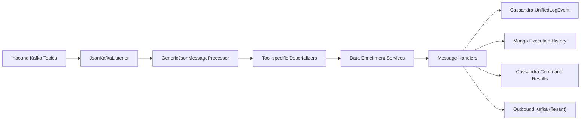
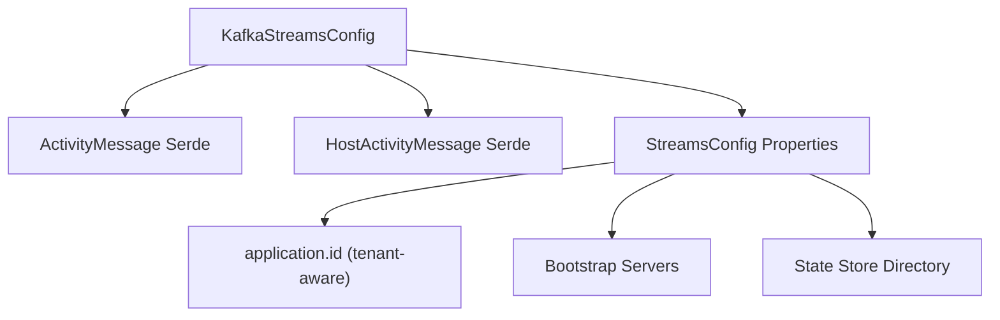
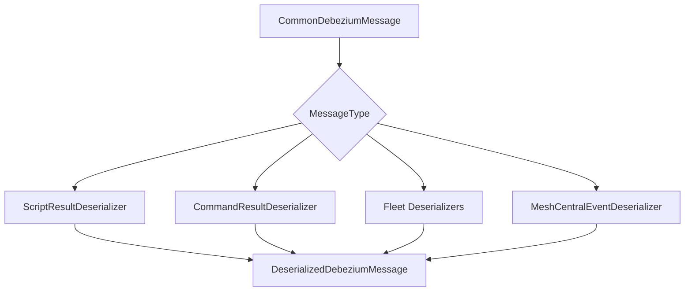
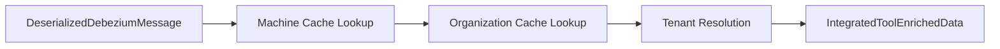
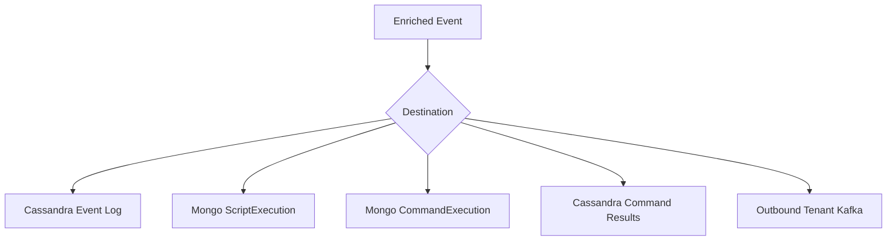
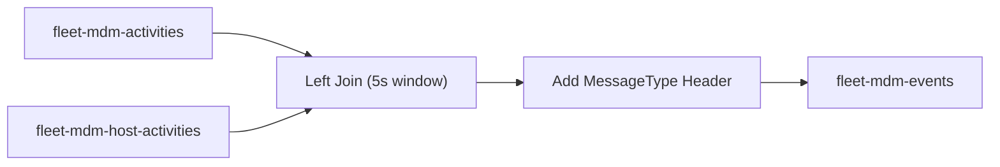
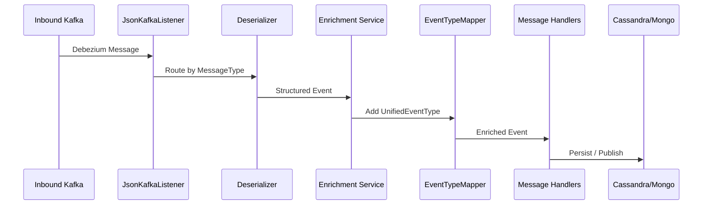

# Stream Service Core

The **Stream Service Core** module is the event-driven backbone of OpenFrame. It consumes, enriches, transforms, and routes real-time events from integrated tools (Fleet MDM, MeshCentral) and native RMM execution results (scripts and commands) through Kafka, Kafka Streams, and downstream storage layers (Cassandra, MongoDB, outbound Kafka topics).

It acts as the canonical **stream processing and projection layer** between:

- External tool event sources (Debezium CDC over Kafka)
- Native OpenFrame RMM execution results
- Enrichment services (machine, organization, tenant resolution)
- Unified event log (Cassandra)
- Execution history projections (MongoDB)
- Tenant-scoped outbound Kafka pipelines

---

## 1. Architectural Overview

At a high level, Stream Service Core performs five responsibilities:

1. **Kafka Consumption** of Debezium envelopes
2. **Message Deserialization** into typed domain messages
3. **Data Enrichment** (machine, org, tenant resolution)
4. **Event Type Mapping** to unified event types
5. **Routing to Destinations** (Cassandra, Mongo, Kafka)

---

## 2. Kafka Integration Layer

### 2.1 Kafka Configuration

**KafkaConfig**
- Registers a `Converter<byte[], MessageType>`.
- Converts Kafka header bytes into `MessageType` enum values.
- Enables dynamic routing of events based on headers.

**KafkaStreamsConfig**
- Configures Kafka Streams when `kafka.stream.enabled=true`.
- Builds a tenant-aware `application.id`.
- Defines SerDes for:
  - `ActivityMessage`
  - `HostActivityMessage`
- Enables:
  - At-least-once processing
  - Controlled batching and polling
  - Local state store (`/tmp/kafka-streams`)

---

## 3. Event Consumption Layer

### 3.1 JsonKafkaListener

The **JsonKafkaListener** is the unified Kafka consumer for integrated tool events in tenant mode.

It listens to:
- Fleet MDM activities
- Fleet host activities
- Fleet policy membership events
- MeshCentral events

Each message includes:
- `CommonDebeziumMessage` payload
- `MessageType` header

The listener delegates processing to the **GenericJsonMessageProcessor**.

---

## 4. Deserialization Layer

Each external tool or execution result type has a dedicated deserializer. These convert raw Debezium JSON into structured `DeserializedDebeziumMessage` objects.

### 4.1 Native RMM Deserializers

- **ScriptResultDeserializer** → `MessageType.SCRIPT_EXECUTED`
- **CommandResultDeserializer** → `MessageType.COMMAND_EXECUTED`

Responsibilities:
- Extract executionId, machineId, exitCode, output
- Generate human-readable message
- Assign source event type (`script_run.finished`, `cmd_run.finished`)

### 4.2 Fleet Deserializers

- **FleetEventDeserializer**
- **FleetPolicyActivityDeserializer**
- **FleetPolicyMembershipEventDeserializer**
- **FleetQueryResultEventDeserializer**

Responsibilities:
- Parse Fleet activity payloads
- Map `activity_type` to readable message via `FleetActivityTypeMapping`
- Resolve policy/query metadata via `FleetMdmCacheService`
- Extract timestamps via `TimestampParser`

### 4.3 MeshCentral Deserializer

- **MeshCentralEventDeserializer**

Responsibilities:
- Parse embedded JSON strings
- Extract `etype.action`
- Resolve tenant/domain
- Extract `_id` and timestamps

---

## 5. Data Enrichment Layer

After deserialization, events are enriched with contextual data.

### 5.1 IntegratedToolDataEnrichmentService

Used for:
- Fleet
- MeshCentral

Enrichment steps:
1. Resolve machineId from external agentId
2. Resolve hostname
3. Resolve organizationId + organizationName
4. Resolve tenantId

### 5.2 RmmEnrichmentService

Used for native OpenFrame RMM events.

Difference:
- `agentId` already equals internal `machineId`
- Skips external tool indirection

---

## 6. Event Type Normalization

### EventTypeMapper

Maps:

`IntegratedToolType + SourceEventType → UnifiedEventType`

Examples:
- `RMM + cmd_run.finished → COMMAND_RUN_FINISHED`
- `FLEET + created_policy → POLICY_APPLIED`
- `MESHCENTRAL + user.login → LOGIN`

If no mapping is found → `UNKNOWN`

This enables consistent storage in the unified event log.

---

## 7. Message Handler Layer

Handlers implement `MessageHandler<U, V>` and route events to destinations.

### 7.1 Cassandra Event Log

**DebeziumCassandraMessageHandler**

- Stores `UnifiedLogEvent`
- Keyed by:
  - tenantId
  - ingestDay
  - toolType
  - eventType
  - timestamp
  - toolEventId

Destination: `CASSANDRA_EVENT_LOG`

### 7.2 Mongo Script Execution Projection

**ScriptExecutionStatusUpdateHandler**

- Transitions `ScriptExecution`:
  - RUNNING → SUCCESS
  - RUNNING → FAILED
- Updates stdout, stderr, exitCode, timedOut
- Truncates output safely

Destination: `MONGO_HISTORY`

### 7.3 Mongo Command Execution Projection

**CommandExecutionStatusUpdateHandler**

- Updates `CommandExecution`
- Correlates by `(machineId, executionId)`
- Prevents overwriting terminal states

Destination: `MONGO_COMMAND_HISTORY`

### 7.4 Cassandra Command Results

**CommandResultCassandraMessageHandler**

- Stores raw command result JSON
- Table-level TTL for auto-expiry

Destination: `CASSANDRA_COMMAND_RESULT`

### 7.5 Tenant Outbound Kafka

**TenantDebeziumKafkaMessageHandler**

- Publishes enriched events to outbound tenant topic
- Validated by `TenantIdRequiredDebeziumEventValidator`

---

## 8. Kafka Streams: Fleet Activity Enrichment

The **ActivityEnrichmentService** builds a Kafka Streams topology that:

1. Reads Fleet `activities` topic
2. Reads Fleet `host_activities` topic
3. Left-joins them within 5 seconds
4. Adds:
   - hostId
   - agentId
   - `MessageType` header
5. Publishes enriched result back to events topic

This ensures:
- Policy and activity events are correlated
- Host context is attached before downstream processing

---

## 9. Generic Handler Abstractions

### GenericMessageHandler

Provides:
- JSON mapper configuration
- Operation type detection (`c`, `u`, `d`, `r`)
- Dispatching to CRUD-specific handlers

### DebeziumMessageHandler

Adds:
- Debezium operation parsing
- Unified transform pipeline

This abstraction ensures:
- Consistent message lifecycle
- Clear separation of transformation and persistence logic

---

## 10. Multi-Tenant Behavior

Tenant handling is enforced via:

- `TenantIdRequiredDebeziumEventValidator`
- `TenantIdProvider` (single-tenant clusters)
- `ClusterTenantIdResolver` (shared clusters)
- Tenant-aware Kafka Streams application IDs

Events without a resolved `tenantId` are dropped.

---

## 11. Data Flow Summary

---

# Conclusion

The **Stream Service Core** module is the central event-processing engine of OpenFrame.

It:

- Normalizes heterogeneous tool events
- Enriches them with internal context
- Projects them into read models (Mongo, Cassandra)
- Maintains execution history state machines
- Supports replayability and tenant isolation
- Enables real-time observability across the platform

By isolating stream processing into this module, OpenFrame achieves:

- Strong separation between ingestion and persistence
- Deterministic event-driven state transitions
- Extensibility for new integrated tools
- Replay-friendly architecture via Kafka as source of truth
