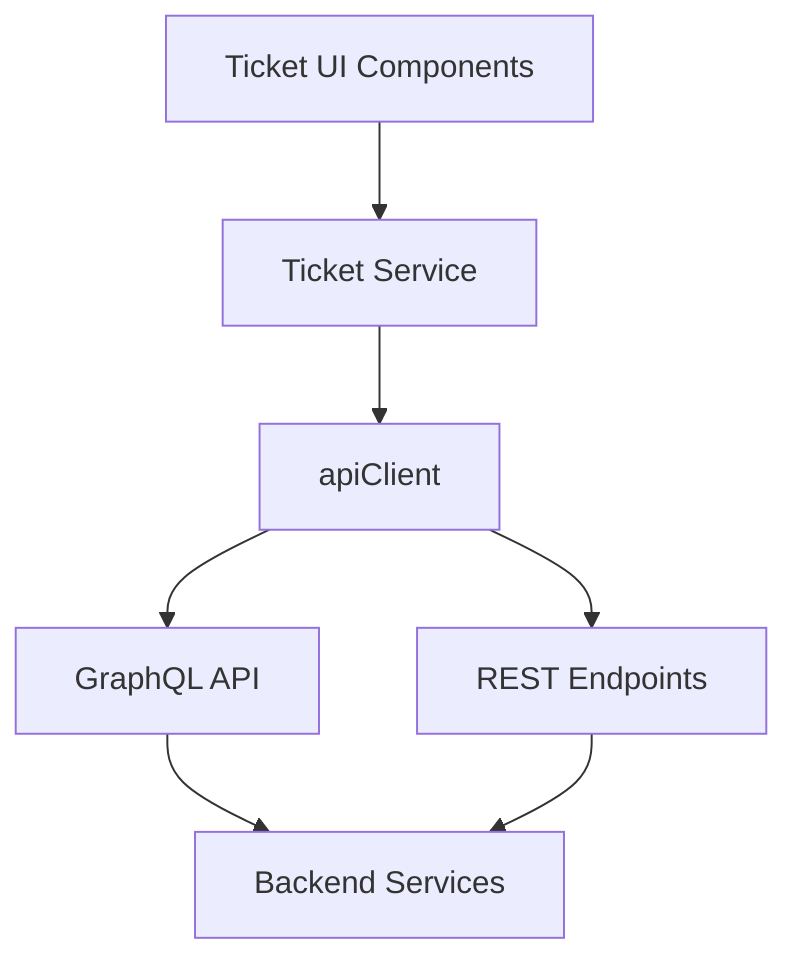
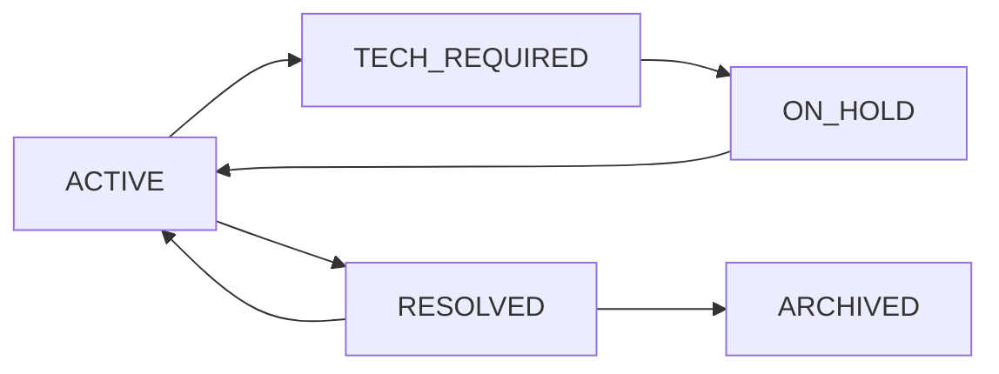
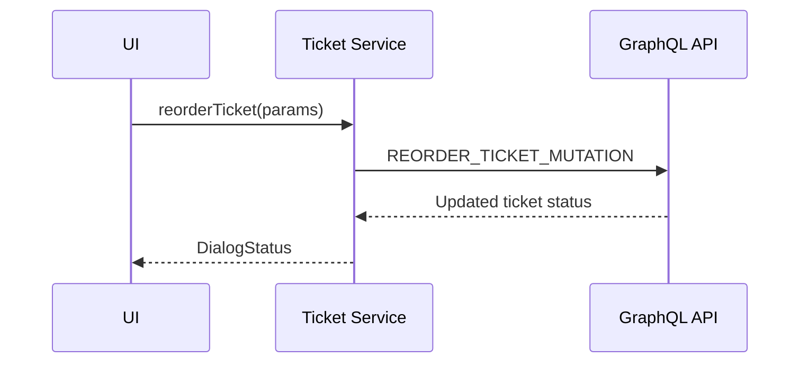
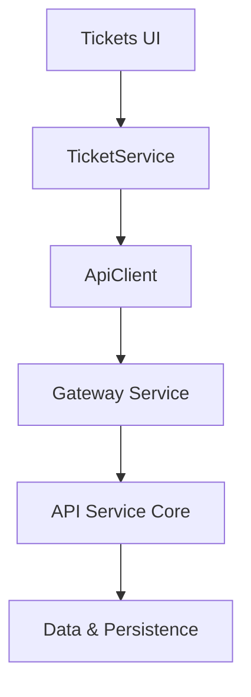

# Ticket Service

The **Ticket Service** module is the frontend abstraction responsible for managing tickets (also modeled as dialogs) within the OpenFrame application.

It acts as a typed service layer between UI components (boards, ticket center, chat panels) and backend APIs (GraphQL + REST), encapsulating:

- Ticket querying and pagination
- Board column loading
- Status transitions and lifecycle mutations
- Ticket reordering (Kanban-style)
- Dialog message retrieval
- AI/chat message sending
- Approval handling
- Chunk-based streaming retrieval

This module ensures consistent data normalization from backend `TicketNode` objects into frontend `Dialog` models used across the application.

---

## Architecture Overview

The Ticket Service sits between UI components and the API layer.



### Key Responsibilities

- Translate UI filter models into backend query variables
- Normalize backend `TicketNode` responses into frontend `Dialog`
- Map lifecycle states between ticket and dialog representations
- Encapsulate mutation and error handling logic
- Provide a unified interface via `TicketService` contract

---

## Core Components

### 1. TicketService (Implementation)

**Component:**

- `openframe-oss-frontend.src.app.(app).tickets.services.ticket-service.TicketService`

This class implements the `TicketService` interface and contains all business-facing logic for tickets.

It provides:

- Query execution (GraphQL)
- REST calls for approvals and streaming
- Status mutation routing
- Reorder logic for Kanban boards
- Dialog message access

---

### 2. TicketService Interface (Contract)

**Component:**

- `openframe-oss-frontend.src.app.(app).tickets.services.ticket-service.types.TicketService`

This interface defines the public contract consumed by UI layers:

```text
fetchDialogs()
fetchBoardColumnByStatusId()
fetchDialog()
fetchMessages()
updateStatus()
transitionTicket()
reorderTicket()
fetchTicketStatusTransitions()
fetchTicketStatusTransitionRules()
sendMessage()
approveRequest()
rejectRequest()
archiveDialog()
fetchChunks()
```

This separation ensures testability and future backend abstraction flexibility.

---

## Data Model Normalization

Backend GraphQL returns a `TicketNode` shape.

The Ticket Service converts it into a `Dialog` model via:

```text
normalizeTicketToDialog(ticket: TicketNode) => Dialog
```

### Mapping Responsibilities

- Status mapping (`Ticket` → `DialogStatus`)
- Owner normalization (CLIENT vs ADMIN)
- Label and attachment extraction
- Token usage enrichment
- Notes transformation
- Pending approval mapping

### Status Mapping

Two mapping records ensure consistency:

```text
TICKET_TO_DIALOG_STATUS
DIALOG_TO_TICKET_STATUS
```

This decouples backend lifecycle naming from frontend dialog states.

---

## Ticket Lifecycle Management

Ticket lifecycle operations are handled through controlled mutations.



### Mutation Routing

`STATUS_TO_MUTATION` maps lifecycle states to their GraphQL mutation:

```text
ON_HOLD  -> PUT_TICKET_ON_HOLD_MUTATION
RESOLVED -> RESOLVE_TICKET_MUTATION
ARCHIVED -> ARCHIVE_TICKET_MUTATION
ACTIVE   -> REOPEN_TICKET_MUTATION
```

The method `mutateStatus()` dynamically selects the correct mutation.

---

## Query Operations

### 1. Fetch Dialogs (List View)

```text
fetchDialogs(params: FetchTicketsParams)
```

Supports:

- Status or statusId filtering
- Organization filtering
- Assignee filtering
- Label filtering
- Search term
- Cursor-based pagination

Returns:

```text
TicketsPage {
  dialogs: Dialog[]
  pageInfo: CursorPageInfo
  filteredCount: number
}
```

---

### 2. Fetch Board Column

```text
fetchBoardColumnByStatusId()
```

Optimized for Kanban views. Filters by lifecycle column ID.

---

### 3. Fetch Single Dialog

```text
fetchDialog(id: string)
```

Returns normalized `Dialog` or `null`.

---

### 4. Fetch Messages

Messages are retrieved from a dedicated chat GraphQL endpoint:

```text
POST /chat/graphql
```

Supports:

- Cursor pagination
- Sort field and direction
- ChatType separation

---

## Ticket Reordering (Kanban)

Reordering supports drag-and-drop between columns.



Supports:

- `afterTicketId`
- `beforeTicketId`
- Optional lifecycle `statusId`
- Optional status name mapping

---

## Approval Workflow

Tickets may contain pending AI/tool approval requests.

Operations:

```text
approveRequest(requestId)
rejectRequest(requestId)
```

These use REST endpoints:

```text
POST /approval-request/{id}/approve
```

With body:

```text
{ approve: true | false }
```

---

## AI & Chat Integration

The Ticket Service integrates directly with dialog-based AI messaging.

### Send Message

```text
sendMessage(dialogId, content, chatType)
```

Uses a REST endpoint defined in `API_ENDPOINTS.SEND_MESSAGE`.

### Streaming Chunks

```text
fetchChunks(dialogId, chatType, fromSequenceId?)
```

This retrieves incremental `ChunkData[]` for streaming UI updates.

If the backend returns an error, an empty array is returned safely.

---

## Error Handling Strategy

All GraphQL mutations follow this pattern:

```text
1. Execute mutation
2. Extract payload
3. Check payload.userErrors
4. Throw first error message
5. Validate payload.ticket exists
```

REST calls check:

```text
response.ok
```

Errors are surfaced to calling UI layers for display.

---

## Pagination Model

Cursor-based pagination is used consistently.

```text
CursorPageInfo {
  hasNextPage
  hasPreviousPage
  startCursor
  endCursor
}
```

This enables:

- Infinite scrolling
- Board column incremental loading
- Message history scrolling

---

## Design Principles

The Ticket Service follows these principles:

- ✅ Single responsibility for ticket data access
- ✅ Backend-agnostic UI interface
- ✅ Explicit status mapping layer
- ✅ Centralized error handling
- ✅ Consistent pagination model
- ✅ Strong typing via TypeScript contracts

---

## How It Fits into the System

Within the broader OpenFrame frontend:



The Ticket Service provides a stable frontend abstraction while backend modules such as API Service Core and Data Mongo layers handle persistence and workflow logic.

---

## Summary

The **Ticket Service** module is the central orchestration layer for:

- Ticket querying
- Lifecycle transitions
- Kanban reordering
- Chat/message integration
- Approval flows
- Streaming chunk retrieval

It provides a strongly typed, normalized, and resilient interface between OpenFrame’s UI components and backend ticket infrastructure.