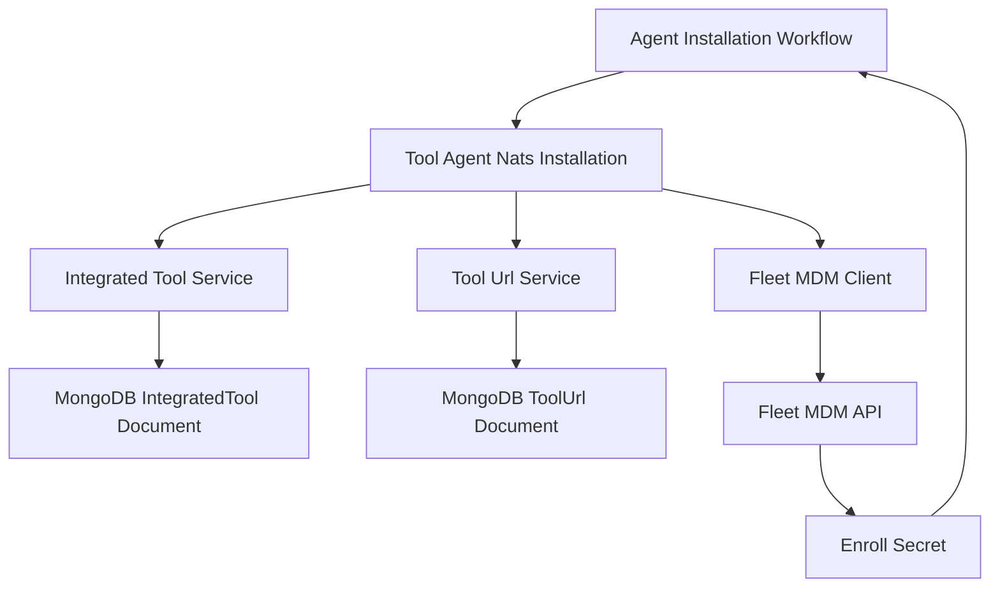
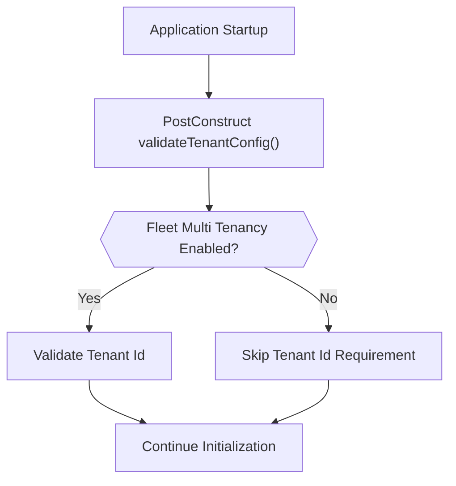
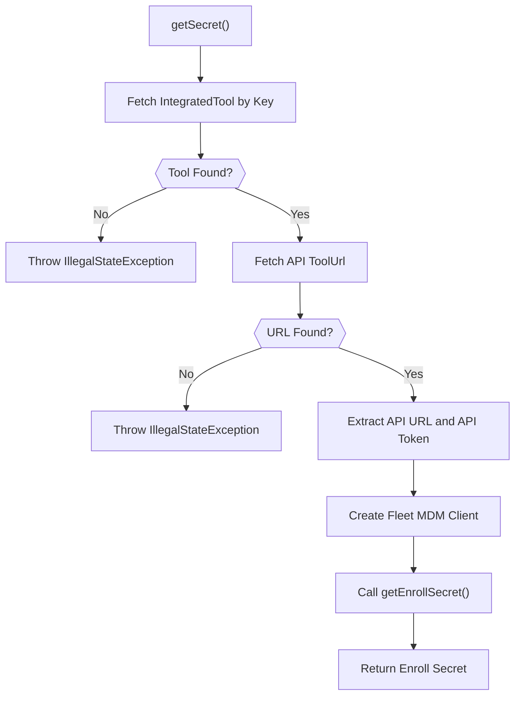
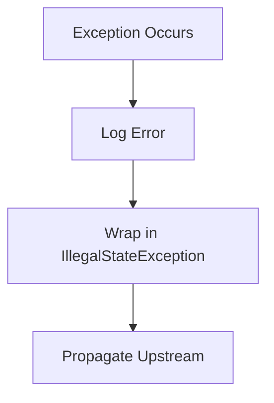
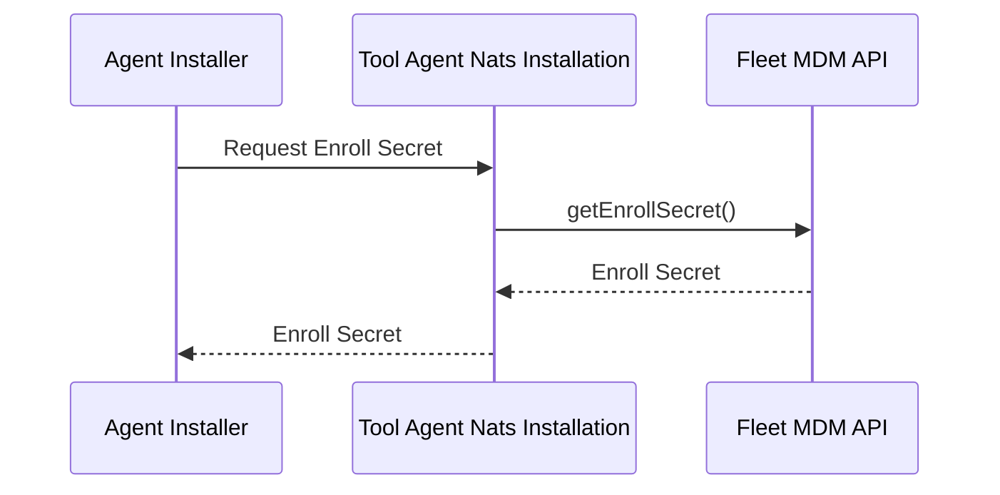
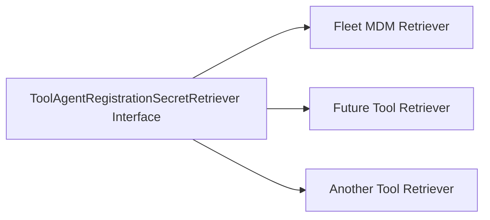

# Tool Agent Nats Installation

## Overview

The **Tool Agent Nats Installation** module is responsible for retrieving agent registration secrets from integrated external tools and making them available for agent onboarding workflows over NATS-based communication channels.

In its current implementation, this module provides a Fleet MDM–specific secret retriever that dynamically fetches the **enroll secret** required for agent registration. This secret is later used by agent provisioning and installation flows managed by other backend services.

This module acts as a bridge between:

- Integrated tool configuration stored in MongoDB
- External tool APIs (Fleet MDM)
- Agent onboarding and NATS-based messaging flows

---

## Core Component

### Fleet Mdm Agent Registration Secret Retriever

**Class:** `FleetMdmAgentRegistrationSecretRetriever`  
**Implements:** `ToolAgentRegistrationSecretRetriever`

This component:

1. Identifies the Fleet MDM tool by key (`fleetmdm-server`).
2. Resolves its API endpoint and credentials.
3. Instantiates a Fleet MDM SDK client.
4. Retrieves the current Fleet enroll secret.
5. Returns the secret to the caller for use in agent installation flows.

It is conditionally loaded using:

```text
openframe.integration.tool.enabled=true
```

This ensures the retriever is only active when tool integrations are enabled.

---

## High-Level Architecture

The Tool Agent Nats Installation module sits between tool configuration storage and the Fleet MDM API.



### Responsibilities by Layer

- **Integrated Tool Service** – Resolves tool metadata and credentials.
- **Tool Url Service** – Retrieves the correct API endpoint.
- **Fleet MDM Client (SDK)** – Performs authenticated API calls.
- **Tool Agent Nats Installation** – Orchestrates retrieval and error handling.

---

## Configuration Model

### 1. Tool Identification

The retriever uses a constant tool key:

```text
fleetmdm-server
```

This must match the stored `IntegratedTool` key in the database.

### 2. Tenant Configuration

The component reads:

```text
TENANT_ID
openframe.fleet.multi-tenancy.enabled
```

At startup, it validates tenant configuration using `FleetTenantHeader.validate(...)`.

### Multi-Tenant Validation Flow



This ensures:

- Tenant ID is present when multi-tenancy is enabled.
- Configuration errors fail fast during startup.

---

## Secret Retrieval Process

The core logic is implemented in `getSecret()`.

### Step-by-Step Flow



### Internal Operations

1. Resolve `IntegratedTool` by key.
2. Resolve `ToolUrl` of type `API`.
3. Build API base URL from host and port.
4. Extract API token from stored credentials.
5. Instantiate `FleetMdmClient` with:
   - API URL
   - API token
   - Tenant ID
6. Invoke `getEnrollSecret()`.

---

## Error Handling Strategy

All retrieval logic is wrapped in a try–catch block.

If any step fails:

- The error is logged.
- A new `IllegalStateException` is thrown.



This ensures:

- Fail-fast behavior.
- No silent secret retrieval failures.
- Clear operational visibility in logs.

---

## Interaction with NATS-Based Agent Installation

Although this module does not directly publish or subscribe to NATS messages, it supports the broader NATS-based installation pipeline.

Typical lifecycle:



The returned secret is then:

- Embedded in agent configuration payloads
- Used during device enrollment
- Propagated via NATS-based orchestration services

---

## Dependencies

### Internal Dependencies

- `IntegratedToolService`
- `ToolUrlService`

These services provide access to:

- Tool metadata
- Credentials
- API endpoints

### External Dependencies

- `FleetMdmClient` (SDK)
- `FleetTenantHeader` validation utility

These enable:

- Authenticated API communication
- Tenant-aware request construction

---

## Design Characteristics

### 1. Tool-Specific Implementation

This retriever is specific to Fleet MDM and identified via:

```text
getToolId() -> fleetmdm-server
```

This allows:

- Multiple tool-specific retrievers
- Pluggable secret retrieval strategies

### 2. Conditional Activation

The class is annotated with:

```text
@ConditionalOnProperty(name = "openframe.integration.tool.enabled", havingValue = "true")
```

This ensures:

- The component is not loaded when integrations are disabled.
- Reduced attack surface and startup overhead.

### 3. Runtime Secret Resolution

Secrets are not statically stored in OpenFrame.

Instead:

- The enroll secret is dynamically fetched from Fleet MDM.
- The latest valid secret is always returned.

This avoids stale enrollment credentials.

---

## Operational Considerations

### Logging

- Successful retrieval logs an informational message.
- Failures log full exception traces.

### Failure Modes

Possible causes of failure:

- Missing integrated tool configuration
- Missing API URL
- Invalid credentials
- Fleet MDM API unavailability
- Tenant misconfiguration

All result in a controlled `IllegalStateException`.

---

## Extensibility Model

The design supports adding additional tool-specific retrievers.



To add a new tool:

1. Implement `ToolAgentRegistrationSecretRetriever`.
2. Provide a unique `getToolId()`.
3. Implement tool-specific secret resolution logic.
4. Register it as a Spring component.

---

## Summary

The **Tool Agent Nats Installation** module provides a focused, production-grade implementation for retrieving Fleet MDM agent enrollment secrets.

It ensures:

- Secure, dynamic secret retrieval
- Proper multi-tenant validation
- Tight integration with stored tool configuration
- Clean separation between configuration, SDK communication, and orchestration layers

Within the OpenFrame architecture, this module plays a critical role in enabling secure, automated agent onboarding workflows across integrated infrastructure tools.