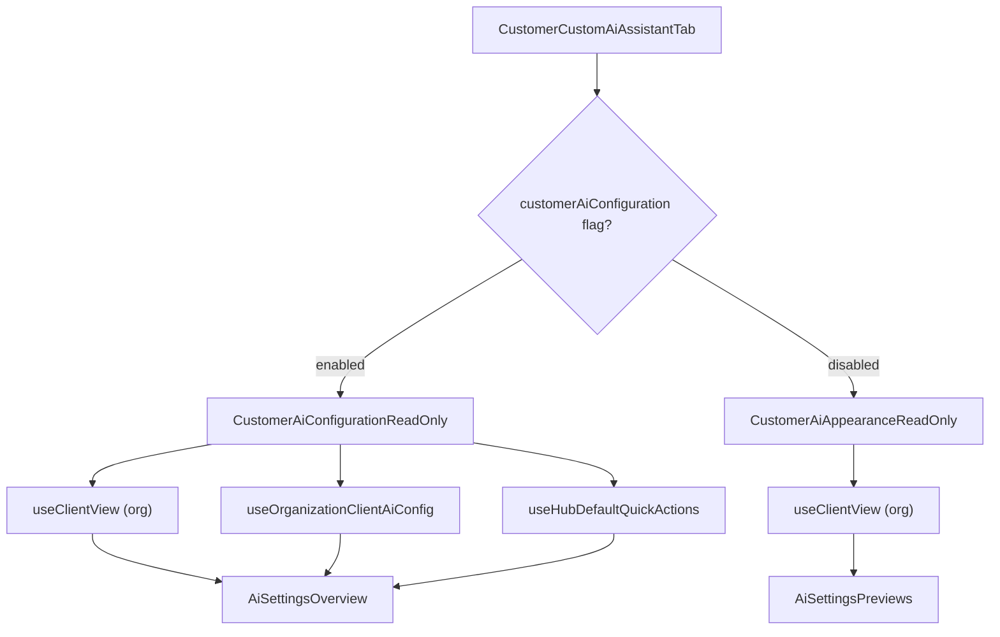

<!-- source-hash: 178764f740ec5c2b73eca12a98c76988 -->
Read-only tab component for displaying a customer's custom AI assistant configuration on the customer details page, with feature-flag-controlled rendering of either a full AI settings overview or a legacy appearance-only view.

## Key Components

### `CustomerCustomAiAssistantTab` (main export)
Entry point that switches between two implementations based on the `customerAiConfiguration` feature flag:
- **Enabled** → `CustomerAiConfigurationReadOnly` (full AI config overview)
- **Disabled** → `CustomerAiAppearanceReadOnly` (legacy appearance-only view)

### `CustomerAiConfigurationReadOnly`
Full read-only view mirroring the global AI settings CLIENT tab. Resolves effective configuration by merging org-level overrides with tenant defaults. Displays an inheritance banner when the customer uses default settings, and renders `AiSettingsOverview` with resolved `AgentAiConfig`.

### `CustomerAiAppearanceReadOnly`
Legacy view showing only appearance-related overrides: assistant name, avatar, application theme, and accent color, followed by `AiSettingsPreviews`.

## Usage Example

```typescript
// Rendered inside the customer details page tab panel
<CustomerCustomAiAssistantTab organizationId="org_abc123" />
```

## Key Behaviors

- **Inheritance detection**: `inheritsDefault` is `true` when no `orgView` override exists and `orgConfig.inheritDefault` is `true` — surfaces an "Edit Default Configuration" banner linking to global AI settings
- **Quick actions resolution**: Cascades from org-specific → tenant default → OpenFrame Hub built-ins; `isOpenFrameSet` flag controls the "curated by OpenFrame" banner copy
- **Loading states**: Skeleton placeholders shown while `useClientView`, `useOrganizationClientAiConfig`, and `useHubDefaultQuickActions` are pending
- **Error handling**: `LoadError` with retry callback when config fetch fails

## Data Flow

