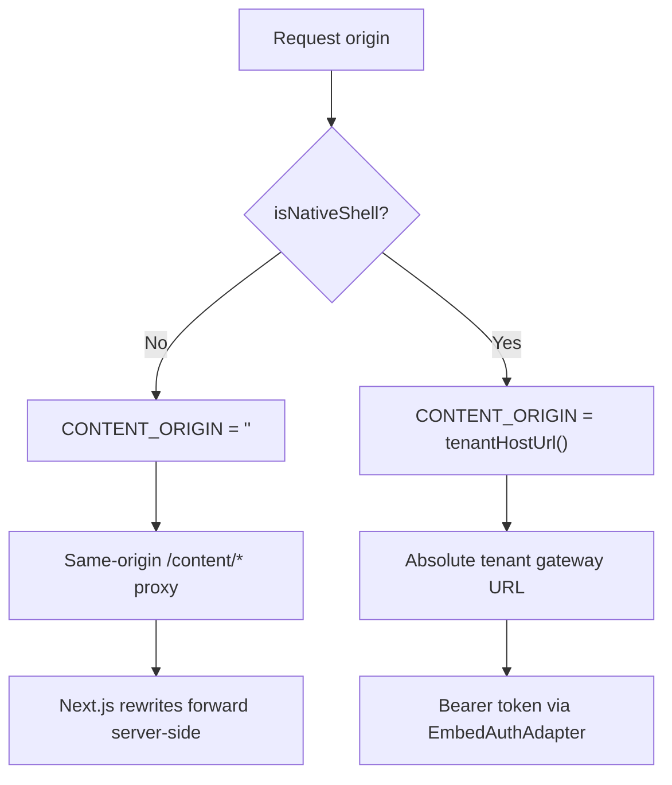

<!-- source-hash: f735570f9b40074eb386d0eec5b084d2 -->
Centralizes all Help Center content API endpoint definitions, routing web requests through a same-origin `/content` proxy and native shell requests directly to the tenant gateway.

## Key Components

| Export | Type | Description |
|--------|------|-------------|
| `CONTENT_ORIGIN` | `string` | Empty string on web (same-origin); tenant gateway URL in native shell |
| `HELP_CENTER_BASE` | `string` | Route prefix for the Help Center section and back-button target |
| `KNOWLEDGE_BASE_ROUTE` | `string` | Route for the docs hub page, shared between the page and chat bundle |
| `CONTENT_API_BASE` | `string` | Base URL for `<FaqSection>` to append `/api/faqs?…` |
| `EP` | `const object` | All content API endpoints (onboarding, roadmap, delivery, releases, legal, docs) |
| `HELP_CENTER_ENDPOINTS` | `EndpointsRuntime` | Announcements, access-code, and contact URLs for lib context provider |

## Usage Example

```typescript
import { EP, HELP_CENTER_BASE, HELP_CENTER_ENDPOINTS } from '@/lib/endpoints';

// Fetch roadmap data
const res = await contentFetch(EP.roadmap);

// Fetch a specific release by slug
const releaseRes = await contentFetch(EP.productReleaseBySlug('v2-june-2025'));

// Fetch docs structure for the knowledge base
const structureRes = await contentFetch(EP.docsStructure('openframe-docs'));

// Mount the required EndpointsRuntimeContext for lib contact surfaces
<EndpointsRuntimeContext.Provider value={HELP_CENTER_ENDPOINTS}>
  <HelpCenterCreateForm backHref={HELP_CENTER_BASE} />
</EndpointsRuntimeContext.Provider>
```

## Routing Strategy



> **Source:** [`src/lib/endpoints.ts`](https://github.com/flamingo-stack/openframe-oss-frontend/blob/main/src/lib/endpoints.ts)