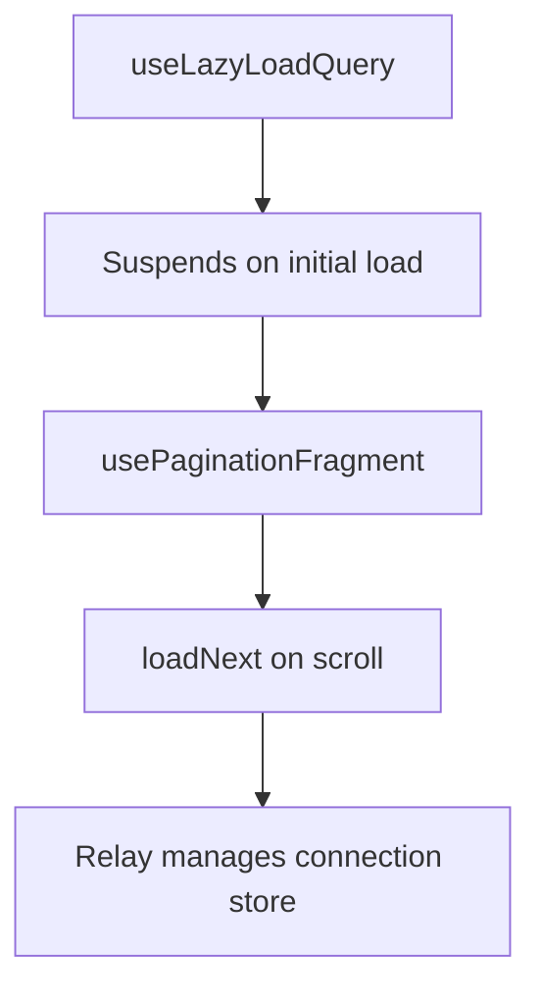

<!-- source-hash: 800c7cb4fe517d23e742411c8e196a34 -->
Relay-backed context item components that fetch and paginate Devices, Organizations, Knowledge Base Articles, and Scripts from the `/api/graphql` endpoint using idiomatic Relay cursor pagination (`@refetchable` + `@connection` + `usePaginationFragment`).

## Key Components

### Exported Components

| Component | Entity Type | GraphQL Connection | Notes |
|---|---|---|---|
| `DeviceItems` | `DEVICE` | `devices` | Filters to `ONLINE`/`OFFLINE` statuses only |
| `OrganizationItems` | `ORGANIZATION` | `organizations` | Includes category as description |
| `KnowledgeBaseItems` | `KB_ARTICLE` | `knowledgeBaseItems` | Filters to `ARTICLE` type only |
| `ScriptItems` | `SCRIPT` | `scripts` | Filters to `ACTIVE` status; drops nodes that fail global ID decode |

All four components share the same prop signature (`ContextItemsProps`) and delegate rendering to `ContextItemsList`.

### ID Handling

Each component decodes Relay global IDs (`base64("TypeName:<rawId>")`) via `decodeGlobalId` before storing items. Raw database IDs are stored so backend context resolvers and `@mention` markers receive the expected format; mention chips re-encode to global IDs for their own `node(id:)` fetches.

## Usage Example

```typescript
// Inside a Suspense boundary (useLazyLoadQuery suspends on first load)
import { DeviceItems, OrganizationItems, KnowledgeBaseItems, ScriptItems } from './relay-items';

<Suspense fallback={<SkeletonList />}>
  <DeviceItems
    query={searchText}
    selectedKeys={selectedKeys}
    onToggle={(item) => toggleContextItem(item)}
    atLimit={selectedKeys.size >= MAX_CONTEXT_ITEMS}
  />
</Suspense>
```

## Pagination Pattern

Each component uses the same three-layer Relay pattern:



**Source:** [`relay-items.tsx`](https://github.com/flamingo-stack/openframe-oss-frontend/blob/main/relay-items.tsx)