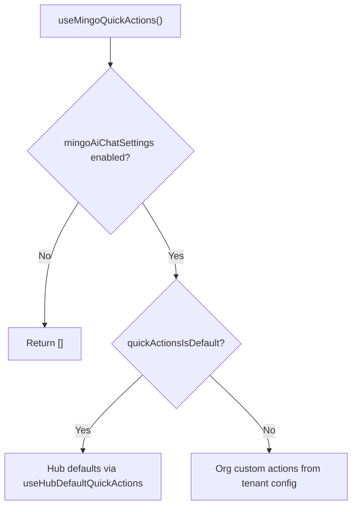

<!-- source-hash: 05cba55733a3959fd3a8509ccbbbf811 -->
Resolves and returns the active quick-action chips for the Mingo AI chat empty-state, switching between OpenFrame Hub defaults and org-customized actions based on admin configuration.

## Key Components

- **`useMingoQuickActions`** — Custom hook that returns an `AiQuickAction[]` array, selecting the correct source based on the `quickActionsIsDefault` flag in the admin AI config.

### Internal Dependencies

| Hook / Utility | Role |
|---|---|
| `featureFlags.mingoAiChatSettings` | Gates the entire feature; returns `[]` when disabled |
| `useAdminAiConfig` | Fetches the tenant's AI settings record |
| `useHubDefaultQuickActions` | Fetches defaults from the Product Hub (`agent-mingo` config via `/chat/content/**`) |

## Source Selection Logic



## Usage Example

```typescript
import { useMingoQuickActions } from './use-mingo-quick-actions';

function MingoEmptyState() {
  const quickActions = useMingoQuickActions();

  return (
    <div>
      {quickActions.map((action) => (
        <Chip key={action.id} label={action.label} />
      ))}
    </div>
  );
}
```

## Notes

- The `useHubDefaultQuickActions` query is kept idle (`enabled: false`) when either the feature flag is off **or** `quickActionsIsDefault` is `false`, avoiding unnecessary network requests.
- The `quickActionsIsDefault` field defaults to `true` if the config record has not yet loaded, ensuring Hub defaults are shown optimistically.