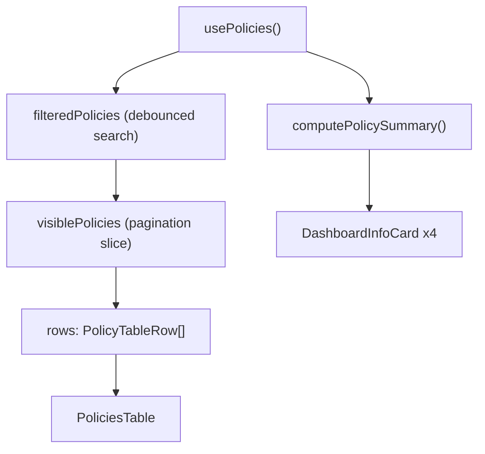

<!-- source-hash: 1b2edf3e150591f9007703ffd342c186 -->
A client-side React page component that renders the Policies management view, including summary statistics, a searchable/filterable policy table, empty state handling, and delete confirmation.

## Key Components

- **`Policies`** — Main exported page component that orchestrates the full policies listing UI
- **`usePolicies`** — Custom hook providing `policies`, `isLoading`, `error`, and `deletePolicy`
- **`useSearchParam`** — Debounced URL search param sync for responsive search input
- **`useStickyToolbar`** — Hook managing sticky toolbar positioning and scroll offset
- **`PoliciesTable`** — Shared normalized table component consuming `PolicyTableRow` view-models
- **`ConfirmDeleteMonitoringModal`** — Confirmation dialog for policy deletion
- **`computePolicySummary` / `getPolicyStatus` / `POLICY_STATUS_CONFIG`** — Utilities that derive summary stats and per-policy status labels/variants

## Usage Example

```typescript
// Rendered via the Next.js app router — no props required
import { Policies } from './policies';

export default function PoliciesPage() {
  return <Policies />;
}
```

## Data Flow



## Notable Behaviors

- **Pagination** — Loads `PAGE_SIZE` (20) rows at a time; "load more" appends the next slice without a full re-fetch
- **Search** — Filters by `name` and `description`; debounced at 300 ms to avoid per-keystroke URL navigation
- **Empty state** — Shown only when loading is complete, no active search, and `policies.length === 0`
- **Status mapping** — Each policy is mapped to `passing`, `failing`, or `partial` via `getPolicyStatus`, then enriched with a `note` badge showing failing/missing device counts
- **Platform column** — Temporarily hidden; commented-out `parsePlatforms` utility and `showPlatform` prop are preserved for future restoration