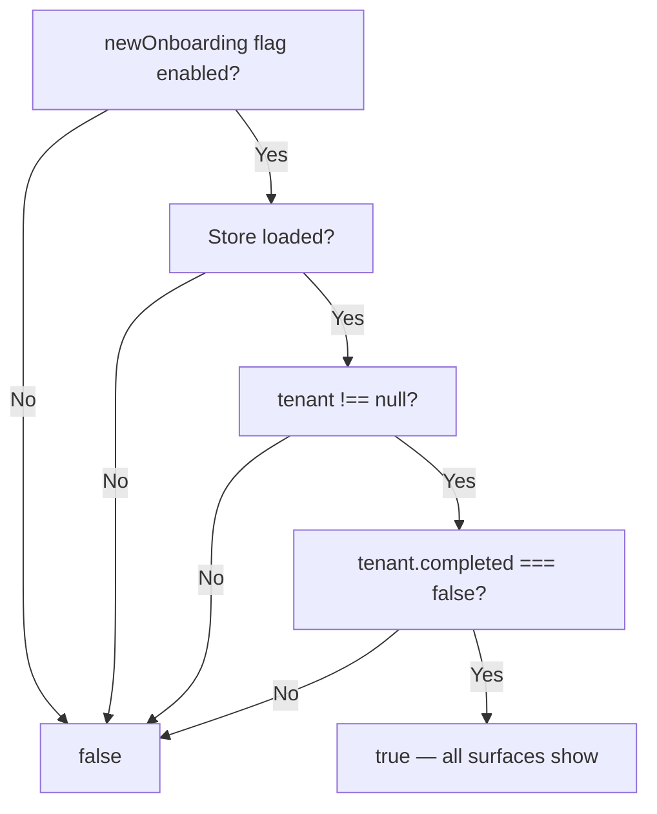

<!-- source-hash: 7d1813318ec924ef881b628b99846cc7 -->
Determines whether the tenant "Initial Setup" onboarding flow is currently active, serving as the single source of truth to keep three UI surfaces — the yellow top bar, dashboard dimming overlay, and Initial Setup card — in lockstep.

## Key Components

| Export | Type | Description |
|--------|------|-------------|
| `useInitialSetupActive` | `() => boolean` | React hook returning `true` only when all four conditions are met: `newOnboarding` flag enabled, store loaded, tenant record exists (non-null), and onboarding not yet completed |

## Logic

Returns `true` **only when all four conditions hold simultaneously**:



The `!!tenant` guard is critical: `refreshOnboardingProgress` marks the store as loaded even on a failed/empty fetch (leaving `tenant` as `null`). Without this guard, the bar and overlay would activate while the card — which renders nothing for a null tenant — stays hidden.

## Usage Example

```typescript
import { useInitialSetupActive } from '@/hooks/use-initial-setup-active';

function DashboardDimmingOverlay() {
  const isActive = useInitialSetupActive();

  if (!isActive) return null;
  return <div className="absolute inset-0 bg-black/40" />;
}
```

## Notes

- The Initial Setup card may remain visible (in its "victory" state) after this hook returns `false` — that asymmetry is intentional. The guarantee only runs in one direction: when this returns `true`, the card is guaranteed to be showing.
- All three surfaces should derive their visibility from this hook rather than computing their own conditions independently.

**Source:** [`use-initial-setup-active.ts`](https://github.com/flamingo-stack/openframe-oss-frontend/blob/main/use-initial-setup-active.ts)