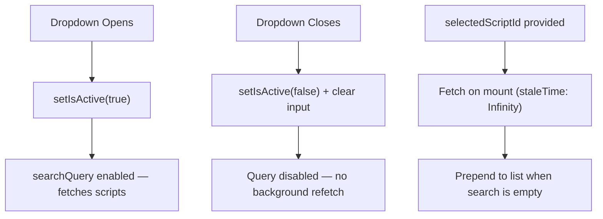

<!-- source-hash: 205eed5c3da9b45cd073ee23a94dd412 -->
Hook that manages server-side script autocomplete with debounced search, lazy query activation, and edit-mode preselection for a pre-existing script entry.

## Key Components

### `useScriptsAutocomplete(supportedPlatforms, selectedScriptId?)`

Main exported hook accepting a list of supported platform strings and an optional pre-selected script ID (edit mode). Returns the following:

| Return Value | Type | Description |
|---|---|---|
| `scripts` | `ScriptEntry[]` | Deduplicated, ordered options list |
| `isLoading` | `boolean` | True while search query is fetching |
| `inputValue` | `string` | Current text input value |
| `onInputChange` | `(val: string) => void` | Updates input; triggers debounced search |
| `onOpen` | `() => void` | Activates the lazy query |
| `onClose` | `() => void` | Deactivates query and resets input |
| `onClear` | `() => void` | Immediately clears input (bypasses debounce) |

### Internal Stubs (Migration Pending)

- **`fetchScriptsV2`** — Always resolves to `[]`; no backend wired yet.
- **`fetchScriptById`** — Always rejects via `rejectScriptsMigrationPending()`; see [`scripts-migration.ts`](https://github.com/flamingo-stack/openframe-oss-frontend/blob/main/src/lib/scripts-migration.ts).

## Loading Strategy



## Usage Example

```typescript
import { useScriptsAutocomplete } from './use-scripts-autocomplete';

function ScriptSelector({ scriptId }: { scriptId?: number }) {
  const {
    scripts,
    isLoading,
    inputValue,
    onInputChange,
    onOpen,
    onClose,
    onClear,
  } = useScriptsAutocomplete(['windows', 'linux'], scriptId);

  return (
    <Autocomplete
      options={scripts}
      loading={isLoading}
      inputValue={inputValue}
      onInputChange={(_, val) => onInputChange(val)}
      onOpen={onOpen}
      onClose={onClose}
      onClear={onClear}
    />
  );
}
```

> **Note:** Script search currently returns an empty list and edit-mode preselection rejects pending the OpenFrame RMM scripts API integration.