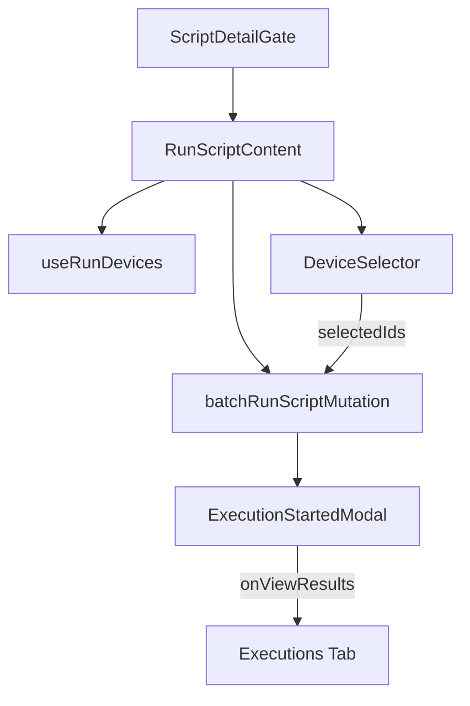

<!-- source-hash: 6e4d4dcceb69c151278ed5c9fd01c912 -->
A Next.js client component that renders the full "Run Script" surface, allowing users to configure and dispatch a script to one or more selected devices via a batch GraphQL mutation.

## Key Components

- **`RunScriptView`** — Public entry point; wraps `RunScriptContent` in `ScriptDetailGate` to handle data-fetching and loading states
- **`RunScriptContent`** — Core form component managing device selection, timeout, privilege level, script arguments, and environment variables
- **`runFormSchema`** — Zod schema validating form fields: `timeout` (1–86400s), `runAsUser`, `scriptArgs`, and `envVars`
- **`dispatchBatch`** — Commits the `batchRunScriptMutation`, sending one execution across all selected machine IDs under a shared `executionId`
- **`ExecutionStartedModal`** — Post-submit modal confirming dispatch and offering navigation to execution history

## Usage Example

```typescript
// Route-level page component
export default function RunScriptPage({ params }: { params: { scriptId: string } }) {
  return <RunScriptView scriptId={params.scriptId} />;
}
```

## Form Fields

| Field | Type | Default | Description |
|---|---|---|---|
| `timeout` | `number` | `90` | Execution timeout in seconds (1–86400) |
| `runAsUser` | `boolean` | `false` | Run as user-level vs. admin privilege |
| `scriptArgs` | `array` | `[]` | Key-value pairs passed as CLI arguments |
| `envVars` | `array` | `[]` | Key-value pairs injected as environment variables |

## Data Flow

