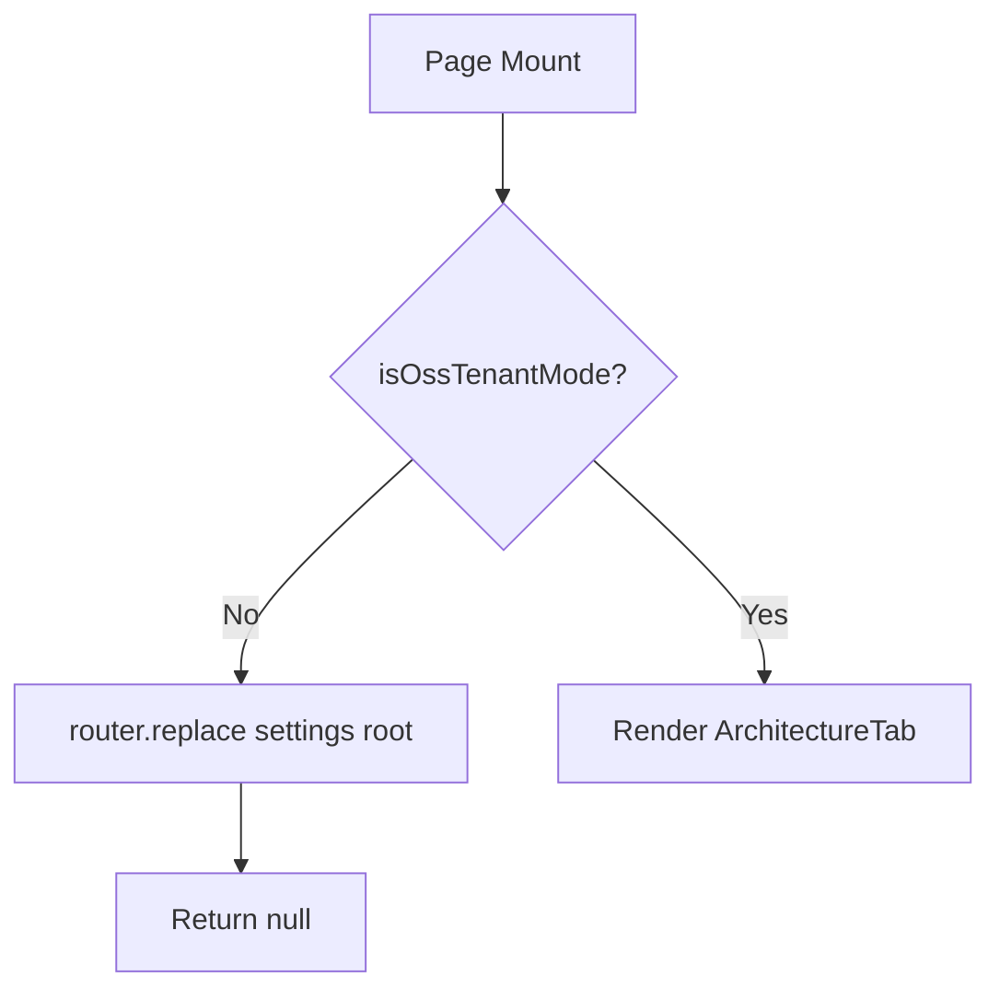

<!-- source-hash: 0b7ef8081a5b6730d90af895fc270ba2 -->
Architecture settings page component that guards access based on tenant mode, redirecting non-OSS tenants to the settings root and rendering the `ArchitectureTab` for OSS tenants.

## Key Components

| Export | Type | Description |
|--------|------|-------------|
| `ArchitecturePage` | `default` React component | Page-level component that enforces OSS-only access and renders the architecture settings UI |

**Dependencies:**

- `isOssTenantMode` — runtime check from [`@/lib/app-mode`](https://github.com/flamingo-stack/openframe-oss-frontend/blob/main/lib/app-mode.ts) determining if the app is running in OSS tenant mode
- `routes.settings.root()` — typed route helper from [`@/lib/routes`](https://github.com/flamingo-stack/openframe-oss-frontend/blob/main/lib/routes.ts) for redirect target
- `ArchitectureTab` — settings tab UI from the local `../components/tabs/architecture` module

## Behavior



## Usage Example

This is a Next.js App Router page — it is mounted automatically via the file system. No manual instantiation is needed.

```typescript
// Navigating to this page from elsewhere
import { routes } from '@/lib/routes';
import { useRouter } from 'next/navigation';

const router = useRouter();
router.push(routes.settings.architecture()); // OSS tenants only
```

> **Access control:** Non-OSS tenants are redirected server-side via `router.replace` and the component returns `null` to prevent any flash of content during the redirect.