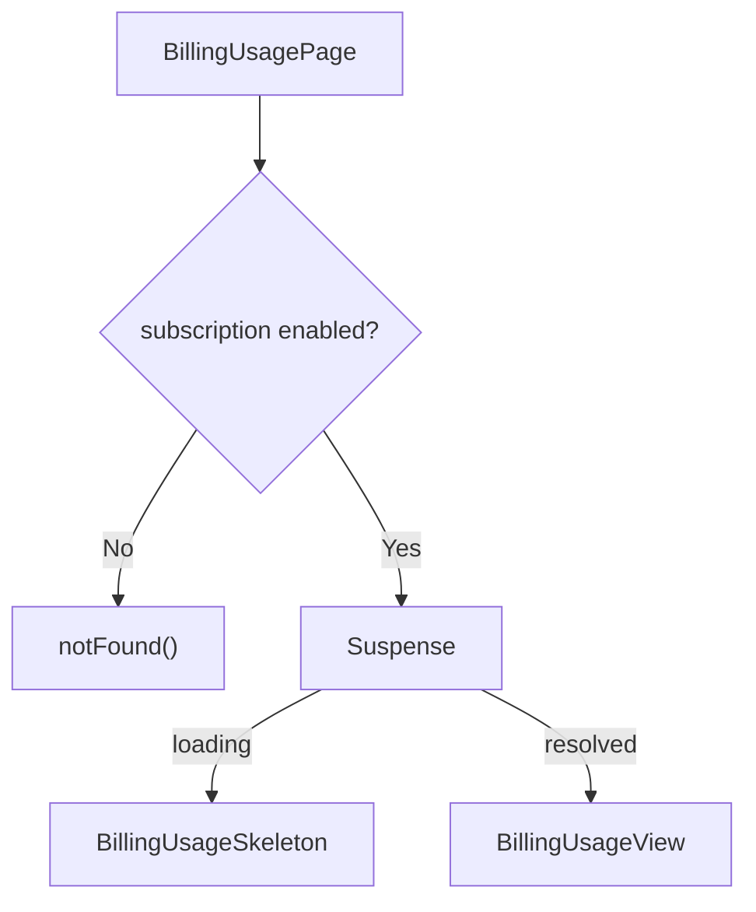

<!-- source-hash: c78b2816ff17753f63a132954dab665f -->
Client-side Next.js page component that renders the billing usage dashboard, guarded by a feature flag.

## Key Components

- **`BillingUsagePage`** — Default export page component that checks the `subscription` feature flag before rendering. Returns a 404 if the feature is disabled.
- **`featureFlags.subscription.enabled()`** — Gate that controls access to the billing usage page.
- **`BillingUsageView`** — The main billing usage content component, loaded asynchronously.
- **`BillingUsageSkeleton`** — Loading placeholder shown via `Suspense` while `BillingUsageView` resolves.

## Usage Example

This is a Next.js App Router page rendered at the `/billing/usage` route. No direct invocation is needed — Next.js handles routing automatically.

```typescript
// Enabling the subscription feature flag will expose this page.
// If disabled, navigating to /billing/usage returns a 404.

// featureFlags configuration (lib/feature-flags.ts)
export const featureFlags = {
  subscription: {
    enabled: () => process.env.NEXT_PUBLIC_SUBSCRIPTION_ENABLED === 'true',
  },
};
```

The page wraps `BillingUsageView` in a `Suspense` boundary, allowing the skeleton to display during any async data fetching inside the view.



## Related Files

- [`billing-usage-view.tsx`](https://github.com/flamingo-stack/openframe-oss-frontend/blob/main/app/billing/usage/components/billing-usage-view.tsx)
- [`billing-usage-skeleton.tsx`](https://github.com/flamingo-stack/openframe-oss-frontend/blob/main/app/billing/usage/components/billing-usage-skeleton.tsx)
- [`feature-flags.ts`](https://github.com/flamingo-stack/openframe-oss-frontend/blob/main/lib/feature-flags.ts)