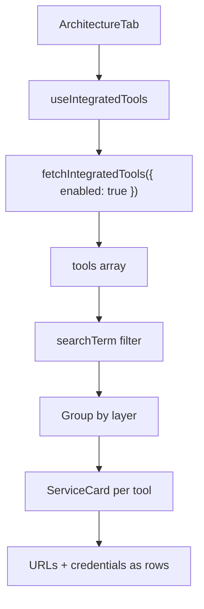

<!-- source-hash: 6733d55c394998831517700af582a6ea -->
A React client component that renders the Architecture Overview tab, displaying integrated tools grouped by layer with search filtering and credential management.

## Key Components

### `ArchitectureTab`
The main exported component that:
- Fetches enabled integrated tools via `useIntegratedTools`
- Provides a real-time search bar filtering tools by name, description, category, layer, and URLs
- Groups filtered tools alphabetically by `layer` and renders each group with its tools as `ServiceCard` instances
- Displays skeleton loading placeholders during data fetch
- Renders tool credentials (username, password, API key) and URLs as `ServiceCard` rows with copy/reveal/open actions

### Props

| Prop | Type | Default | Description |
|------|------|---------|-------------|
| `title` | `string` | `'Architecture Overview'` | Page heading passed to `PageLayout` |

## Usage Example

```typescript
import { ArchitectureTab } from './architecture';

// Basic usage with default title
export default function ArchitecturePage() {
  return <ArchitectureTab />;
}

// With a custom title
export default function ArchitecturePage() {
  return <ArchitectureTab title="My Stack Architecture" />;
}
```

## Data Flow



## Notes

- Uses `useSafeBack` to navigate back to `routes.settings.root()` if no browser history is available
- Tool URLs with a `port` field display both a combined `url:port` link and a separate Port row
- All filtering is memoized via `useMemo` to avoid unnecessary recomputation on re-renders

**Source:** [`architecture.tsx`](https://github.com/flamingo-stack/openframe-oss-frontend/blob/main/architecture.tsx)