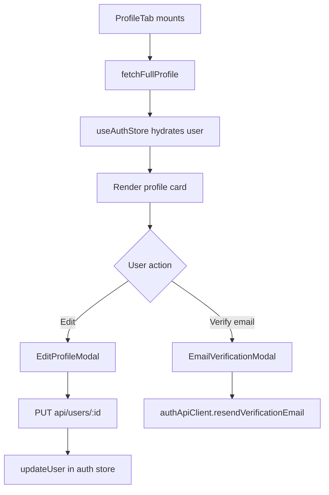

<!-- source-hash: c8b6fb42d5534e283ae404a52c229cb8 -->
A React client component that renders the user profile tab, displaying the current user's avatar, name, email, and roles, with support for editing profile details and triggering email verification.

## Key Components

- **`ProfileTab`** — Main exported component that orchestrates profile display and editing
- **`updateProfile`** — Memoized async handler that PUTs updated name fields to `api/users/:id` and syncs the auth store
- **`handleResendVerification`** — Sends a verification email via `authApiClient` and shows a toast notification
- **Loading/Error states** — Renders a `Skeleton` during initial load and a `PageError` if no user data is available
- **`EditProfileModal`** — Modal for editing first/last name, controlled by `isEditModalOpen`
- **`EmailVerificationModal`** — Modal triggered when the user clicks the "Not verified" warning badge

## Usage Example

```typescript
// Rendered as a tab panel within the account/settings page
import { ProfileTab } from '@/components/settings/tabs/profile';

export function AccountSettingsPage() {
  return (
    <Tabs defaultValue="profile">
      <TabsContent value="profile">
        <ProfileTab />
      </TabsContent>
    </Tabs>
  );
}
```

## Data Flow



**Source:** [`profile.tsx`](https://github.com/flamingo-stack/openframe-oss-frontend/blob/main/profile.tsx)