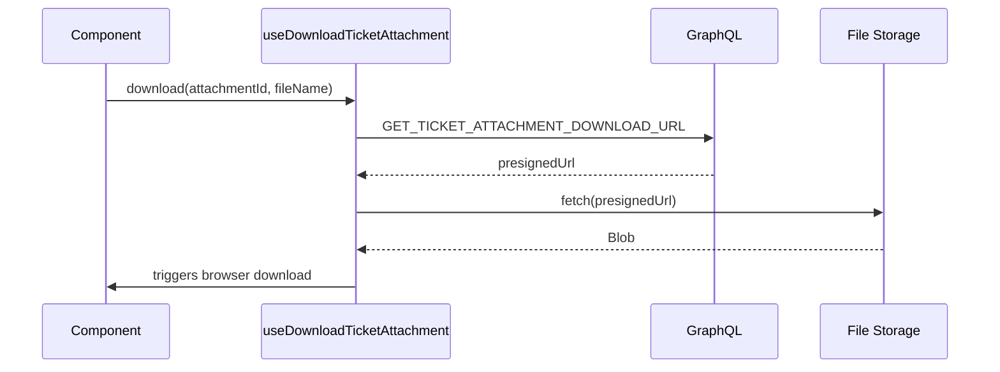

<!-- source-hash: e8f8ac1d1bf518aef4fc764906fa0f02 -->
Provides a React hook for downloading ticket attachments via a GraphQL-powered presigned URL flow, with built-in error toast notifications.

## Key Components

### `useDownloadTicketAttachment`
A client-side hook that returns a `download` function to fetch and trigger browser downloads for ticket attachments.

- Queries `GET_TICKET_ATTACHMENT_DOWNLOAD_URL` via GraphQL to retrieve a presigned download URL
- Fetches the file from the presigned URL and converts it to a `Blob`
- Programmatically triggers a browser download using a temporary anchor element
- Displays a destructive toast notification on any failure (network error, missing URL, etc.)

## Usage Example

```typescript
import { useDownloadTicketAttachment } from './use-ticket-attachments';

function AttachmentRow({ attachment }: { attachment: { id: string; fileName: string } }) {
  const { download } = useDownloadTicketAttachment();

  return (
    <button onClick={() => download(attachment.id, attachment.fileName)}>
      Download {attachment.fileName}
    </button>
  );
}
```

## Flow



## Notes

- Marked `'use client'` — Next.js App Router client component only
- URL object is revoked immediately after click to avoid memory leaks
- Error handling covers both GraphQL and file fetch failures