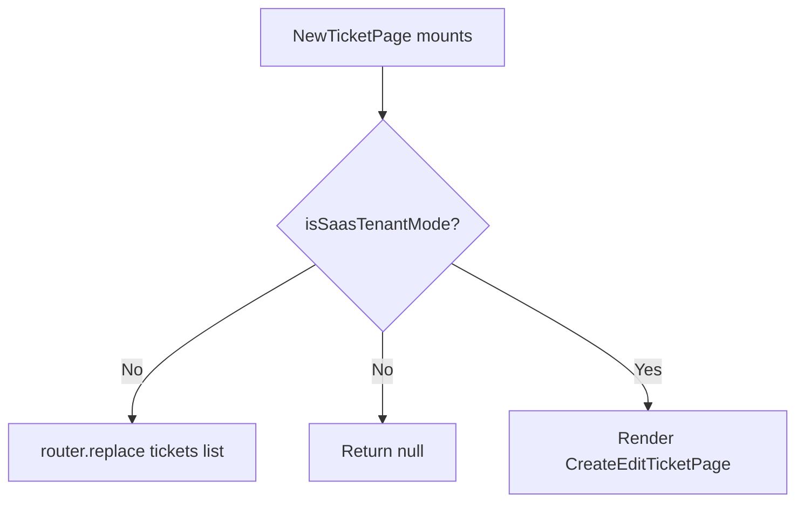

<!-- source-hash: 2b2efe21254ec4faf30cbe18b3bb7138 -->
A Next.js client page component that guards the new ticket creation route, redirecting non-SaaS tenant users to the ticket list and rendering the `CreateEditTicketPage` form for eligible users.

## Key Components

- **`NewTicketPage`** — Default export page component that enforces SaaS tenant mode access control
- **`isSaasTenantMode()`** — Utility imported from `@/lib/app-mode` used to determine if the current deployment is in SaaS tenant mode
- **`routes.tickets.list`** — Typed route constant used as the redirect target for non-SaaS users
- **`CreateEditTicketPage`** — The actual ticket creation form rendered when access is permitted

## Behavior



## Usage Example

This page is registered as a Next.js route (e.g. `app/tickets/new/page.tsx`) and requires no props — routing and access control are handled internally.

```typescript
// Accessed via navigation to /tickets/new
// Non-SaaS tenants are silently redirected to /tickets
// SaaS tenants see the CreateEditTicketPage form

import NewTicketPage from './page';

// Rendered automatically by the Next.js App Router
<NewTicketPage />
```

## Notes

- The `useEffect` redirect and the synchronous `null` return work together to prevent a flash of the form for unauthorized users
- Source: [`app/tickets/new/page.tsx`](https://github.com/flamingo-stack/openframe-oss-frontend/blob/main/app/tickets/new/page.tsx)