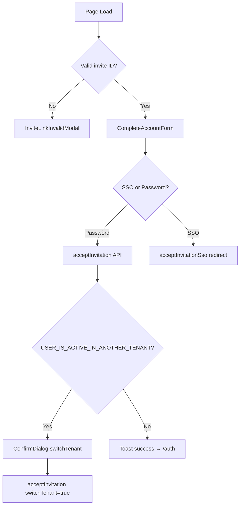

<!-- source-hash: 8036ae9e84b4a42074b751d7c3699cb4 -->
The invitation acceptance page (`/auth/invite`) that handles new user registration via email invite links, supporting both password-based account creation and SSO (Google/Microsoft) sign-up flows.

## Key Components

| Export/Symbol | Description |
|---|---|
| `InvitePage` | Default export — main page component rendering the invite acceptance UI |
| `handleSubmit` | Submits the account creation form, handling the `USER_IS_ACTIVE_IN_ANOTHER_TENANT` edge case |
| `handleSso` | Initiates browser-redirect SSO flow for Google or Microsoft providers |
| `isInvalidInviteError` | Helper that detects expired or already-used invitation error strings |
| `SSO_TO_FORM` | Maps backend provider IDs to typed `AuthSsoProvider` form values |
| `MIN_PASSWORD_LENGTH` | Constant (`8`) used for both real-time validation and error messaging |

## Usage Example

```typescript
// Accessed via Next.js routing at: /auth/invite?id=<invitationId>
// No direct instantiation — rendered automatically by the Next.js App Router.

// The page reads the invitation ID from search params:
const invitationId = searchParams.get('id');

// Invalid/missing ID renders the error modal instead of the form:
if (!invitationId || isInvalidInviteError(error)) {
  return <InviteLinkInvalidModal onBackToLogin={handleBack} />;
}

// On successful acceptance, redirects to /auth after 2 seconds.
// If the user belongs to another tenant, a confirmation dialog
// prompts before calling handleSubmit(true) with switchTenant = true.
```

## Flow Summary

