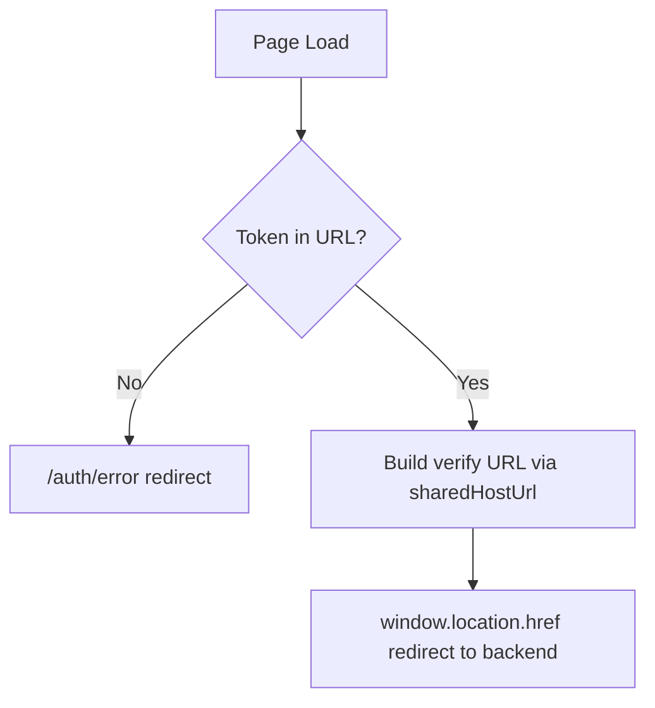

<!-- source-hash: 862740f52765cdf6a7f47a22b432f0a1 -->
Handles email verification by extracting a token from the URL query string and redirecting the user to the backend verification endpoint, with error handling for missing tokens.

## Key Components

- **`VerifyEmailPage`** — Default export. A Next.js client component that:
  - Reads the `token` query parameter via `useSearchParams`
  - Redirects to `/auth/error` if no token is present
  - Constructs the backend verify URL using `runtimeEnv.sharedHostUrl()` and performs a `window.location.href` redirect
  - Renders a branded loading state (animated dots) while the redirect is in progress

## Usage Example

```typescript
// Accessed via route: /auth/verify-email?token=<jwt>
// Example redirect target constructed internally:
// https://<sharedHostUrl>/sas/email/verify?token=<encoded-token>

// If token is missing, user is redirected to:
// /auth/error?error=Invalid%20verification%20link.%20Please%20try%20again.
```

## Behavior Flow



## Notes

- Uses `runtimeEnv.sharedHostUrl()` from [`@/lib/runtime-config`](https://github.com/flamingo-stack/openframe-oss-frontend/blob/main/lib/runtime-config.ts) to support dynamic backend URL resolution at runtime
- The animated loading UI provides visual feedback during the brief redirect delay
- Branding includes both OpenFrame and Flamingo logos with a link to `https://flamingo.run`