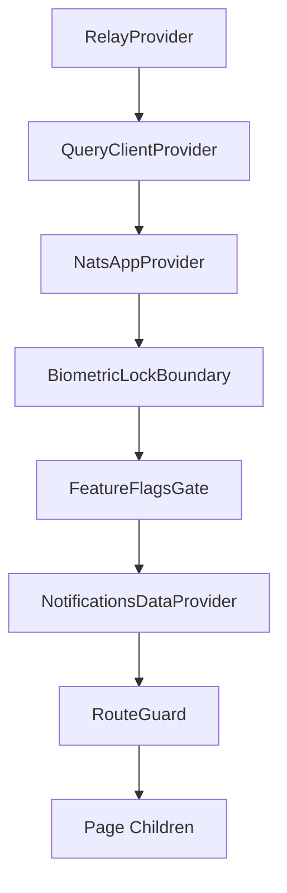

<!-- source-hash: c26707583ff6cbf7bc442df0ebe6dbf7 -->
The root Next.js layout component for the OpenFrame application, responsible for global metadata, viewport configuration, font injection, and the top-level provider hierarchy that wraps every page.

## Key Components

| Export | Type | Description |
|--------|------|-------------|
| `metadata` | `Metadata` | SEO metadata including OpenGraph, Twitter cards, favicons, and web manifest |
| `generateViewport()` | `Viewport` | Dynamic viewport config — pins scale in static/native-shell exports, allows pinch-zoom on web |
| `RootLayout` | React component | Root `<html>` layout wrapping all pages in the full provider stack |

## Provider Hierarchy



## Key Behaviors

- **Build target branching** — `OPENFRAME_BUILD_TARGET=export` enables static/native-shell mode: skips `<PublicEnvScript />` (Capacitor/Tauri injects `window.__ENV` instead) and disables user scaling to prevent WebKit input auto-zoom
- **FOUC prevention** — inlines `sidebarWidthFoucScript` in `<head>` to seed sidebar width before first paint, avoiding a collapsed-to-expanded flash
- **Viewport ownership** — uses `generateViewport()` rather than a manual `<meta>` tag to prevent Next.js from injecting a duplicate that silently drops `viewport-fit` and `maximum-scale` in WebKit

## Usage Example

```typescript
// next.config.ts — trigger static export mode
const nextConfig = {
  output: process.env.OPENFRAME_BUILD_TARGET === 'export' ? 'export' : 'standalone',
};

// All pages automatically receive the full provider stack:
export default function SomePage() {
  return <div>Content here is wrapped by RootLayout automatically</div>;
}
```

**Source:** [`app/layout.tsx`](https://github.com/flamingo-stack/openframe-oss-frontend/blob/main/app/layout.tsx)