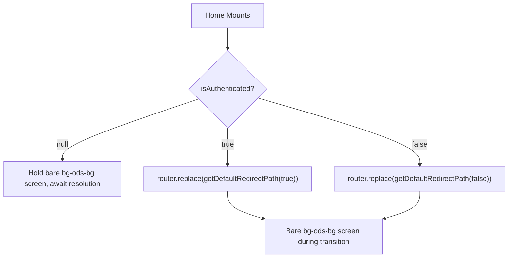

Root entry point component that handles authentication-based routing on app load, redirecting users to the appropriate path while holding a neutral screen.

## Key Components

| Export | Type | Description |
|--------|------|-------------|
| `Home` | `default` React component | Root page component that checks auth state and redirects accordingly |

**Dependencies:**
- `useAuthStore` — reads `isAuthenticated` from the global auth store
- `getDefaultRedirectPath` — resolves the correct redirect target based on auth state
- `useRouter` / `useEffect` — triggers `router.replace()` once auth state is resolved

## Behavior



## Usage Example

This component is mounted automatically by Next.js at the `/` route. No direct usage is required.

```typescript
// Indirectly controlled via auth store + app-mode utility:
// getDefaultRedirectPath controls the target:
const path = getDefaultRedirectPath(isAuthenticated); // e.g. '/dashboard' or '/auth'
router.replace(path);
```

## Notes

- `isAuthenticated === null` acts as a loading sentinel — no redirect fires until the value resolves, preventing a redirect flash on cold boot.
- Both branches render the same bare `bg-ods-bg` screen. This route is only ever passed through, so it promises nothing about where the user is going; the plain background also matches the native splash, so the hand-off to the sign-in page shows no flash.

**Source:** [`app/page.tsx`](https://github.com/flamingo-stack/openframe-oss-frontend/blob/main/app/page.tsx)
