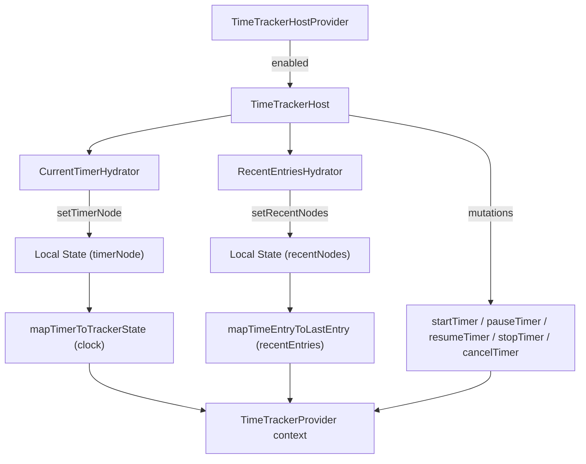

<!-- source-hash: 67916cccab8db20fc0993f445f9f3cc7 -->
Provides the React context host for the global time tracker, wiring Relay GraphQL mutations and queries to the `TimeTrackerProvider` context consumed by UI components.

## Key Components

| Export / Component | Description |
|---|---|
| `TimeTrackerHostProvider` | Public entry point; renders children directly when `enabled` is false, otherwise mounts `TimeTrackerHost` |
| `TimeTrackerHost` | Internal orchestrator that owns all timer state, mutations, and UI modals |
| `CurrentTimerHydrator` | Suspense-wrapped child that fetches and streams the active timer into state |
| `RecentEntriesHydrator` | Suspense-wrapped child that paginates recent time entries into state |
| `CancelEntryDescription` | Inline component rendering a live-ticking description of discarded time in the cancel confirm dialog |

## Usage Example

```typescript
// Wrap your app layout to enable the global time tracker
import { TimeTrackerHostProvider } from '@/app/components/time-tracker-host-provider';

export default function RootLayout({ children }: { children: ReactNode }) {
  const { featureFlags } = useCurrentUser();

  return (
    <TimeTrackerHostProvider enabled={featureFlags.timeTracker}>
      {children}
    </TimeTrackerHostProvider>
  );
}
```

## Data Flow



## Notes

- **Seeding**: When an in-progress timer is fetched on mount, `useEffect` pre-populates the ticket/customer selection and notes fields once via a `seededRef` guard.
- **Relay cache updates**: All mutations use custom `updater` functions (`makeSetCurrentTimerUpdater`, `makeStopTimerUpdater`, `makeCancelTimerUpdater`) to keep the Relay store consistent without a network refetch.
- **Cancel confirmation**: Deleting an active timer routes through `ConfirmDialog` with a live-updating duration so the user sees exactly how much time will be discarded.
- **Manual entries**: Both create (`ManualEntryModal` with no `entry` prop) and edit (with an `editTarget`) flows reuse the same modal component.

**Source:** [`time-tracker-host-provider.tsx`](https://github.com/flamingo-stack/openframe-oss-frontend/blob/main/time-tracker-host-provider.tsx)