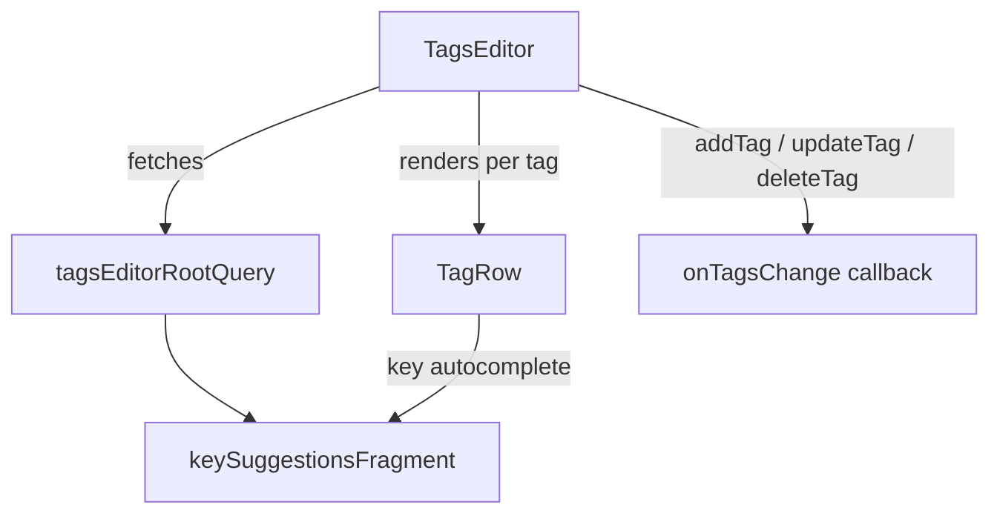

<!-- source-hash: db76098b46c86ef8cb3d62c08b1cdef6 -->
A React client component for managing a list of key-value tags, supporting add, update, and delete operations with autocomplete suggestions fetched via Relay GraphQL.

## Key Components

- **`TagsEditor`** — Main exported component that renders a dynamic list of `TagRow` entries with controls to add/remove tags
- **`tagsEditorRootQuery`** — Relay GraphQL query fetching initial tag key suggestions (limit: 20)
- **`keySuggestionsFragment`** — Exported refetchable Relay fragment (`tagsEditor_keySuggestions`) used by `useTagKeySuggestions` to support search-driven suggestion refetching
- **`TagsEditorProps`** — Interface defining `tags`, `onTagsChange`, and optional `addLabel`

## Usage Example

```typescript
import { TagsEditor } from './tags-editor';
import type { TagEntryWithId } from './types';

function MyForm() {
  const [tags, setTags] = useState<TagEntryWithId[]>([]);

  return (
    <TagsEditor
      tags={tags}
      onTagsChange={setTags}
      addLabel="Add Tag"
    />
  );
}
```

> **Note:** `TagsEditor` uses `useLazyLoadQuery` and must be rendered inside a Relay `<Suspense>` boundary with an active Relay environment.

## Data Flow



**Source:** [`src/.../tags-editor.tsx`](https://github.com/flamingo-stack/openframe-oss-frontend/blob/main/src/components/tags-editor.tsx)