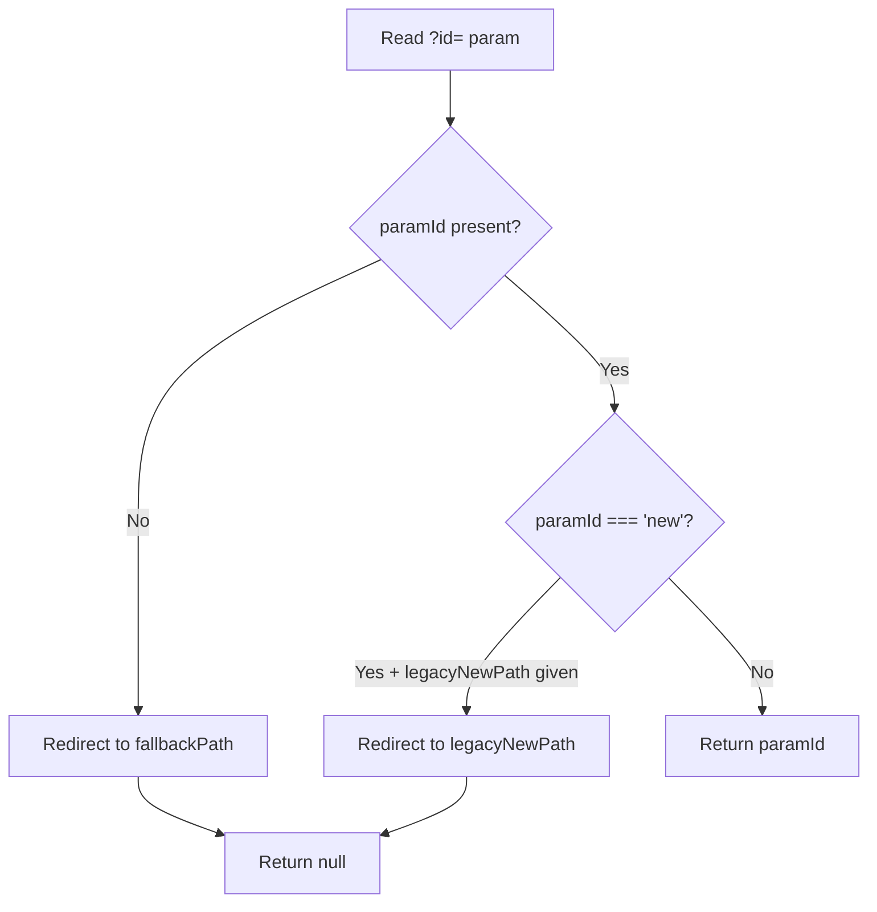

<!-- source-hash: b433a12cf067263f15dbcf89eacc86d0 -->
Reads the `?id=` query parameter required by edit/detail wrapper pages, handling missing and legacy `?id=new` sentinel values with automatic redirects.

## Key Components

### `useRequiredIdParam(fallbackPath, legacyNewPath?)`

| Parameter | Type | Description |
|---|---|---|
| `fallbackPath` | `string` | Redirect target when `?id=` is missing (typically the list page) |
| `legacyNewPath` | `string` (optional) | Redirect target when `?id=new` is detected (the dedicated `/new` route) |

**Returns:** `string` — the validated ID, or `null` while a redirect is in progress.

**Redirect logic:**



## Usage Example

```typescript
export default function EditDevicePage() {
  const id = useRequiredIdParam('/devices', '/devices/new');

  // Render nothing while redirect is in flight
  if (!id) return null;

  return <DeviceEditForm id={id} />;
}
```

## Behavior Notes

- **Missing `?id=`** — redirects to `fallbackPath` (e.g. `/devices`) to prevent silently loading a create form when an edit was intended
- **`?id=new`** — a pre-alignment sentinel; redirects to `legacyNewPath` when provided, since entities are now created at dedicated `/new` routes
- **Valid ID** — returned directly; caller is responsible for rendering

---

**Source:** [`use-required-id-param.ts`](https://github.com/flamingo-stack/openframe-oss-frontend/blob/main/use-required-id-param.ts)