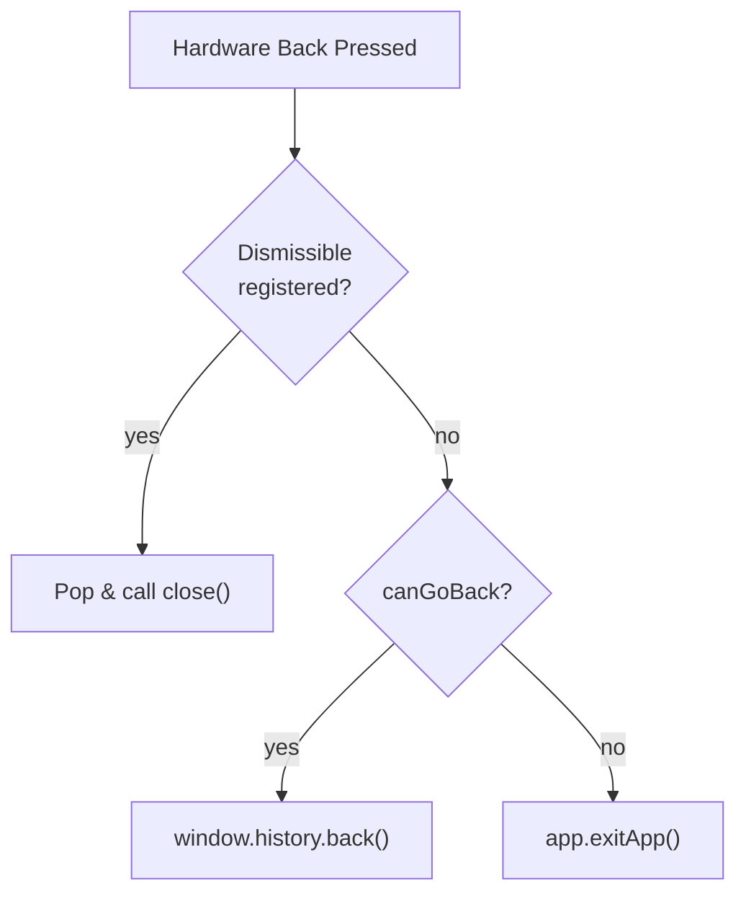

<!-- source-hash: 40e317426a8207b628a16bee8f8f4ca1 -->
Manages Android hardware back button behavior in a Capacitor native shell, implementing a priority-based dismissal system for overlays before falling back to SPA history navigation or app exit.

## Key Components

| Export | Type | Description |
|---|---|---|
| `pushBackDismissible` | Function | Registers an overlay close handler in a LIFO stack; returns an unregister function |
| `initNativeBack` | Function | One-time setup of the `backButton` listener via `@capacitor/app`; no-op on web/iOS |
| `useNativeBackDismissible` | React Hook | Registers/unregisters an overlay's `onClose` handler while `isOpen` is true |

## Back Priority (Android)



## Usage Example

```typescript
// Initialize once at app startup (e.g., in your root component or shell init)
initNativeBack();

// In an overlay or modal component:
import { useNativeBackDismissible } from '@/native/native-back';
import { useCallback, useState } from 'react';

function BottomSheet() {
  const [isOpen, setIsOpen] = useState(false);

  // Must be stable — wrap in useCallback to avoid re-registering every render
  const handleClose = useCallback(() => setIsOpen(false), []);

  useNativeBackDismissible(isOpen, handleClose);

  return <div>{/* sheet content */}</div>;
}
```

## Notes

- **iOS**: No-op — left-edge swipe is handled natively via `WKWebView` and never emits `backButton`
- **Listener registration**: Uses `Promise.resolve()` to safely handle both synchronous and Promise-based return shapes from the Capacitor bridge, preventing boot-time crashes
- `onClose` passed to `useNativeBackDismissible` must be wrapped in `useCallback` to prevent unnecessary re-registrations