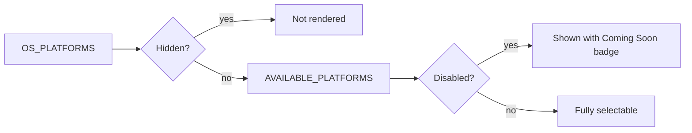

<!-- source-hash: 5447095ab72b6dbd53fe317e0eb2b385 -->
Filters and categorizes OS platforms for display in the OpenFrame UI, controlling which platforms are visible, selectable, or hidden.

## Key Components

| Export | Type | Description |
|--------|------|-------------|
| `DISABLED_PLATFORMS` | `OSPlatformId[]` | Platforms shown in the UI with a "Coming Soon" badge but not selectable |
| `AVAILABLE_PLATFORMS` | `OSPlatformId[]` | Filtered list of platforms visible in the UI, excluding hidden ones (e.g. `linux`) |

`HIDDEN_PLATFORMS` is an internal constant (not exported) that defines platforms completely removed from the UI.

## Usage Example

```typescript
import { AVAILABLE_PLATFORMS, DISABLED_PLATFORMS } from './platforms';

// Render platform selector
AVAILABLE_PLATFORMS.forEach(platform => {
  const isDisabled = DISABLED_PLATFORMS.includes(platform.id);
  console.log(`${platform.id} - ${isDisabled ? 'Coming Soon' : 'Available'}`);
});
```

## Platform States



## Source

[`platforms.ts`](https://github.com/flamingo-stack/openframe-oss-frontend/blob/main/platforms.ts)