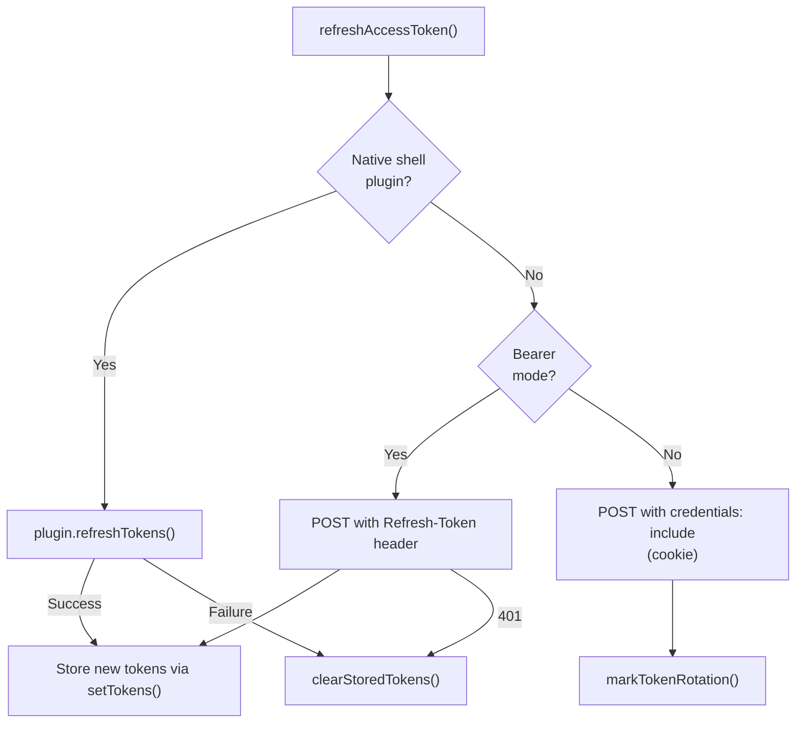

<!-- source-hash: 2a6aed8f3edc49c5ae567d69c711932d -->
Centralized manager for OAuth access token refresh operations, deduplicating concurrent refresh calls and handling multiple authentication modes (native shell, bearer token, and cookie-based sessions).

## Key Components

| Export | Type | Description |
|--------|------|-------------|
| `refreshAccessToken(observedEpoch?)` | `async function` | Primary entry point. Refreshes the access token, deduplicating concurrent calls via a shared promise. Accepts an optional epoch value to skip stale 401-triggered refreshes. |
| `isTokenRefreshing()` | `function` | Returns `true` if a refresh is currently in flight. |
| `waitForRefresh()` | `async function` | Resolves with the result of any in-progress refresh, or `false` if none is active. |

### Internal Functions

- **`executeRefresh(tenantId?)`** — Core refresh logic. Dispatches to the native shell plugin (`plugin.refreshTokens()`) if available, otherwise POSTs to `/oauth/refresh`. Handles bearer token rotation, cookie-based sessions, and dev-ticket mode.
- **`buildRefreshUrl(tenantId?)`** — Constructs the refresh endpoint URL from `runtimeEnv.sharedHostUrl()`, optionally scoped to a tenant.

## Usage Example

```typescript
import { refreshAccessToken, isTokenRefreshing, waitForRefresh } from './token-refresh-manager';

// In an HTTP interceptor — pass the epoch captured before the failed request
// to avoid rotating a credential that was already replaced
const epoch = getTokenEpoch();
const makeRequest = async () => {
  const res = await fetch('/api/data');
  if (res.status === 401) {
    const refreshed = await refreshAccessToken(epoch);
    if (refreshed) {
      return fetch('/api/data'); // retry with new token
    }
    // forceLogout() or redirect
  }
  return res;
};

// Check if a refresh is already underway before triggering another
if (isTokenRefreshing()) {
  const success = await waitForRefresh();
}
```

## Auth Mode Behavior



## Notes

- **Epoch-based deduplication** prevents a burst of concurrent 401s (common when an access token expires mid-flight) from each triggering independent rotations — rotating refresh tokens are invalidated on first use, so multiple rotations in quick succession will cause the backend to reject reuse and log the user out.
- The module is intentionally a singleton (module-level `isRefreshing`/`refreshPromise`), making it the single source of truth shared by both `ApiClient` and `AuthApiClient`.