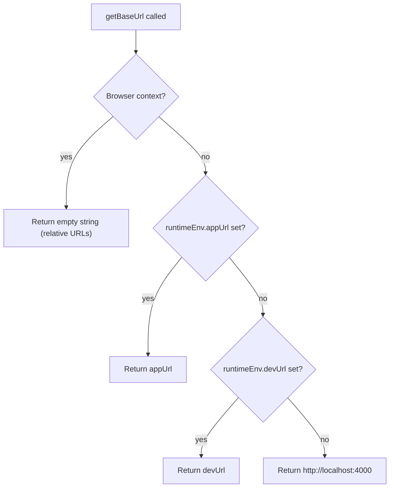

<!-- source-hash: 11b17fb064e07445d3d3a4b944bfc5c3 -->
Utility functions for resolving base and asset URLs in both browser and server-side rendering contexts within the OpenFrame frontend.

## Key Components

| Export | Signature | Description |
|--------|-----------|-------------|
| `getBaseUrl` | `() => string` | Returns the application base URL based on runtime environment |
| `getAssetUrl` | `(path: string) => string` | Builds an absolute URL for a given asset path |

### `getBaseUrl` Resolution Order



## Usage Example

```typescript
import { getBaseUrl, getAssetUrl } from './utils';

// Resolves base URL for server-side fetch
const base = getBaseUrl();
// Browser: ''
// Server (production): 'https://app.example.com'
// Server (dev fallback): 'http://localhost:4000'

// Build absolute asset path
const logoUrl = getAssetUrl('images/logo.png');
// Browser:     '/images/logo.png'
// Server:      'https://app.example.com/images/logo.png'

// Leading slash is handled automatically
const iconUrl = getAssetUrl('/icons/check.svg');
// → '<baseUrl>/icons/check.svg'
```

## Notes

- In browser contexts, `getBaseUrl` returns `''` so all paths remain relative, avoiding CORS or host-mismatch issues during SSR hydration.
- `getAssetUrl` normalises the `path` argument by ensuring exactly one leading `/` regardless of whether the caller provides one.
- Base URL priority: `APP_URL` → `DEV_URL` → `http://localhost:4000`. Configure these via [`runtime-config`](https://github.com/flamingo-stack/openframe-oss-frontend/blob/main/runtime-config.ts).