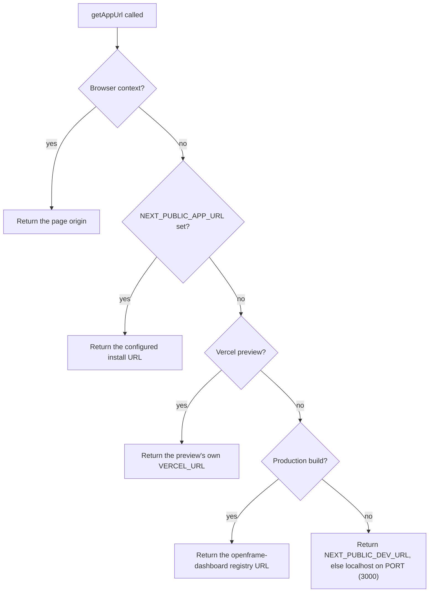

<!-- source-hash: 11b17fb064e07445d3d3a4b944bfc5c3 -->
Resolves where this OpenFrame app is reachable. The rule itself lives once in `@flamingo-stack/openframe-frontend-core/platform-domains` (`getDeploymentUrl`), shared with every other Flamingo app; this module only supplies the platform and this install's configured URL.

## Key Components

| Export | Signature | Description |
|--------|-----------|-------------|
| `getAppUrl` | `() => string` | This app's absolute origin, no trailing slash |

### `getAppUrl` Resolution Order



## Usage Example

```typescript
import { getAppUrl } from './utils';

const ogImage = `${getAppUrl()}/assets/openframe/og-image.png`;
```

## Notes

- A self-hosted install sets `NEXT_PUBLIC_APP_URL` at runtime (`runtime-config`), and that address wins over every default.
- The result never ends with a slash, so paths can be appended directly.
